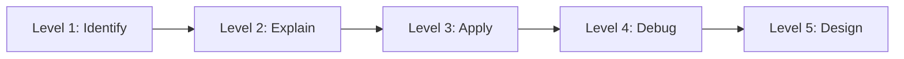

# Advanced JPA Progressive Quiz Drill

## What This Drill Covers

This drill moves from mapping basics to fetch planning and performance troubleshooting.

## Python Bridge

| JPA Concept | Python / SQLAlchemy Equivalent | Why It Helps |
|---|---|---|
| `@ManyToOne` / `@OneToMany` | `relationship()` | Models object links between tables |
| `@Transactional` | Session / unit of work scope | Keeps work atomic |
| `JOIN FETCH` | `joinedload()` | Loads a graph in one query |
| `@EntityGraph` | Loader options on a repository query | Reuses a fetch plan |
| `N+1` | Hidden lazy-load loop | Explains why "works" can still be slow |

## Progressive Questions

### Level 1 - Identify

1. Which annotation usually owns the foreign key side of a relationship?
2. What is the default fetch type for `@ManyToOne`?
3. What does `@Transactional` protect?

### Level 2 - Explain

1. Why is `LAZY` safer than `EAGER` for collections?
2. What problem appears when a loop triggers one query per row?
3. When would `JOIN FETCH` be better than a default mapping?

### Level 3 - Apply

1. Pick the right mapping for "one author, many books".
2. Write a fetch plan for an endpoint that returns an order plus line items.
3. Choose a transaction boundary for a service method that saves two entities.

### Level 4 - Debug

1. An endpoint suddenly issues 51 SQL statements for 50 rows. What is the first thing you inspect?
2. Why might a lazy collection fail outside a service method?
3. What is the self-invocation trap in Spring transactions?

### Level 5 - Design

1. Design a repository method that keeps the query count stable.
2. Decide whether `JOIN FETCH` or `@EntityGraph` is easier to maintain for a shared query.
3. Explain how you would test for N+1 regressions before production.

## Self-Check Answers

- The foreign key side is usually the `@ManyToOne` side.
- `@ManyToOne` defaults to `EAGER`.
- `@Transactional` protects the unit of work and rollback boundary.
- N+1 is usually a fetch-plan problem, not a database problem.

## Interview Questions

1. Why is `EAGER` often a bad default for performance?
2. How do `JOIN FETCH` and `@EntityGraph` differ?
3. What causes the self-invocation trap in Spring transactions?
4. How do you recognize an N+1 issue from logs?
5. When would you keep a relationship `LAZY` even if it adds code complexity?
