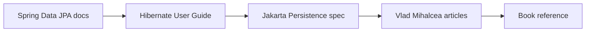

# Advanced JPA Top Resource Guide

## Best Starting Points

## Curated External Resources

1. [Spring Data JPA reference documentation](https://docs.spring.io/spring-data/jpa/docs/current/reference/html/) - The best official overview of repositories, query methods, transactionality, and fetch graphs.
2. [Hibernate ORM User Guide](https://docs.hibernate.org/orm/current/userguide/html_single/Hibernate_User_Guide.html) - The deepest official reference for fetching, persistence context behavior, and performance tuning.
3. [Jakarta Persistence API documentation](https://jakarta.ee/specifications/persistence/2.2/apidocs/) - The API contract behind JPA-style persistence.
4. [Vlad Mihalcea tutorial hub: Hibernate](https://vladmihalcea.com/tutorials/hibernate/) - Strong practical articles on fetching strategies, N+1, lazy loading, and performance tradeoffs.
5. [Java Persistence with Hibernate, Second Edition](https://www.manning.com/books/java-persistence-with-hibernate-second-edition) - A book-length guide to mappings, fetch strategies, transactions, and performance.

## How To Use These Resources

- Start with the Spring Data JPA reference to refresh repository-level APIs.
- Move to the Hibernate guide when you need provider-level details.
- Use the Jakarta API docs when you want the standard contract.
- Read Vlad Mihalcea when you want performance advice and real-world examples.

## Interview Questions

1. Why is the Hibernate guide still useful even when you use Spring Data JPA?
2. What problem does the Jakarta Persistence API documentation solve for you?
3. When would you reach for a performance article instead of a reference manual?
4. Why is a book still useful for fetch planning and transaction design?
5. Which resource would you open first when debugging N+1?
