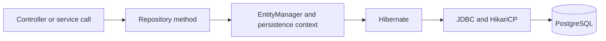

# 02 - Data Access

## Why This Module Matters

Every backend application needs to persist and retrieve data from a database. In the Spring Boot ecosystem, Spring Data JPA is the dominant data access layer because it removes boilerplate SQL while keeping the code type-safe and repository-driven.

If you come from Python, think of this module as SQLAlchemy ORM + repository functions + transaction scoping, but with compile-time type safety, explicit fetch planning, and convention-based query generation.

## Python/FastAPI Comparison

| Concern | Python/FastAPI | Java/Spring Data JPA |
|---|---|---|
| ORM | SQLAlchemy | Hibernate (JPA implementation) |
| Specification | No standard (SQLAlchemy is de facto) | JPA (Jakarta Persistence API) |
| Model definition | Python class + `Column()` | Java class + `@Entity` / `@Column` |
| Repository | Custom `crud.py` functions | `JpaRepository<T, ID>` |
| Query builder | SQLAlchemy query API | Derived query methods / `@Query` JPQL |
| Fetch planning | `joinedload()` / `selectinload()` | `JOIN FETCH` / `@EntityGraph` |
| Transactions | `session.begin()` / `commit()` | `@Transactional` annotation |
| Connection pool | SQLAlchemy pool | HikariCP (default in Spring Boot) |
| Relationships | `relationship()` + `ForeignKey` | `@OneToMany` / `@ManyToOne` annotations |

## Module Structure

- `01-spring-data-jpa/` - Core JPA concepts: entities, annotations, repositories, derived queries
- `02-advanced-jpa/` - Entity relationships, transactions, fetch strategies, N+1 behavior, and performance tuning

## Data Access Flow

## Advanced JPA Focus

The advanced JPA module is where we move from "it works" to "it still works under load".

- `JOIN FETCH` is for query-specific fetch plans when you know the exact graph you need.
- `@EntityGraph` is for repository-level fetch plans when you want to keep JPQL cleaner.
- `LAZY` is usually the safest default, but it must be paired with a transaction boundary and an explicit fetch plan.
- `@Transactional` belongs on the service layer, and self-invocation bypasses the Spring proxy.

## Mindmap

See [MINDMAP.md](MINDMAP.md) for a visual overview of all data access concepts covered in this module.

## Support Pack

- [Progressive Quiz Drill](resources/progressive-quiz-drill.md)
- [One-Page Cheat Sheet](resources/one-page-cheat-sheet.md)
- [Top Resource Guide](resources/top-resource-guide.md)
