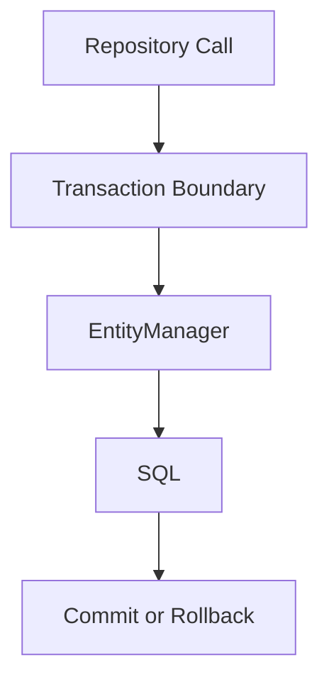

# Data Access One-Page Cheat Sheet

## Core Concepts

| Concept | Fast reminder |
|---|---|
| Repository | entry point for persistence access |
| `@Transactional` | unit-of-work boundary |
| Lazy loading | load relationships only when needed |
| JOIN FETCH / EntityGraph | make the fetch graph explicit |
| Dirty checking | Hibernate writes changed managed entities at flush/commit |

## Danger Table

| Smell | Risk |
|---|---|
| touching lazy collections after service returns | `LazyInitializationException` |
| looping over lazy associations | N+1 query explosion |
| eager loading everything | oversized queries and memory waste |
| writes inside read-only transactions | confusing or skipped persistence behavior |

## Python Bridge

| Java / Spring | Python mental model |
|---|---|
| JPA entity | SQLAlchemy ORM model |
| `@Transactional` | session / transaction unit of work |
| JOIN FETCH | `joinedload()` |
| EntityGraph | explicit loader strategy |

## Fast Rules

1. Fetch what the use case needs, not what the entity graph could possibly expose.
2. Keep transaction boundaries in the service layer.
3. Treat query count as a design concern, not only a performance afterthought.

## Interview Questions

1. Why is N+1 usually a query-design problem instead of an entity-definition problem?
2. When is lazy loading the right default, and when should you override it?
3. Why should transaction boundaries normally live in services instead of controllers?
