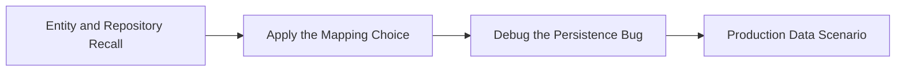

# Data Access Progressive Quiz Drill

Use this drill to confirm that JPA, transactions, and fetch planning feel predictable rather than mysterious.



## Round 1 - Core Recall

**Q1.** What problem does an ORM solve on top of raw JDBC?

**Q2.** Why is `@Transactional` important even when repository methods already exist?

**Q3.** What is the N+1 problem, and why does it appear even with correct entity mappings?

**Q4.** Why is lazy loading usually the safer default for large relationships?

## Round 2 - Apply and Compare

**Q5.** You need to show an order history page with customer and line items. Would you rely on ad-hoc lazy loading or define a fetch plan up front? Why?

**Q6.** You need to update two aggregates as one business action. Would you use two separate repository calls without a transaction or wrap the service method in `@Transactional`? Why?

**Q7.** A team wants every association to be `EAGER` because "it avoids lazy errors." Is that a good default? Explain.

## Round 3 - Debug the Bug

**Q8.** Why is this method risky?

```java
@Transactional(readOnly = true)
public void raiseSalary(Long id, BigDecimal salary) {
    Employee employee = repo.findById(id).orElseThrow();
    employee.setSalary(salary);
}
```

**Q9.** What causes the failure here?

```java
public OrderDto show(Long id) {
    Order order = repo.findById(id).orElseThrow();
    return new OrderDto(order.getItems().size());
}
```

The service method already returned and `items` is lazily loaded.

**Q10.** Why can this become a performance bug?

```java
List<Department> departments = repo.findAll();
for (Department department : departments) {
    department.getEmployees().size();
}
```

## Round 4 - Staff-Level Scenario

**Q11.** A service works in local tests but times out in production on a reporting endpoint. What fetch-plan and transaction questions would you ask first?

**Q12.** A team wants to "fix" all persistence bugs by turning on eager loading everywhere. What trade-offs would you highlight before approving that change?

---

## Answer Key

### Round 1 - Core Recall

**A1.** An ORM maps relational data to objects, handles identity and dirty checking, and reduces repetitive SQL boilerplate. It does not remove the need to understand transactions or query shape.

**A2.** `@Transactional` defines the unit of work. It ensures reads and writes happen with consistent database behavior and that commit or rollback happens at the right boundary.

**A3.** N+1 happens when one root query is followed by one additional query per related row, often because a lazy association is touched in a loop. The mapping can be correct and still perform badly.

**A4.** Lazy loading avoids pulling large graphs unless they are actually needed. That keeps default queries smaller and makes fetch decisions intentional.

### Round 2 - Apply and Compare

**A5.** Define the fetch plan up front. A reporting endpoint usually needs predictable query count and predictable latency, which means the repository or query should describe the graph clearly.

**A6.** Wrap the service method in `@Transactional`. The business action is one unit of work, so commit and rollback should apply to both changes together.

**A7.** No. Global eager loading often creates oversized queries, unnecessary joins, and memory waste. It trades one class of bug for a different class of performance problems.

### Round 3 - Debug the Bug

**A8.** The method is marked `readOnly = true` but performs a write. Depending on the provider and settings, dirty checking can be skipped or behavior becomes misleading. Write methods should use a normal write transaction.

**A9.** This is a lazy-loading boundary problem. Once the transaction/session is closed, Hibernate cannot initialize `items`, so you risk `LazyInitializationException`.

**A10.** The loop can trigger one extra query per department, which is the classic N+1 problem. It looks simple in code but becomes expensive in production.

### Round 4 - Staff-Level Scenario

**A11.** Ask what the repository query looks like, whether the endpoint touches lazy associations in loops, whether a transaction remains open for the read, and whether DTO mapping is accidentally triggering extra loads.

**A12.** Eager loading can hide lazy exceptions while creating large joins, duplicated row data, memory pressure, and unpredictable endpoint cost. It is usually better to fix fetch plans per use case.
