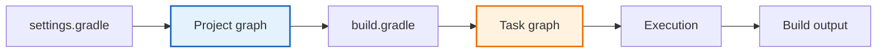

# 01 - Gradle Basics

## Overview

This sub-module covers the foundational concepts of Gradle that every Spring Boot developer must understand. You will learn how Gradle structures builds, manages dependencies, and orchestrates tasks, and how all of this compares to the Python tools you already know.

## Build Flow

## Python Bridge

| Gradle Concept | Python Equivalent | Why It Matters |
|---|---|---|
| `build.gradle` | `pyproject.toml` / `setup.py` | Declares how the project is built |
| `./gradlew test` | `pytest` | Runs the test suite |
| `./gradlew bootRun` | `uvicorn main:app --reload` | Starts the app during development |
| `dependencyInsight` | `pip show` + lockfile inspection | Answers "why is this library present?" |
| `gradle-wrapper.properties` | `poetry.lock` / `pyenv` pinning | Makes builds reproducible |

The key difference is that Gradle actively builds a task graph and enforces dependency resolution rules, while Python workflows often rely on a more manual mix of tooling.

## Core Concepts Covered

1. What is Gradle? - Gradle vs Maven vs pip/poetry; why the Spring ecosystem chose Gradle
2. The Gradle Wrapper - Why `gradlew` is committed to Git and how it guarantees reproducible builds
3. Build Lifecycle - The three phases: Initialization -> Configuration -> Execution
4. Tasks - The build task DAG, built-in tasks, and how `./gradlew bootRun` works
5. Dependencies - Scopes (`implementation`, `testImplementation`, `runtimeOnly`) and repositories
6. Multi-Module Projects - `settings.gradle`, `include`, and shared dependency blocks
7. Dependency Management - BOM (Bill of Materials) and the Spring dependency-management plugin
8. Build Health - `dependencies`, `dependencyInsight`, wrapper updates, and dependency drift checks

## Structure

- `explanation/` - Deep-dive markdown files for each concept, with Mermaid diagrams and Python comparisons
- `explanation/08-dependency-health.md` - Build hygiene, wrapper checks, and dependency drift inspection
- `exercises/` - Hands-on tasks to build custom Gradle configurations
- `resources/` - Quiz drill, cheat sheet, and curated external resource guide

## Support Pack

- [progressive-quiz-drill.md](resources/progressive-quiz-drill.md)
- [one-page-cheat-sheet.md](resources/one-page-cheat-sheet.md)
- [top-resource-guide.md](resources/top-resource-guide.md)

## Mindmap

See [MINDMAP.md](MINDMAP.md) for a visual overview of all Gradle Basics concepts.
