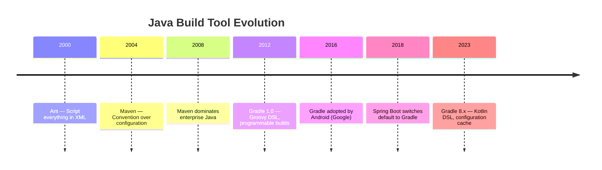
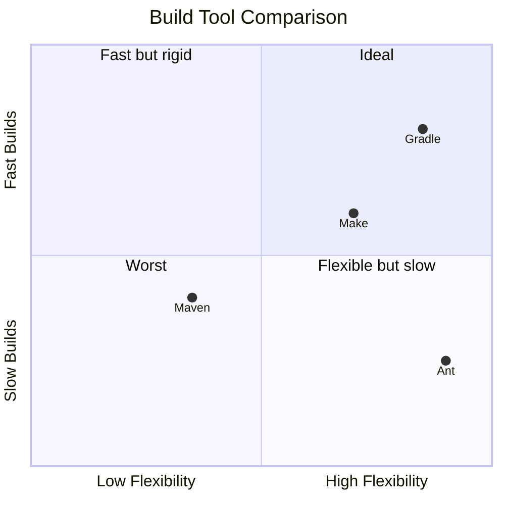

# What is Gradle?

Gradle is a modern, open-source build automation tool that replaced Apache Maven as the standard for Java projects. Spring Boot, Android, Netflix, and LinkedIn all use Gradle as their primary build system.

## Why Gradle Exists

Before Gradle, Java projects used:
1. **Ant** (2000) — XML-based, zero conventions, you script everything manually.
2. **Maven** (2004) — XML-based, heavy conventions ("convention over configuration"). Your `pom.xml` can reach 500+ lines for a moderately complex project.
3. **Gradle** (2012) — Uses an actual programming language (Groovy or Kotlin DSL) instead of XML. Supports incremental builds, build caching, and parallel execution out of the box.

## Gradle vs Maven: The Key Differences

| Feature | Maven | Gradle |
|---|---|---|
| Config language | XML (`pom.xml`) | Groovy/Kotlin DSL (`build.gradle`) |
| Readability | Verbose, hundreds of XML lines | Concise, ~30 lines for typical project |
| Incremental builds | No (always rebuilds everything) | Yes (only rebuilds what changed) |
| Build cache | No | Yes (local + remote) |
| Parallel execution | Limited | Full parallel by default |
| Customization | Requires writing Maven plugins | Inline Groovy/Kotlin code |
| Dependency resolution | Nearest-wins (can hide conflicts) | Fails-on-conflict (safer) |

## Python Comparison

If you come from Python, here is how the tools map:

| Gradle Concept | Python Equivalent |
|---|---|
| `build.gradle` | `pyproject.toml` / `setup.py` |
| `./gradlew build` | `pip install -e .` + `pytest` |
| `repositories { mavenCentral() }` | PyPI (default in pip) |
| `implementation 'group:artifact:version'` | `dependency = "^1.0"` in poetry |
| `./gradlew test` | `pytest` |
| `./gradlew bootRun` | `uvicorn main:app --reload` |
| Gradle Wrapper (`gradlew`) | No direct equivalent; closest is `pipenv run` |
| Multi-module `settings.gradle` | Monorepo with `pip install -e ./subpackage` |

The biggest mental shift: **In Python, the build tool is mostly passive** (pip installs dependencies and that's it). **In Java/Gradle, the build tool actively compiles, tests, packages, and deploys** — it's a full pipeline orchestrator.

## Core Terminology

- **Project**: A Gradle build unit. One `build.gradle` file = one project.
- **Task**: A single unit of work (compile, test, package). Tasks form a **Directed Acyclic Graph (DAG)**.
- **Plugin**: Adds tasks and conventions to your project. `java` plugin adds `compileJava`, `test`, `jar` tasks.
- **Dependency**: A library your project needs. Gradle downloads it from a **repository** (like Maven Central).
- **Configuration**: A named bucket of dependencies (e.g., `implementation`, `testImplementation`).

## Interview Questions

### Conceptual

**Q1: Why did the Spring Boot team switch from Maven to Gradle as the default build tool?**
> Gradle provides incremental compilation (only recompiling changed files), build caching (reusing outputs from previous builds), and parallel task execution. For large enterprise projects with hundreds of modules, these features reduce build times from minutes to seconds. Maven rebuilds everything on every run.

**Q2: What is the fundamental difference between Maven's XML approach and Gradle's DSL approach?**
> Maven's `pom.xml` is a declarative data format — you describe *what* you want, but cannot express *logic*. Gradle's `build.gradle` is executable code (Groovy or Kotlin). You can write `if` statements, loops, and custom functions directly in your build file. This makes Gradle infinitely more flexible for complex build scenarios.

### Scenario/Debug

**Q3: Your team's Maven build takes 8 minutes. Switching to Gradle with the same code reduces it to 90 seconds. What explains this?**
> Three mechanisms: (1) Incremental compilation — Gradle only recompiles Java files that actually changed, while Maven recompiles everything. (2) Build cache — Gradle stores task outputs and reuses them if inputs haven't changed. (3) Parallel execution — Gradle runs independent tasks concurrently, while Maven processes modules sequentially by default.

### Quick Fire

**Q4: What file extension does Gradle use for its build script?**
> `build.gradle` (Groovy DSL) or `build.gradle.kts` (Kotlin DSL).

**Q5: What is the Gradle equivalent of Maven's `pom.xml`?**
> `build.gradle` (for project configuration) and `settings.gradle` (for multi-module project structure).
