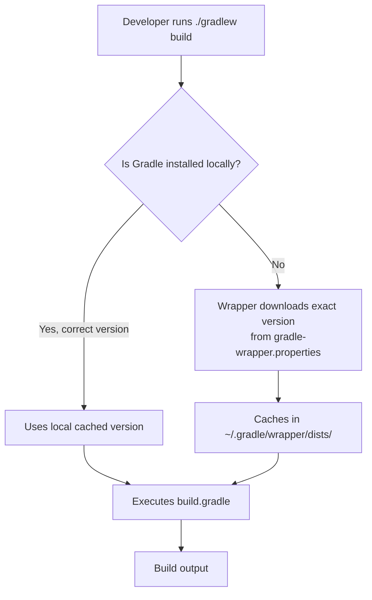

# The Gradle Wrapper

The Gradle Wrapper is one of the most important yet overlooked concepts for team development. It ensures that every developer, CI server, and deployment pipeline uses the **exact same Gradle version** — without requiring a global Gradle installation.

## The Problem Without a Wrapper

Imagine a team of 5 developers:
- Developer A has Gradle 7.6 installed globally.
- Developer B has Gradle 8.2.
- The CI server has Gradle 8.0.

The same `build.gradle` file can produce different results on different machines because Gradle APIs evolve between versions. Build breakage becomes unpredictable and impossible to debug.

## How the Wrapper Works



When you run `./gradlew build` (Linux/Mac) or `gradlew.bat build` (Windows), the wrapper script:

1. Reads `gradle/wrapper/gradle-wrapper.properties` to find the exact Gradle distribution URL.
2. Downloads that specific Gradle version if not already cached at `~/.gradle/wrapper/dists/`.
3. Executes your build with that exact version.

## The Wrapper Files

```
your-project/
├── gradlew                          ← Shell script (Linux/Mac)
├── gradlew.bat                      ← Batch script (Windows)
└── gradle/
    └── wrapper/
        ├── gradle-wrapper.jar       ← Tiny bootstrap JAR that downloads Gradle
        └── gradle-wrapper.properties ← Pins the exact Gradle version
```

The `gradle-wrapper.properties` file looks like:

```properties
distributionUrl=https\://services.gradle.org/distributions/gradle-8.5-bin.zip
distributionBase=GRADLE_USER_HOME
distributionPath=wrapper/dists
```

**Critical Rule**: All four files (`gradlew`, `gradlew.bat`, `gradle-wrapper.jar`, `gradle-wrapper.properties`) **must be committed to Git**. This is not optional.

## Python Comparison

Python has no direct equivalent to the Gradle Wrapper. The closest concepts:

| Gradle Wrapper | Python Equivalent |
|---|---|
| Pins exact build tool version | `poetry.lock` pins dependency versions (but not pip itself) |
| Auto-downloads correct version | `pyenv` can install specific Python versions |
| `./gradlew` script | `pipenv run` / `poetry run` prefix |
| No global install needed | Python itself must be installed globally |

The key difference: In Python, you must manually ensure the correct Python version is installed. The Gradle Wrapper completely automates this — a fresh machine with only a JDK can clone your repo and run `./gradlew build` immediately, and Gradle will download itself.

## Generating the Wrapper

If you need to generate the wrapper for a new project:

```bash
# Must have Gradle installed globally (one-time only)
gradle wrapper --gradle-version 8.5

# This creates all 4 wrapper files
# After this, never use global 'gradle' again — always use './gradlew'
```

To upgrade the wrapper version in an existing project:

```bash
./gradlew wrapper --gradle-version 8.7
```

## Interview Questions

### Conceptual

**Q1: Why should the Gradle Wrapper files be committed to version control?**
> The wrapper ensures every developer, CI server, and production build uses the identical Gradle version. Without it, different environments may have different Gradle versions installed globally, leading to inconsistent build behavior, API incompatibilities, and broken builds that work on one machine but fail on another.

**Q2: What happens when you run `./gradlew build` for the first time on a machine that has never used Gradle?**
> The `gradlew` shell script executes the `gradle-wrapper.jar` bootstrap program. This reads `gradle-wrapper.properties` to find the distribution URL, downloads the exact Gradle distribution ZIP, extracts it to `~/.gradle/wrapper/dists/`, and then runs the build using that downloaded Gradle installation.

### Scenario/Debug

**Q3: A new team member clones your repo and runs `gradle build` (without the `./gradlew` prefix). The build fails with API errors. Why?**
> They used their globally installed Gradle version, which may differ from the version pinned in your wrapper. The fix is to always use `./gradlew build` instead of `gradle build`. The wrapper guarantees the correct version.

### Quick Fire

**Q4: What is the minimum JDK requirement to use the Gradle Wrapper?**
> A JDK must be installed (the wrapper downloads Gradle, not Java). For Gradle 8.x, JDK 8+ is required; for Spring Boot 3.x projects, JDK 17+ is required.

**Q5: Where does the Gradle Wrapper cache downloaded distributions?**
> `~/.gradle/wrapper/dists/` in the user's home directory.
