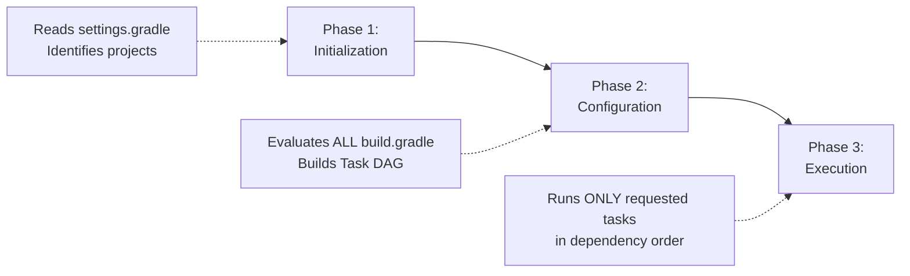
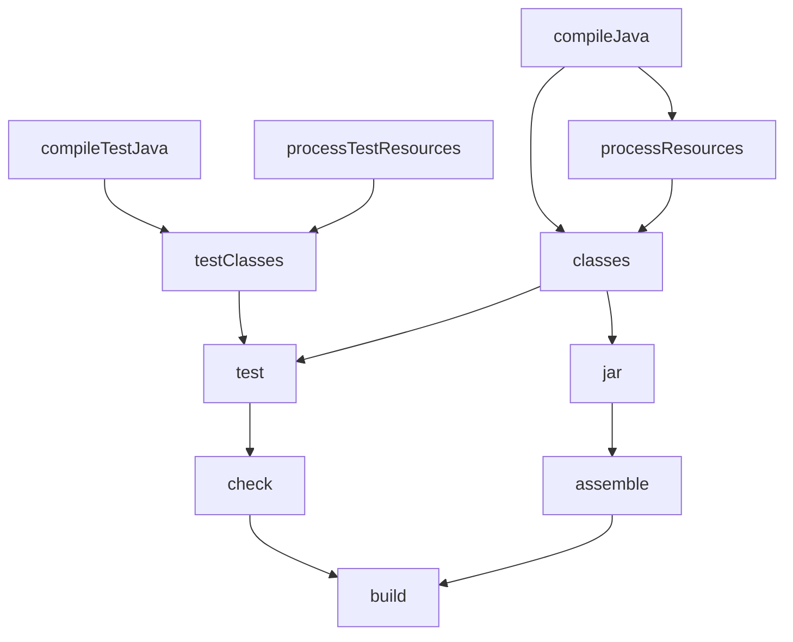

# Gradle Build Lifecycle

Understanding the three-phase build lifecycle is essential for debugging Gradle issues. Every single Gradle build, no matter how simple, follows this exact sequence.

## The Three Phases



### Phase 1: Initialization

Gradle reads `settings.gradle` to determine:
- The root project name.
- Which sub-projects participate in this build (via `include` statements).

```groovy
// settings.gradle
rootProject.name = 'spring-mastery'
include 'common-lib'
include 'web-app'
include 'batch-processor'
```

At the end of this phase, Gradle knows: "I have 4 projects to build (root + 3 modules)."

### Phase 2: Configuration

Gradle evaluates **every** `build.gradle` file for every participating project — even if you only asked to build one module. This is because Gradle must construct the complete **Task Dependency Graph (DAG)** to determine the correct execution order.

```groovy
// build.gradle
plugins {
    id 'java'
    id 'org.springframework.boot' version '3.2.0'
}

// This code runs DURING CONFIGURATION — not during execution!
dependencies {
    implementation 'org.springframework.boot:spring-boot-starter-web'
}

// This registers a task — the task body runs during EXECUTION
task hello {
    doLast {
        println 'Hello from execution phase!'
    }
}

// THIS runs during configuration — common mistake!
println 'This prints during configuration, not execution!'
```

**Architect Trap**: Code placed directly in `build.gradle` (outside a `doLast`/`doFirst` block) runs during **configuration**, not execution. This is the most common Gradle misunderstanding.

### Phase 3: Execution

Gradle takes the task DAG, identifies which tasks you requested (e.g., `build`), computes all their transitive dependencies, and executes them in topological order.



When you run `./gradlew build`, Gradle walks this graph and executes tasks bottom-up.

## Python Comparison

Python has no build lifecycle. Here's the mental mapping:

| Gradle Phase | Python Equivalent |
|---|---|
| Initialization | No equivalent — Python has no project graph |
| Configuration | Reading `pyproject.toml` / `setup.cfg` |
| Execution | Running `pytest`, `python -m build`, etc. |
| Task DAG | `Makefile` targets with dependencies |
| `doLast {}` block | Body of a `make` target |

The key difference: **In Python, each tool runs independently** (pip, pytest, build). In Gradle, **one tool orchestrates everything** through a dependency graph of tasks.

## The DAG Visualizer

You can print the task graph to understand dependencies:

```bash
# See all tasks available
./gradlew tasks --all

# See dependencies of a specific task
./gradlew build --dry-run
# Output: :compileJava SKIPPED, :processResources SKIPPED, :classes SKIPPED, ...
```

## Interview Questions

### Conceptual

**Q1: What are the three phases of the Gradle build lifecycle, and what happens in each?**
> (1) **Initialization**: Gradle reads `settings.gradle` to discover all participating projects. (2) **Configuration**: Gradle evaluates every `build.gradle` file and constructs the Task DAG (Directed Acyclic Graph). (3) **Execution**: Gradle runs only the requested tasks in their correct dependency order.

**Q2: Why does Gradle evaluate ALL build.gradle files even if you only run a task in one module?**
> Because tasks can depend on tasks in other modules (e.g., `web-app:build` may depend on `common-lib:jar`). Gradle must construct the complete dependency graph before execution to determine the correct order and detect circular dependencies.

### Scenario/Debug

**Q3: You have `println("Hello")` at the top level of your `build.gradle`. It prints every time you run ANY Gradle command, even `./gradlew help`. Why?**
> Top-level code in `build.gradle` executes during the **Configuration Phase**, which runs for every Gradle invocation. To make code run only during task execution, it must be inside a `doLast {}` or `doFirst {}` block within a task definition.

**Q4: A developer adds a task that depends on another task, but sometimes the dependency task runs before it, and sometimes after. What could cause non-deterministic ordering?**
> The developer likely used `mustRunAfter` (which is a suggestion, not a hard constraint) instead of `dependsOn` (which enforces ordering). Only `dependsOn` creates a true edge in the task DAG.

### Quick Fire

**Q5: What Gradle file determines which projects participate in a multi-module build?**
> `settings.gradle`

**Q6: What does `--dry-run` do when passed to a Gradle command?**
> It prints the task execution order without actually executing any tasks. Useful for debugging the task DAG.
