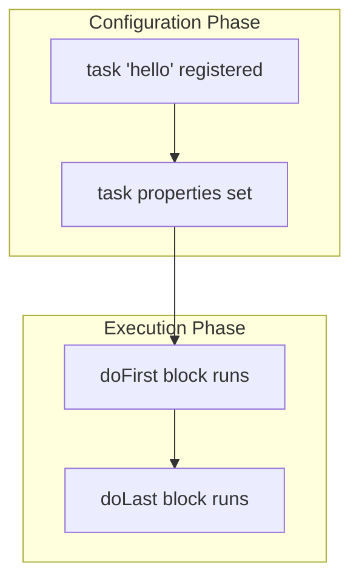
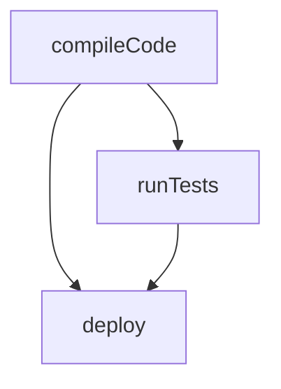

# Gradle Tasks

Tasks are the fundamental units of work in Gradle. When you run `./gradlew build`, you are executing a **task** named `build`, which depends on dozens of other tasks that are executed in a specific order determined by the Task DAG (Directed Acyclic Graph).

## How Tasks Work

Every Gradle task follows this pattern:
1. **Registration**: The task is registered during the Configuration Phase.
2. **Configuration**: The task's properties are set (inputs, outputs, dependencies).
3. **Execution**: The task's action (`doLast`/`doFirst`) runs during the Execution Phase.



## Built-in Tasks (Java Plugin)

When you apply the `java` plugin, Gradle automatically registers these tasks:

| Task | What It Does | Python Equivalent |
|---|---|---|
| `compileJava` | Compiles `.java` → `.class` files | No equivalent (Python is interpreted) |
| `processResources` | Copies resources to build dir | N/A |
| `classes` | Depends on `compileJava` + `processResources` | N/A |
| `jar` | Packages `.class` files into a JAR archive | `python -m build` → `.whl` |
| `test` | Runs JUnit tests | `pytest` |
| `build` | Runs `assemble` + `check` (full build) | `make all` |
| `clean` | Deletes the `build/` directory | `rm -rf dist/ build/` |
| `dependencies` | Prints the dependency tree | `pip list` / `pipdeptree` |

## Spring Boot Plugin Tasks

When you apply the `org.springframework.boot` plugin, extra tasks become available:

| Task | What It Does | Python Equivalent |
|---|---|---|
| `bootRun` | Runs the Spring Boot app with hot reload | `uvicorn main:app --reload` |
| `bootJar` | Creates an executable fat JAR | `pyinstaller` (loosely) |
| `bootBuildImage` | Builds a Docker image via Cloud Native Buildpacks | `docker build .` |

## Writing Custom Tasks

```groovy
// Simple custom task
task hello {
    description = 'Prints a greeting'
    group = 'Custom'

    doLast {
        println 'Hello from Gradle!'
    }
}

// Task with inputs/outputs for incremental support
task generateVersion {
    def outputFile = file("$buildDir/version.txt")
    outputs.file(outputFile)

    doLast {
        outputFile.text = "Version: ${project.version}\nBuild time: ${new Date()}"
    }
}
```

Run custom tasks:
```bash
./gradlew hello
./gradlew generateVersion
```

## Task Dependencies

Tasks can declare dependencies on other tasks:

```groovy
task compileCode {
    doLast { println 'Compiling...' }
}

task runTests(dependsOn: compileCode) {
    doLast { println 'Testing...' }
}

task deploy(dependsOn: [compileCode, runTests]) {
    doLast { println 'Deploying...' }
}
```



### Ordering Constraints

| Keyword | Behavior |
|---|---|
| `dependsOn` | Hard requirement — target runs before this task |
| `mustRunAfter` | If both tasks run, this one runs second (but doesn't force the other to run) |
| `shouldRunAfter` | Soft hint — Gradle prefers this order but may ignore it |
| `finalizedBy` | Target runs after this task, even if this task fails |

## Python Comparison

| Gradle Tasks | Python Equivalent |
|---|---|
| `task hello { doLast { ... } }` | A `make` target in `Makefile` |
| `dependsOn` | Target prerequisites in `Makefile` |
| `./gradlew tasks` | `make help` (if you set it up) |
| Task DAG (auto-ordering) | No equivalent — Python scripts run linearly |
| Incremental build (inputs/outputs) | No real equivalent in Python build tools |

## Interview Questions

### Conceptual

**Q1: What is the difference between code placed directly in a task block vs inside `doLast {}`?**
> Code directly in the task block runs during the **Configuration Phase** (every build invocation). Code inside `doLast {}` runs during the **Execution Phase** (only when the task is actually executed). This distinction is critical for performance and correctness.

**Q2: What is the Task DAG, and why does Gradle use it?**
> DAG stands for Directed Acyclic Graph. Gradle builds a graph of all tasks with their dependencies. This allows Gradle to determine the correct execution order, detect circular dependencies, and enable parallel execution of independent tasks.

### Scenario/Debug

**Q3: You write a custom task that reads a database connection string. This string is printed even when you run `./gradlew clean`. Why?**
> The database read is in the task configuration block (not inside `doLast {}`), so it runs during the Configuration Phase on every Gradle invocation. Move the read into a `doLast {}` block to execute it only when the task runs.

### Quick Fire

**Q4: How do you list all available tasks in a Gradle project?**
> `./gradlew tasks --all`

**Q5: What does `dependsOn` do?**
> It declares that the current task requires another task to complete before it can execute.
