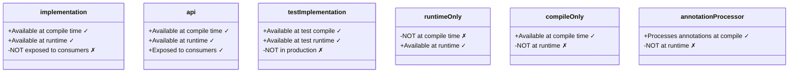

# Gradle Dependencies

Dependencies are external libraries your project needs. Gradle's dependency management is one of its strongest features — it resolves transitive dependencies, handles version conflicts, and supports multiple dependency scopes.

## Declaring Dependencies

```groovy
// build.gradle
repositories {
    mavenCentral()    // The primary public Java package registry (like PyPI for Python)
}

dependencies {
    // Scope       'group:artifact:version'
    implementation 'org.springframework.boot:spring-boot-starter-web:3.2.0'
    testImplementation 'org.springframework.boot:spring-boot-starter-test:3.2.0'
    runtimeOnly 'org.postgresql:postgresql:42.7.0'
    compileOnly 'org.projectlombok:lombok:1.18.30'
    annotationProcessor 'org.projectlombok:lombok:1.18.30'
}
```

## Dependency Scopes (Configurations)

Understanding scopes is critical. Each scope controls **when** a dependency is available:



| Scope | Compile | Runtime | Exposed to Consumers | Use Case |
|---|---|---|---|---|
| `implementation` | ✓ | ✓ | ✗ | Default for most libraries |
| `api` | ✓ | ✓ | ✓ | Library modules that expose types |
| `testImplementation` | ✓ (tests) | ✓ (tests) | ✗ | JUnit, Mockito, test helpers |
| `runtimeOnly` | ✗ | ✓ | ✗ | JDBC drivers, logging backends |
| `compileOnly` | ✓ | ✗ | ✗ | Lombok, Servlet API (provided by container) |
| `annotationProcessor` | ✓ (APT) | ✗ | ✗ | Lombok, MapStruct processors |

### Why `implementation` vs `api` Matters

In a multi-module project:

```
web-app → common-lib → jackson-databind
```

If `common-lib` declares `jackson-databind` as `implementation`, then `web-app` **cannot** see Jackson classes. If declared as `api`, `web-app` **can** use Jackson directly.

**Rule of thumb**: Use `implementation` by default. Only use `api` when your module's public API exposes types from the dependency.

## Transitive Dependencies

When you depend on `spring-boot-starter-web`, it brings in:
- `spring-web`
- `spring-webmvc`
- `spring-boot-starter-tomcat`
- `jackson-databind`
- ...and more

You can inspect the full tree:

```bash
./gradlew dependencies --configuration runtimeClasspath
```

## Python Comparison

| Gradle Concept | Python Equivalent |
|---|---|
| `repositories { mavenCentral() }` | PyPI (implicit in pip) |
| `implementation 'group:artifact:version'` | `dependency = "^1.0"` in `pyproject.toml` |
| `testImplementation` | `[tool.pytest.ini_options]` / `dev-dependencies` in Poetry |
| `runtimeOnly` | No direct equivalent |
| `compileOnly` | No equivalent (Python has no compile phase) |
| `./gradlew dependencies` | `pipdeptree` or `pip list` |
| Transitive deps resolved automatically | pip resolves transitive deps (but less reliably) |
| Version conflict → build fails | pip uses "first wins" (can silently break) |

## Version Conflict Resolution

Gradle is strict about version conflicts:

```groovy
// Force a specific version
configurations.all {
    resolutionStrategy {
        force 'com.google.guava:guava:32.1.3-jre'
    }
}

// Fail on conflicts instead of silently resolving
configurations.all {
    resolutionStrategy {
        failOnVersionConflict()
    }
}
```

## Interview Questions

### Conceptual

**Q1: What is the difference between `implementation` and `api` dependency scopes?**
> `implementation` hides the dependency from downstream consumers — only the declaring module can use its classes. `api` exposes the dependency to consumers. `implementation` provides better encapsulation and faster recompilation because changes to internal dependencies don't trigger recompilation of consumer modules.

**Q2: Why should JDBC drivers (like PostgreSQL) use `runtimeOnly` scope?**
> Your code never directly references JDBC driver classes — you use the JDBC API (interfaces). The actual driver class is loaded at runtime via `Class.forName()` or service discovery. Making it `runtimeOnly` prevents accidental coupling to a specific driver at compile time.

### Scenario/Debug

**Q3: Your multi-module project compiles fine, but at runtime you get `ClassNotFoundException` for a library class. What scope issue might cause this?**
> The library is declared as `compileOnly`, which makes it available during compilation but excludes it from the runtime classpath. Change it to `implementation` if the class is needed at runtime, or ensure the runtime container provides it (e.g., Servlet API on Tomcat).

### Quick Fire

**Q4: What command shows the full dependency tree for a Gradle project?**
> `./gradlew dependencies`

**Q5: What is the default scope for most dependencies in a Spring Boot project?**
> `implementation` — available at both compile time and runtime, but not exposed to consumer modules.
