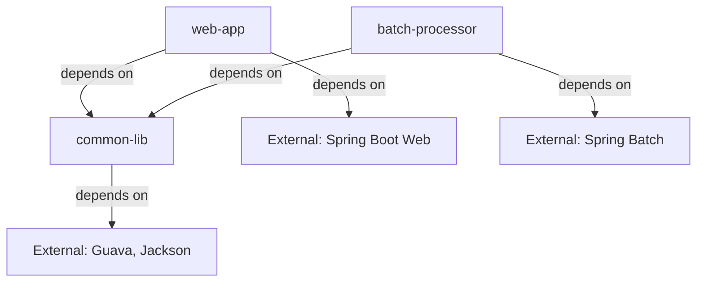

# Multi-Module Gradle Projects

Real-world Spring Boot applications rarely consist of a single module. Enterprise projects typically split code into multiple modules: a shared library, a web API, a batch processor, and more. Gradle's multi-module support makes this seamless.

## Why Multi-Module?

| Concern | Single Module | Multi-Module |
|---|---|---|
| Build time | Recompiles everything | Only recompiles changed modules |
| Code reuse | Copy-paste between projects | Shared `common-lib` module |
| Team ownership | Everyone touches everything | Each team owns a module |
| Deployment | Deploy entire monolith | Deploy individual services |
| Testing | All tests run together | Run module-specific tests |

## Project Structure

```
spring-mastery/                     ← Root project
├── settings.gradle                 ← Declares all modules
├── build.gradle                    ← Shared configuration
├── common-lib/                     ← Shared code module
│   ├── build.gradle
│   └── src/main/java/...
├── web-app/                        ← Spring Boot web application
│   ├── build.gradle
│   └── src/main/java/...
└── batch-processor/                ← Background job processor
    ├── build.gradle
    └── src/main/java/...
```

## The `settings.gradle` File

This file is the **entry point** for multi-module builds. It tells Gradle which directories are sub-projects:

```groovy
// settings.gradle
rootProject.name = 'spring-mastery'
include 'common-lib'
include 'web-app'
include 'batch-processor'
```

## Root `build.gradle`

The root build file configures shared settings across all modules:

```groovy
// Root build.gradle
plugins {
    id 'java'
}

// Applied to ALL projects (root + sub-projects)
allprojects {
    group = 'com.learning'
    version = '1.0.0'

    repositories {
        mavenCentral()
    }
}

// Applied to only sub-projects (not root)
subprojects {
    apply plugin: 'java'

    java {
        sourceCompatibility = JavaVersion.VERSION_21
        targetCompatibility = JavaVersion.VERSION_21
    }

    dependencies {
        testImplementation 'org.junit.jupiter:junit-jupiter:5.10.0'
    }

    test {
        useJUnitPlatform()
    }
}
```

## Inter-Module Dependencies

Modules can depend on each other using `project(':module-name')`:

```groovy
// web-app/build.gradle
plugins {
    id 'org.springframework.boot' version '3.2.0'
    id 'io.spring.dependency-management' version '1.1.4'
}

dependencies {
    // This module depends on common-lib
    implementation project(':common-lib')

    implementation 'org.springframework.boot:spring-boot-starter-web'
}
```



## `allprojects` vs `subprojects`

| Block | Applies To | Use Case |
|---|---|---|
| `allprojects {}` | Root + all sub-projects | Repositories, group, version |
| `subprojects {}` | Only sub-projects (not root) | Java plugin, shared dependencies |
| Individual `build.gradle` | That specific module | Module-specific plugins and deps |

## Python Comparison

| Gradle Multi-Module | Python Equivalent |
|---|---|
| `settings.gradle` with `include` | No standard — manually managed paths |
| `project(':common-lib')` | `pip install -e ../common-lib` |
| `allprojects {}` | Shared `pyproject.toml` (not standardized) |
| `subprojects {}` | No equivalent |
| Root `build.gradle` | Root `Makefile` in monorepo |
| Module-specific `build.gradle` | Each package's `setup.py` / `pyproject.toml` |

Python's monorepo story is fragmented. Tools like `pants`, `bazel`, and `nx` try to solve it, but none have the same native integration Gradle provides.

## Common Commands for Multi-Module

```bash
# Build everything
./gradlew build

# Build only one module
./gradlew :web-app:build

# Run tests for one module
./gradlew :common-lib:test

# See the project structure
./gradlew projects

# See dependencies for a module
./gradlew :web-app:dependencies
```

## Interview Questions

### Conceptual

**Q1: What is the difference between `allprojects` and `subprojects` in the root build.gradle?**
> `allprojects` applies configuration to the root project AND all sub-projects. `subprojects` applies only to sub-projects, excluding the root. Use `allprojects` for universal settings (repositories, group, version) and `subprojects` for module-specific conventions (Java plugin, shared test dependencies).

**Q2: How does Gradle resolve inter-module dependencies like `project(':common-lib')`?**
> During the Configuration Phase, Gradle reads `settings.gradle` to discover all modules. When one module depends on another via `project(':common-lib')`, Gradle adds an edge in the task DAG ensuring `common-lib:jar` runs before the dependent module's compilation. The dependency is resolved from the build output, not from a remote repository.

### Scenario/Debug

**Q3: You run `./gradlew :web-app:build` but get a compilation error because `common-lib` hasn't been compiled yet. What's wrong?**
> The `web-app/build.gradle` is missing `implementation project(':common-lib')` in its dependencies block. Without this declaration, Gradle won't build `common-lib` first. Adding the `project()` dependency creates the necessary task ordering.

### Quick Fire

**Q4: What command runs only the tests for the `batch-processor` module?**
> `./gradlew :batch-processor:test`

**Q5: Where do you declare which directories are Gradle sub-projects?**
> In the `settings.gradle` file, using `include 'module-name'` statements.
