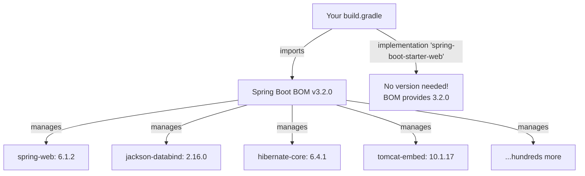

# Dependency Management & BOM

As your Spring Boot project grows, managing dependency versions across dozens of libraries becomes a nightmare. The **Spring dependency-management plugin** and **Bill of Materials (BOM)** solve this by centralizing version control.

## The Version Hell Problem

Without dependency management:

```groovy
dependencies {
    implementation 'org.springframework.boot:spring-boot-starter-web:3.2.0'
    implementation 'org.springframework.boot:spring-boot-starter-data-jpa:3.2.1'  // Version mismatch!
    implementation 'org.springframework.boot:spring-boot-starter-security:3.1.5'  // Even worse!
    implementation 'com.fasterxml.jackson.core:jackson-databind:2.15.3'           // Compatible?
}
```

These libraries have deep internal dependencies on each other. Mismatched versions can cause runtime `NoSuchMethodError`, `ClassNotFoundException`, or subtle behavioral bugs.

## The BOM (Bill of Materials) Solution

A **BOM** is a special POM file that declares verified-compatible versions of dozens of related libraries. You import the BOM once and then declare dependencies **without specifying versions**.



## The Spring dependency-management Plugin

```groovy
// build.gradle
plugins {
    id 'java'
    id 'org.springframework.boot' version '3.2.0'
    id 'io.spring.dependency-management' version '1.1.4'  // The BOM manager
}

repositories {
    mavenCentral()
}

dependencies {
    // No version numbers! The BOM handles it
    implementation 'org.springframework.boot:spring-boot-starter-web'
    implementation 'org.springframework.boot:spring-boot-starter-data-jpa'
    implementation 'org.springframework.boot:spring-boot-starter-security'
    
    // Even transitive libraries are managed
    implementation 'com.fasterxml.jackson.core:jackson-databind'
    
    // Only need explicit versions for non-Spring libraries
    implementation 'com.google.guava:guava:32.1.3-jre'
    
    runtimeOnly 'org.postgresql:postgresql'  // Version managed by BOM!
    testImplementation 'org.springframework.boot:spring-boot-starter-test'
}
```

## Importing External BOMs

You can import additional BOMs for non-Spring libraries:

```groovy
dependencyManagement {
    imports {
        mavenBom 'software.amazon.awssdk:bom:2.21.0'
    }
}

dependencies {
    implementation 'software.amazon.awssdk:s3'      // Version from AWS BOM
    implementation 'software.amazon.awssdk:dynamodb' // Version from AWS BOM
}
```

## Overriding Managed Versions

Sometimes you need a specific version that differs from the BOM:

```groovy
// Method 1: ext property (Spring Boot convention)
ext['jackson.version'] = '2.16.1'

// Method 2: Explicit version on dependency (always wins)
dependencies {
    implementation 'com.fasterxml.jackson.core:jackson-databind:2.16.1'
}

// Method 3: dependencyManagement block
dependencyManagement {
    dependencies {
        dependency 'com.google.guava:guava:32.1.3-jre'
    }
}
```

## Python Comparison

| Gradle BOM | Python Equivalent |
|---|---|
| BOM (Bill of Materials) | No direct equivalent |
| `io.spring.dependency-management` plugin | `pip-compile` / Poetry lock file (partially) |
| Version-less declarations | Version constraints in `pyproject.toml` |
| BOM ensures compatible versions | No automated compatibility checking in pip |
| Override a managed version | Pin a specific version in `requirements.txt` |

Python lacks a true BOM concept. The closest is Poetry's lock file, which pins all transitive versions — but it doesn't guarantee that the locked versions have been tested together by the framework authors. Spring's BOM provides **vendor-verified compatibility**, which is a stronger guarantee.

## Interview Questions

### Conceptual

**Q1: What is a BOM (Bill of Materials) in Gradle, and why does Spring Boot use one?**
> A BOM is a special dependency descriptor that centralizes version management for a set of related libraries. Spring Boot's BOM declares verified-compatible versions of hundreds of libraries (Spring, Hibernate, Jackson, Tomcat, etc.). By importing the BOM, developers declare dependencies without specifying versions, eliminating version mismatches.

**Q2: What is the role of the `io.spring.dependency-management` plugin?**
> This Gradle plugin applies the Maven BOM concept to Gradle builds. It reads the BOM POM, extracts version information, and automatically applies those versions to dependencies declared without explicit versions. Without this plugin, you would need to specify versions for every dependency manually.

### Scenario/Debug

**Q3: You upgrade Spring Boot from 3.1 to 3.2 in your `build.gradle`. Jackson suddenly breaks at runtime with `NoSuchMethodError`. What happened?**
> The BOM upgraded Jackson to a new version that has a breaking API change. If your code (or a non-managed library) depends on the old Jackson API, the new BOM-managed version causes the conflict. Fix by either adapting your code or overriding the Jackson version via `ext['jackson.version']`.

### Quick Fire

**Q4: How do you declare a Spring Boot dependency without specifying a version?**
> Import the Spring Boot BOM via the `org.springframework.boot` and `io.spring.dependency-management` plugins, then declare `implementation 'org.springframework.boot:spring-boot-starter-web'` without a version.

**Q5: Can you import multiple BOMs in a single project?**
> Yes — use the `dependencyManagement { imports { mavenBom '...' } }` block to import BOMs from different vendors (e.g., Spring BOM + AWS BOM).
