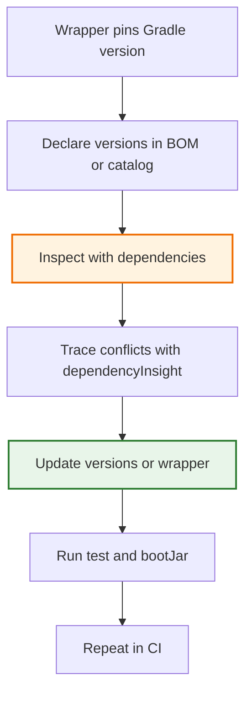

# Dependency Health and Build Hygiene

Gradle projects age in one of two ways: either they stay healthy, reproducible, and easy to upgrade, or they slowly accumulate version drift, hidden conflicts, and CI surprises. This topic exists to keep the build healthy on purpose.

## Python Bridge

| Gradle Concern | Python Equivalent | Why It Helps |
|---|---|---|
| Gradle Wrapper | `pyenv` or pinned Poetry environment | Guarantees the same tool version everywhere |
| `dependencies` task | `pip list` / `pipdeptree` | Shows what is installed and why |
| `dependencyInsight` | Manual lockfile inspection | Explains why a transitive dependency exists |
| BOM / version catalog | `requirements.in` + `pip-compile` | Centralizes dependency versions |
| `dependencyUpdates` | `pip list --outdated` | Finds newer dependency versions |

Python workflows often lean on environment pinning and lockfiles. Gradle adds stronger build-level visibility, so you can inspect the dependency graph and fix version drift before it breaks production.

## Build Health Loop



## What To Check First

1. The wrapper version in `gradle-wrapper.properties`.
2. The dependency source of truth, usually a BOM or version catalog.
3. The runtime classpath with `./gradlew dependencies --configuration runtimeClasspath`.
4. Any transitive conflict with `./gradlew dependencyInsight --dependency <name> --configuration runtimeClasspath`.

## Example Build Snippet

```groovy
plugins {
    id 'java'
    id 'org.springframework.boot' version '3.2.0'
    id 'io.spring.dependency-management' version '1.1.4'
}

dependencies {
    implementation platform('org.springframework.boot:spring-boot-dependencies:3.2.0')
    implementation 'org.springframework.boot:spring-boot-starter-web'
    runtimeOnly 'org.postgresql:postgresql'
}
```

This style keeps the version source of truth in one place. That makes upgrades easier and reduces the chance of one module silently drifting away from the rest of the build.

## Real-World Use Cases

- A platform team upgrades Spring Boot and wants to confirm every transitive dependency still resolves cleanly.
- A multi-module app shares a version catalog and needs to catch a mismatch before CI fails.
- A production incident requires checking which library brought an unsafe transitive version into the runtime classpath.

## Anti-Patterns

- Pinning versions in many separate modules. Use a BOM or version catalog instead.
- Ignoring `dependencyInsight` when a transitive library causes a runtime failure.
- Upgrading Gradle without the wrapper, which makes local and CI builds diverge.

## Interview Questions

### Conceptual

**Q1: Why is build hygiene more than just "the build is green"?**
> A green build can still hide version drift, unnecessary transitive dependencies, or a non-reproducible wrapper version. Build hygiene means the build is inspectable, reproducible, and easy to upgrade safely.

**Q2: What problem do BOMs and version catalogs solve?**
> They centralize version decisions so one compatible set of library versions is reused across the build instead of being duplicated and drifted in many places.

### Scenario/Debug

**Q3: A service starts failing only in CI after a dependency bump. What Gradle command helps you explain the dependency graph?**
> `./gradlew dependencies --configuration runtimeClasspath` shows the full graph, and `./gradlew dependencyInsight --dependency <name> --configuration runtimeClasspath` explains which path brought a dependency into the build.

**Q4: Your team upgraded Gradle locally but forgot to commit wrapper changes. Why is that a problem?**
> Local builds and CI can now run different Gradle versions. That is exactly how reproducibility breaks. The wrapper files must move together with the version upgrade.

### Quick Fire

**Q5: What command inspects why a particular dependency is on the classpath?**
> `dependencyInsight`

**Q6: What command checks for newer dependency versions when the versions plugin is applied?**
> `dependencyUpdates`
