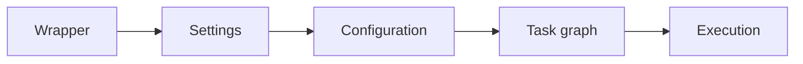

# Gradle Basics One-Page Cheat Sheet

## Build Flow

## Python Bridge

| Gradle Concept | Python Equivalent | Short Memory Hook |
|---|---|---|
| `build.gradle` | `pyproject.toml` | Build definition |
| Wrapper | `uv`, `poetry`, or pinned venv tooling | Reproducible execution |
| `testImplementation` | Dev/test dependencies | Only for tests |
| Version catalog | Shared dependency registry | One place for versions |
| Task graph | Command orchestration | Ordered work list |

## Fast Reference

| Topic | Use It When | Watch Out For |
|---|---|---|
| Gradle Wrapper | You want consistent builds everywhere | Do not rely on local Gradle installs |
| `implementation` | A dependency is needed by main code | Do not leak unnecessary APIs |
| `runtimeOnly` | A library is only needed at runtime | It will not be on the compile classpath |
| Version catalogs | You want centralized dependency versions | Keep aliases consistent and readable |
| `dependencyInsight` | You need to know why a dependency exists | Use it before changing versions blindly |

## Debug Checklist

1. Confirm the wrapper version.
2. Inspect the dependency tree.
3. Check whether the dependency belongs in `implementation`, `testImplementation`, or `runtimeOnly`.
4. Look for version drift across modules.
5. Re-run the build through the wrapper.

## Mental Model

- The wrapper standardizes the toolchain.
- The build script declares the project.
- The task graph decides what runs.
- Dependency management keeps the build stable.

## Interview Questions

1. Why is the wrapper better than a globally installed Gradle?
2. What is the difference between configuration time and execution time?
3. When would you use a version catalog?
4. Why is `dependencyInsight` important in a real project?
5. How do build health checks reduce maintenance cost?
