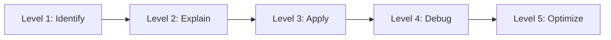

# Gradle Basics Progressive Quiz Drill

## What This Drill Covers

This drill starts with the wrapper and ends with dependency hygiene.

## Python Bridge

| Gradle Concept | Python Equivalent | Why It Helps |
|---|---|---|
| `build.gradle` | `pyproject.toml` | Declares project behavior |
| `./gradlew test` | `pytest` | Runs validation tasks |
| Wrapper | Pinning the interpreter / tooling | Keeps builds reproducible |
| Version catalog | Shared dependency pin file | Centralizes versions |
| `dependencyInsight` | Dependency tree inspection | Explains why something was pulled in |

## Progressive Questions

### Level 1 - Identify

1. What file makes a Gradle project reproducible across machines?
2. What does `./gradlew test` do?
3. What is a version catalog?

### Level 2 - Explain

1. Why do we prefer the wrapper over a locally installed Gradle?
2. What is the difference between `implementation` and `runtimeOnly`?
3. Why does Gradle build a task graph?

### Level 3 - Apply

1. Choose the right dependency bucket for a test library.
2. Add a Spring Boot dependency without hardcoding versions everywhere.
3. Decide when to inspect `dependencyInsight`.

### Level 4 - Debug

1. A build uses the wrong Gradle version. Where do you look first?
2. A library is present twice with different versions. What do you inspect?
3. A task does not run when expected. Which Gradle concept helps explain that?

### Level 5 - Optimize

1. How would you keep dependency versions consistent across modules?
2. When should you prefer a version catalog over inline coordinates?
3. What build health checks would you add to a Spring Boot project?

## Self-Check Answers

- The wrapper files (`gradlew`, `gradlew.bat`, and wrapper metadata) make the build reproducible.
- `./gradlew test` runs the test task through the wrapper-managed Gradle version.
- A version catalog centralizes dependency coordinates and versions.
- `dependencyInsight` helps trace why a dependency is on the classpath.

## Interview Questions

1. Why is the Gradle Wrapper committed to source control?
2. What problem does a version catalog solve?
3. How does Gradle decide task execution order?
4. Why is `dependencyInsight` more useful than guessing?
5. How do you keep a build healthy as the project grows?
