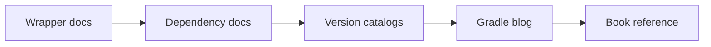

# Gradle Basics Top Resource Guide

## Best Starting Points

## Curated External Resources

1. [Gradle Wrapper](https://docs.gradle.org/current/userguide/gradle_wrapper.html) - The official reference for why the wrapper exists and how to use it.
2. [Dependencies and Dependency Management Basics](https://docs.gradle.org/current/userguide/dependency_management_basics.html) - The official starter guide for dependency buckets and resolution basics.
3. [Version Catalogs](https://docs.gradle.org/current/userguide/version_catalogs.html) - The official guide for centralizing versions and dependency aliases.
4. [The Gradle Blog](https://blog.gradle.org/) - Good for updates, best practices, and platform changes from the Gradle team.
5. [Gradle in Action](https://www.manning.com/books/gradle-in-action) - A book-length reference for real build design and dependency management patterns.
6. [Centralize Dependencies With Version Catalogs](https://www.youtube.com/watch?v=WvtcCCCLfOc) - A practical video walkthrough of why catalogs improve maintainability.

## How To Use These Resources

- Start with the wrapper guide if you want the build to be reproducible.
- Use the dependency and catalog docs when you are cleaning up build files.
- Read the blog when you want current Gradle direction and best practices.
- Use the book and video when you want broader build engineering context.

## Interview Questions

1. Why should every team member use the wrapper?
2. What is the practical benefit of version catalogs?
3. When is a blog post better than a reference page?
4. Why does build hygiene matter in a Spring Boot project?
5. What would you inspect first when dependency versions drift?
