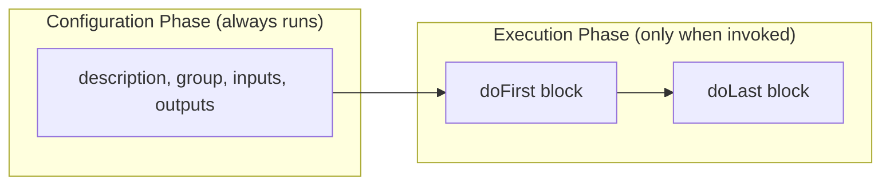
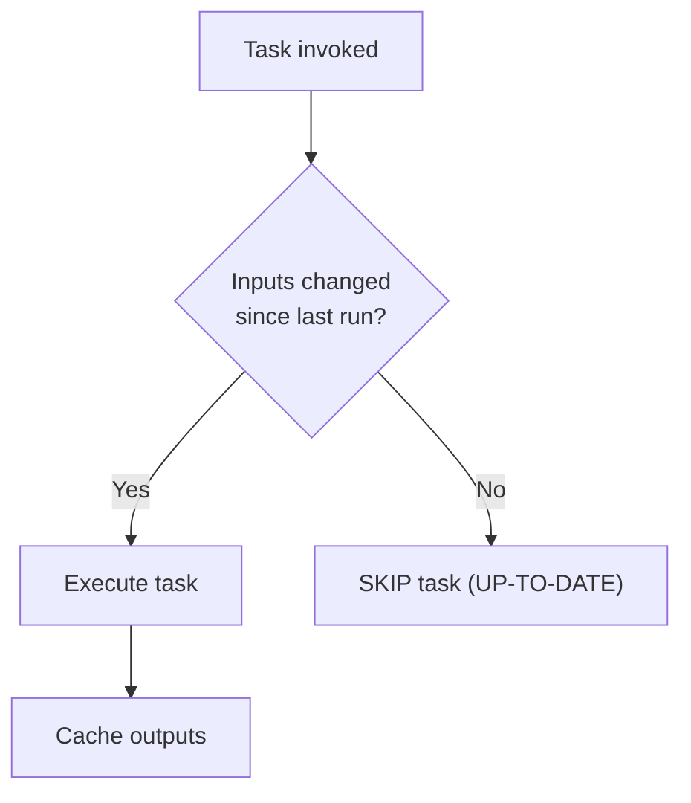

# Custom Gradle Tasks

Custom tasks let you automate anything in your build pipeline: generating code, validating environments, running database migrations, or publishing artifacts. Gradle tasks use Groovy DSL, which gives you the full power of a programming language inside your build file.

## Anatomy of a Custom Task

```groovy
task taskName {
    // CONFIGURATION PHASE — runs on every build invocation
    description = 'Human-readable description'
    group = 'Category for grouping in ./gradlew tasks'

    // Inputs/outputs enable incremental builds
    inputs.property('version', project.version)
    outputs.file("$buildDir/output.txt")

    // EXECUTION PHASE — runs only when task is invoked
    doFirst {
        println 'Runs first within this task'
    }

    doLast {
        println 'Runs last within this task'
    }
}
```



## Practical Custom Task Examples

### 1. Generate a Version File

```groovy
task generateVersionFile {
    description = 'Generates a version.properties file for runtime access'
    group = 'Build'

    def outputFile = file("$buildDir/resources/main/version.properties")
    outputs.file(outputFile)
    inputs.property('version', project.version)
    inputs.property('timestamp', new Date().format('yyyy-MM-dd HH:mm:ss'))

    doLast {
        outputFile.parentFile.mkdirs()
        outputFile.text = """
            app.version=${project.version}
            app.build.time=${new Date().format('yyyy-MM-dd HH:mm:ss')}
            app.java.version=${System.getProperty('java.version')}
        """.stripIndent().trim()
        println "Generated version file: ${outputFile}"
    }
}

// Ensure version file is generated before JAR packaging
processResources.dependsOn generateVersionFile
```

### 2. Environment Validation

```groovy
task validateEnvironment {
    description = 'Validates that required tools are installed'
    group = 'Verification'

    doLast {
        // Check Java version
        def javaVersion = System.getProperty('java.version')
        if (!javaVersion.startsWith('21')) {
            throw new GradleException("Java 21 required, found: $javaVersion")
        }
        println "✓ Java $javaVersion"

        // Check Docker availability
        try {
            def proc = 'docker --version'.execute()
            proc.waitFor()
            println "✓ Docker: ${proc.text.trim()}"
        } catch (Exception e) {
            logger.warn "⚠ Docker not found — bootBuildImage will not work"
        }
    }
}
```

### 3. Database Schema Export

```groovy
task exportSchema(type: JavaExec) {
    description = 'Exports JPA schema DDL to a file'
    group = 'Database'

    classpath = sourceSets.main.runtimeClasspath
    mainClass = 'com.learning.SchemaExporter'
    args = ["$buildDir/schema.sql"]
}
```

## Task Inputs and Outputs (Incremental Builds)

Gradle's incremental build engine skips tasks whose inputs haven't changed since the last successful execution. This is the key to fast builds.



| Input Type | Example |
|---|---|
| `inputs.file(file)` | A source file that the task reads |
| `inputs.dir(dir)` | A directory of source files |
| `inputs.property(name, value)` | A string property (version, timestamp) |
| `outputs.file(file)` | A file the task produces |
| `outputs.dir(dir)` | A directory of generated files |

## Python Comparison

| Gradle Custom Tasks | Python Equivalent |
|---|---|
| `task hello { doLast { ... } }` | `make hello:` target in Makefile |
| `inputs/outputs` (incremental) | No standard equivalent |
| `dependsOn` | Makefile target prerequisites |
| `type: JavaExec` | `subprocess.run(['python', 'script.py'])` |
| `type: Copy` | `shutil.copytree()` in a script |
| `./gradlew tasks --all` | `make help` (if configured) |

## Interview Questions

### Conceptual

**Q1: What is the difference between code in the task configuration block and code in `doLast`?**
> Configuration block code runs during the **Configuration Phase** on every build invocation — even commands like `./gradlew help`. `doLast` code runs during the **Execution Phase** only when the specific task is invoked. Expensive operations (file I/O, network calls) must always be inside `doLast`.

**Q2: How do Gradle's `inputs` and `outputs` enable incremental builds?**
> Gradle hashes task inputs before execution. If the inputs haven't changed since the last successful execution and the outputs still exist, Gradle marks the task as `UP-TO-DATE` and skips it. This avoids redundant work and is the primary reason Gradle builds are faster than Maven.

### Scenario/Debug

**Q3: A custom task that generates a config file always shows as `UP-TO-DATE` even when you want it to regenerate. How do you fix this?**
> The task either has no declared inputs or the inputs haven't changed. To force re-execution, either: (1) add a timestamp input via `inputs.property('timestamp', new Date())`, or (2) remove the `outputs` declaration (Gradle always runs tasks without outputs).

### Quick Fire

**Q4: What does the `group` property do on a custom task?**
> It controls how the task is categorized in the output of `./gradlew tasks`. Tasks without a group only appear with `--all`.
