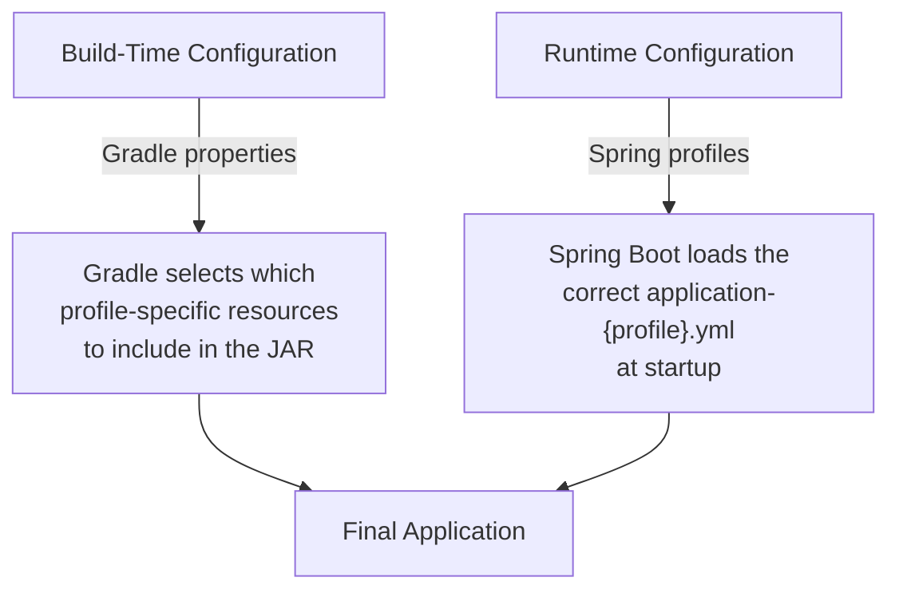

# Build Profiles (Environment-Specific Builds)

Production applications run in different environments — development, testing, staging, and production — each with different database URLs, logging levels, and feature flags. Gradle and Spring Boot work together to manage these configurations cleanly.

## The Two-Layer Approach



Most environment switches in Spring Boot happen at **runtime** (Spring profiles), not build-time. Gradle's role is to:
1. Pass the active profile to `bootRun` during development.
2. Optionally include/exclude resources based on the target environment.
3. Set JVM arguments for performance tuning per environment.

## Spring Profiles via Gradle

### Application Properties Files

```
src/main/resources/
├── application.yml              ← Default (always loaded)
├── application-dev.yml          ← Development overrides
├── application-test.yml         ← Test overrides
└── application-prod.yml         ← Production overrides
```

### Activating Profiles with `bootRun`

```groovy
// build.gradle
bootRun {
    // Default: use 'dev' profile during local development
    systemProperty 'spring.profiles.active', findProperty('profile') ?: 'dev'

    // Pass JVM arguments
    jvmArgs = ['-Xms256m', '-Xmx512m']
}
```

Run with different profiles:

```bash
# Default (dev profile)
./gradlew bootRun

# Explicit profile via Gradle property
./gradlew bootRun -Pprofile=prod

# Explicit profile via system property
./gradlew bootRun --args='--spring.profiles.active=test'
```

## Gradle Properties for Environment Config

### `gradle.properties` File

```properties
# gradle.properties (committed to Git — safe values only!)
projectGroup=com.learning
projectVersion=1.0.0

# Default profile for bootRun
springProfile=dev

# JVM settings
org.gradle.jvmargs=-Xmx2g -XX:+UseG1GC
```

### Using Properties in `build.gradle`

```groovy
// Reading properties in build.gradle
group = project.findProperty('projectGroup') ?: 'com.default'
version = project.findProperty('projectVersion') ?: '0.0.1'

bootRun {
    systemProperty 'spring.profiles.active',
        project.findProperty('springProfile') ?: 'dev'
}
```

### Command-line Property Overrides

```bash
# -P flag overrides gradle.properties values
./gradlew bootRun -PspringProfile=prod

# -D flag sets JVM system properties
./gradlew bootRun -Dspring.profiles.active=staging
```

## Conditional Build Logic

```groovy
// Include extra dependencies only for dev builds
if (project.findProperty('springProfile') == 'dev') {
    dependencies {
        // H2 in-memory database for local development
        runtimeOnly 'com.h2database:h2'

        // Spring Boot DevTools for hot reload
        developmentOnly 'org.springframework.boot:spring-boot-devtools'
    }
}
```

## Python Comparison

| Gradle Build Profiles | Python Equivalent |
|---|---|
| `application-dev.yml` / `application-prod.yml` | `.env.development` / `.env.production` |
| `spring.profiles.active=dev` | `APP_ENV=development` environment variable |
| `gradle.properties` | `.env` file loaded by `python-dotenv` |
| `./gradlew bootRun -Pprofile=prod` | `APP_ENV=production uvicorn main:app` |
| `bootRun { systemProperty ... }` | `os.environ['KEY']` in Python |
| Conditional `if (profile == 'dev')` | `if os.environ.get('ENV') == 'dev':` |

The key difference: **Spring Boot has a built-in profile system** (`@Profile`, property file loading, conditionals). Python frameworks typically rely on environment variables and manual configuration loading.

## Interview Questions

### Conceptual

**Q1: What is the difference between build-time configuration (Gradle properties) and runtime configuration (Spring profiles)?**
> Gradle properties affect the build process itself — which dependencies to include, which tasks to run, JVM arguments. Spring profiles affect application behavior at runtime — which database to connect to, logging levels, feature flags. Most environment switching in Spring Boot is runtime-based via profiles.

**Q2: Why should you NOT put secrets (database passwords, API keys) in `gradle.properties`?**
> `gradle.properties` is committed to Git and visible to everyone with repository access. Secrets should be in environment variables, CI/CD secrets managers (like GitHub Secrets), or external vaults (like HashiCorp Vault). Spring Boot's `application-prod.yml` can reference environment variables: `spring.datasource.password: ${DB_PASSWORD}`.

### Scenario/Debug

**Q3: A developer runs `./gradlew bootRun` locally and it connects to the production database. How did this happen?**
> The active profile is set to `prod` (either in `gradle.properties`, via `-Pprofile=prod`, or in `application.yml` as a default). The fix: set the default profile to `dev` in the `bootRun` configuration and use `application-dev.yml` with a local database URL.

### Quick Fire

**Q4: How do you pass a Gradle property from the command line?**
> Use the `-P` flag: `./gradlew bootRun -PspringProfile=test`

**Q5: What is the `developmentOnly` configuration in Gradle?**
> A special scope for Spring Boot DevTools — dependencies available only when running via `bootRun`, not included in the production JAR.
