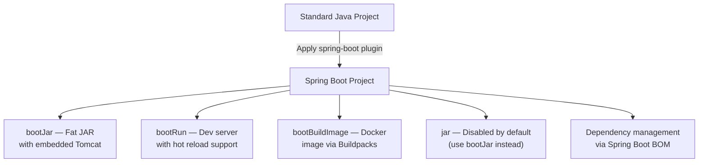

# Spring Boot Gradle Plugin

The `org.springframework.boot` Gradle plugin transforms a standard Java project into a production-deployable Spring Boot application. It adds critical tasks (`bootJar`, `bootRun`, `bootBuildImage`) and configures the build for the Spring Boot ecosystem.

## What the Plugin Does



## `bootJar` vs `jar`

This distinction confuses many developers:

| Feature | `jar` (standard) | `bootJar` (Spring Boot) |
|---|---|---|
| Contains your code | ✓ | ✓ |
| Contains dependencies | ✗ | ✓ (fat JAR) |
| Contains embedded Tomcat | ✗ | ✓ |
| Executable with `java -jar` | ✗ | ✓ |
| Size | ~50 KB | ~30 MB+ |
| Use case | Library module | Deployable application |

When you apply the Spring Boot plugin, the `jar` task is **disabled by default** — only `bootJar` runs:

```groovy
// This is what the plugin does internally
jar {
    enabled = false  // Standard jar disabled
}

bootJar {
    enabled = true   // Fat JAR enabled
}
```

For library modules (shared code, no `main` class), re-enable `jar` and disable `bootJar`:

```groovy
// common-lib/build.gradle (library module, NOT a Spring Boot app)
jar {
    enabled = true
}

bootJar {
    enabled = false
}
```

## `bootRun` Configuration

```groovy
bootRun {
    // Active Spring profile
    systemProperty 'spring.profiles.active', 'dev'

    // JVM memory settings
    jvmArgs = ['-Xms256m', '-Xmx512m', '-XX:+UseG1GC']

    // Pass command-line arguments to the application
    // Usage: ./gradlew bootRun --args='--server.port=9090'

    // Source set for hot reload (DevTools)
    sourceResources sourceSets.main
}
```

## `bootBuildImage` — Docker Without Dockerfile

Spring Boot can build an OCI-compliant Docker image using **Cloud Native Buildpacks** — no Dockerfile required.

```groovy
bootBuildImage {
    imageName = "myregistry/${project.name}:${project.version}"
    
    // Use Paketo buildpacks (default)
    builder = 'paketobuildpacks/builder-jammy-base:latest'
    
    // Environment variables for the buildpack
    environment = [
        'BP_JVM_VERSION': '21',
        'BPE_DELIM_JAVA_TOOL_OPTIONS': ' ',
        'BPE_APPEND_JAVA_TOOL_OPTIONS': '-XX:MaxDirectMemorySize=100M'
    ]
}
```

```bash
# Build Docker image
./gradlew bootBuildImage

# Run the container
docker run -p 8080:8080 myregistry/spring-mastery:1.0.0
```


## Layered JARs (Docker Optimization)

Spring Boot 3.x creates **layered fat JARs** by default, optimizing Docker layer caching:

```
bootJar layers:
├── dependencies/          ← Rarely changes → cached long
├── spring-boot-loader/    ← Almost never changes → cached longest
├── snapshot-dependencies/  ← Changes occasionally
└── application/           ← Changes every commit → rebuilt each time
```

This means Docker rebuilds only the `application` layer on most builds, not the entire 30 MB+ JAR.

## Python Comparison

| Spring Boot Plugin | Python Equivalent |
|---|---|
| `bootJar` (fat JAR) | `pyinstaller --onefile` (loosely) |
| `bootRun` (dev server) | `uvicorn main:app --reload` |
| `bootBuildImage` (Docker) | `docker build .` with a Dockerfile |
| Layered JARs | Multi-stage Docker build with pip cache |
| Embedded Tomcat | Uvicorn/Gunicorn bundled with FastAPI |
| `java -jar app.jar` | `python main.py` |
| No Dockerfile needed | Dockerfile always required |

## Interview Questions

### Conceptual

**Q1: What is the difference between `bootJar` and `jar` tasks in Spring Boot?**
> `bootJar` creates an executable **fat JAR** containing all dependencies and an embedded web server (Tomcat). `jar` creates a standard library JAR containing only your compiled classes. When you apply the Spring Boot plugin, `jar` is disabled by default because Spring Boot applications should be packaged as fat JARs for deployment.

**Q2: How does `bootBuildImage` create a Docker image without a Dockerfile?**
> It uses **Cloud Native Buildpacks** (CNCF standard). Buildpacks analyze your source code, auto-detect the Java version, compile the application, and create an OCI-compliant Docker image using pre-built, security-patched base images. This eliminates the need for hand-written Dockerfiles and ensures best-practice container configuration.

### Scenario/Debug

**Q3: You have a multi-module project. The `common-lib` module fails to build with "Main class not found." What is wrong?**
> The `common-lib` module has the Spring Boot plugin applied, and `bootJar` is trying to create an executable JAR — but `common-lib` is a library with no `main` method. The fix: in `common-lib/build.gradle`, set `bootJar { enabled = false }` and `jar { enabled = true }`.

**Q4: Your Docker image is 400 MB and takes 5 minutes to push on every deployment. How can you reduce rebuild time?**
> Use Spring Boot's **layered JAR** feature. Create a Dockerfile that extracts layers and caches them separately. Dependencies (which rarely change) are cached as a Docker layer, so only the application code layer (~100 KB) is rebuilt on each deployment.

### Quick Fire

**Q5: What command runs a Spring Boot application via Gradle?**
> `./gradlew bootRun`

**Q6: How do you pass command-line arguments to a Spring Boot app via `bootRun`?**
> `./gradlew bootRun --args='--server.port=9090 --spring.profiles.active=prod'`
