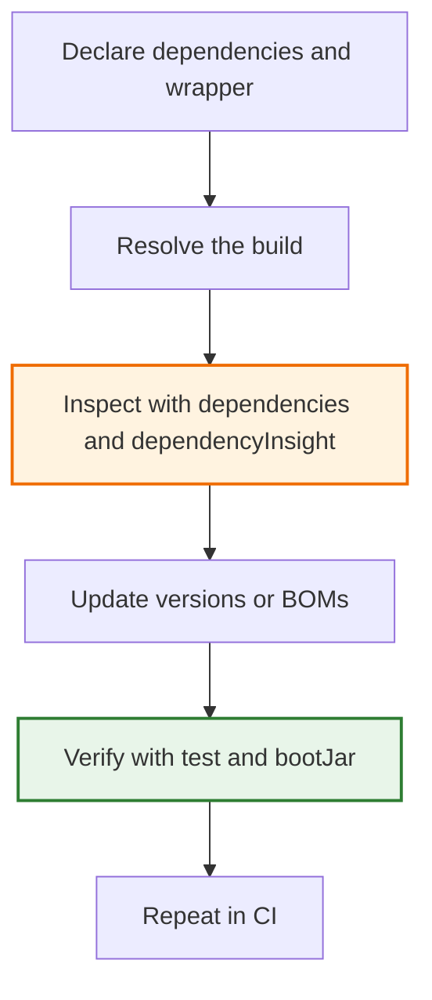

# 02 — Gradle Build Tool

## Why This Module Matters

Every Java project needs a build tool to compile code, manage dependencies, run tests, and package artifacts. **Gradle** is the modern standard for Spring Boot projects.

If you come from Python, think of Gradle as the combination of `pip + setuptools + Makefile + tox` — but with a powerful, programmable Groovy/Kotlin DSL instead of declarative config files.

## Python Bridge

| Concern | Python | Java/Gradle |
|---|---|---|
| Dependency file | `requirements.txt` / `pyproject.toml` | `build.gradle` |
| Lock file | `poetry.lock` / `pip freeze` | `gradle.lockfile` (optional) |
| Install deps | `pip install -r requirements.txt` | `./gradlew build` |
| Run app | `python main.py` / `uvicorn` | `./gradlew bootRun` |
| Run tests | `pytest` | `./gradlew test` |
| Package | `python -m build` -> `.whl` | `./gradlew bootJar` -> `.jar` |
| Multi-module | Monorepo with `pip -e .` | `settings.gradle` + `include` |
| Task runner | `Makefile` / `invoke` | Gradle task DAG (built-in) |

Python projects often glue together several tools. Gradle turns those responsibilities into one reproducible build pipeline, which is why wrapper pinning, dependency management, and task graphs matter so much in Java.

## Build Health Loop

Healthy Gradle builds are not just "green" builds. They are reproducible, inspectable, and easy to upgrade. That is why this module cares about the wrapper, dependency management, and version drift, not just how to write tasks.

## Module Structure

- **[01-gradle-basics/](01-gradle-basics/)** — Core Gradle concepts: build file structure, tasks, dependencies, wrapper, multi-module, dependency hygiene
- **[02-gradle-advanced/](02-gradle-advanced/)** — Custom tasks, build profiles, Spring Boot plugin internals

## Mindmap

See [MINDMAP.md](MINDMAP.md) for a visual overview of all Gradle concepts covered in this module.

## Support Pack

- [Progressive Quiz Drill](resources/progressive-quiz-drill.md)
- [One-Page Cheat Sheet](resources/one-page-cheat-sheet.md)
- [Top Resource Guide](resources/top-resource-guide.md)
