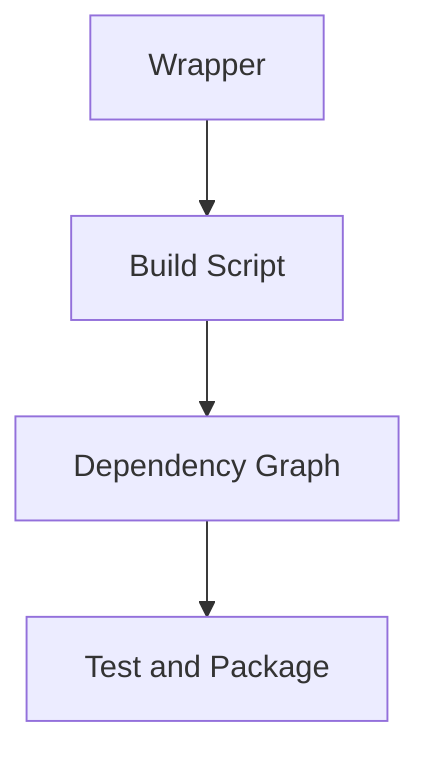

# Gradle Build Tool One-Page Cheat Sheet

## Fast Mapping

| Need | Gradle concept |
|---|---|
| pin the build tool version | Wrapper |
| declare libraries | `dependencies {}` |
| run the app | `run` / `bootRun` |
| inspect transitive versions | `dependencies` / `dependencyInsight` |
| split a large repo | multi-module build |

## High-Value Rules

1. Use `./gradlew`, not a random local Gradle install.
2. Prefer explicit, stable versions over floating versions.
3. Treat the dependency tree like part of the architecture.
4. Keep shared build logic centralized when modules grow.

## Python Bridge

| Python world | Gradle world |
|---|---|
| `pyproject.toml` | `build.gradle` |
| lock file and pinned toolchain | Wrapper plus managed versions |
| `pytest` / build commands | Gradle task graph |

## Red Flags

| Red flag | Why it hurts |
|---|---|
| no wrapper committed | non-reproducible builds |
| `+` dependency versions | different artifacts over time |
| no dependency inspection | hidden transitive conflicts |
| copied build logic in many modules | slow and inconsistent upgrades |

## Interview Questions

1. Why is the Gradle Wrapper a governance tool, not just a convenience?
2. What hidden risks remain in a build that is green but not inspectable?
3. When does a module deserve its own Gradle subproject?
