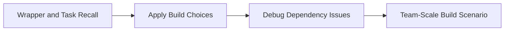

# Gradle Build Tool Progressive Quiz Drill

Use this drill to check whether Gradle feels like a predictable build graph instead of a wall of DSL syntax.



## Round 1 - Core Recall

**Q1.** Why is the Gradle Wrapper more important than a globally installed Gradle version?

**Q2.** What is the purpose of `build.gradle` in a Java project?

**Q3.** Why does dependency insight matter even when the build already succeeds?

**Q4.** What problem does a multi-module Gradle build solve?

## Round 2 - Apply and Compare

**Q5.** A new developer wants to run `gradle build` because Gradle is already installed locally. Would you recommend that over `./gradlew build`? Why?

**Q6.** You see two versions of the same logging library in the dependency tree. Would you ignore it because tests pass, or inspect resolution now? Why?

**Q7.** You need common build logic across several modules. Would you duplicate it in each `build.gradle` or centralize it? Explain.

## Round 3 - Debug the Bug

**Q8.** What is the risk in this workflow?

```text
Machine A uses Gradle 8.5
Machine B uses Gradle 8.7
CI uses Gradle 8.4
No wrapper is committed
```

**Q9.** Why can this become a hidden dependency bug?

```groovy
dependencies {
    implementation 'org.springframework:spring-context:6.1.0'
    implementation 'org.springframework:spring-core:6.0.0'
}
```

**Q10.** A build uses `+` versions for several dependencies. Why is that dangerous?

## Round 4 - Staff-Level Scenario

**Q11.** Your team has ten modules and build times are growing. What Gradle health questions would you ask before adding more hardware?

**Q12.** A service deploy broke because one transitive dependency changed behavior after an innocent-looking upgrade. What build-tool habits would you tighten first?

---

## Answer Key

### Round 1 - Core Recall

**A1.** The wrapper pins the project to a known Gradle version and bootstraps that exact version for every developer and CI environment. That keeps builds reproducible.

**A2.** `build.gradle` declares plugins, dependencies, tasks, and build behavior. It is the central build definition for how the module compiles, tests, and packages.

**A3.** A green build can still hide version conflicts, duplicated libraries, or surprising transitive upgrades. Dependency insight makes the dependency graph visible before those issues surface in production.

**A4.** A multi-module build separates concerns across modules while still letting the whole system build together with shared conventions and dependencies.

### Round 2 - Apply and Compare

**A5.** Use `./gradlew build`. The wrapper guarantees the right Gradle version for the project. A global Gradle install can drift and cause inconsistent results.

**A6.** Inspect it now. Version collisions can produce subtle runtime behavior differences even when compilation and tests still pass.

**A7.** Centralize common logic. Duplication makes upgrades inconsistent and increases the chance of one module silently drifting away from the others.

### Round 3 - Debug the Bug

**A8.** The build is not reproducible. Different Gradle versions can change plugin behavior, dependency resolution, or task semantics. The wrapper exists to prevent exactly this drift.

**A9.** Spring libraries are meant to align by compatible versions. Mixing mismatched versions can create runtime incompatibilities and hard-to-debug failures.

**A10.** `+` versions make builds non-deterministic. The same commit can resolve different artifacts at different times, which makes debugging and rollback much harder.

### Round 4 - Staff-Level Scenario

**A11.** Ask about task cache usage, unnecessary work between modules, test scope, dependency graph bloat, and whether slow tasks are repeated because build logic is poorly structured.

**A12.** Tighten wrapper usage, dependency inspection, version alignment, and upgrade review discipline. The problem is usually not just the upgrade itself but the lack of graph visibility around it.
