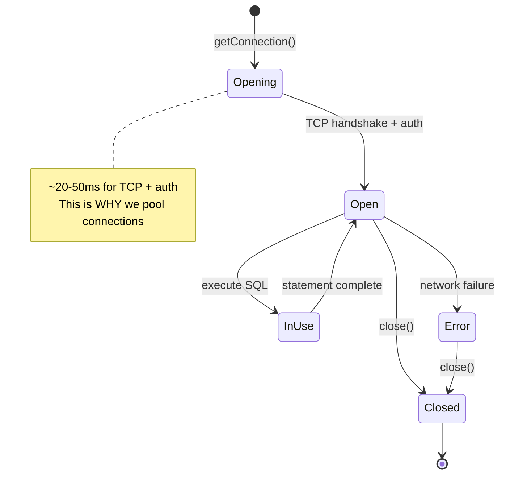
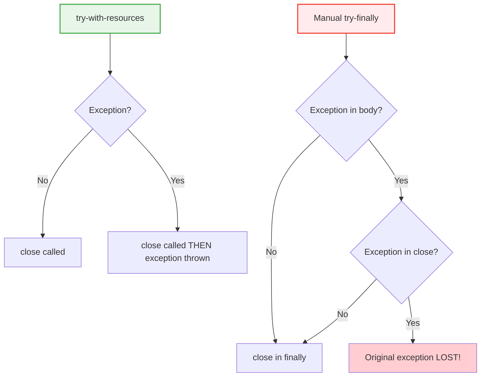

# 02 — Connection Management

## Getting a Connection

In JDBC, a `Connection` represents an active session to the database. It's the gateway to executing SQL.

```java
// Basic connection (dev/test only — NOT for production)
Connection conn = DriverManager.getConnection(
    "jdbc:postgresql://localhost:5432/mydb",
    "username",
    "password"
);
```

> **Python Bridge:** This is identical to `psycopg2.connect(dsn)`. Both create a TCP socket to the database, authenticate, and return a session object.

## Connection Lifecycle



## The try-with-resources Pattern (CRITICAL)

In Java, connections MUST be closed after use. Failing to close leaks connections until the database refuses new ones.

```java
// CORRECT — auto-closed even if an exception occurs
try (Connection conn = DriverManager.getConnection(url, user, pass)) {
    // use conn...
}  // ← conn.close() called automatically here

// Python equivalent:
// with psycopg2.connect(dsn) as conn:
//     # use conn...
// # conn.close() automatic
```



## Connection Properties

```java
Properties props = new Properties();
props.setProperty("user", "admin");
props.setProperty("password", "secret");
props.setProperty("ssl", "true");
props.setProperty("connectTimeout", "5");      // seconds
props.setProperty("socketTimeout", "30");       // seconds
props.setProperty("ApplicationName", "my-app"); // visible in pg_stat_activity

Connection conn = DriverManager.getConnection(
    "jdbc:postgresql://localhost:5432/mydb", props
);
```

**Python comparison:**
```python
conn = psycopg2.connect(
    host="localhost", port=5432, dbname="mydb",
    user="admin", password="secret",
    connect_timeout=5, options="-c statement_timeout=30000"
)
```

## What NOT To Do

| Anti-Pattern | Problem | Fix |
|---|---|---|
| No `close()` | Connection leak → pool exhaustion | Use try-with-resources |
| Catch & swallow exceptions | Silent failures | Log or re-throw |
| Store Connection in a static field | Shared across threads → race conditions | Get a new connection per operation |
| `Class.forName("driver")` | Not needed since Java 6 | Just add driver JAR to classpath |

## Interview Questions

### Conceptual

**Q1: Why must you always close a JDBC Connection?**
> Each Connection holds a TCP socket and database-side session. If not closed, the database keeps the session alive indefinitely, consuming memory and connection slots. After reaching `max_connections` (default 100 in PostgreSQL), no new connections can be made.

**Q2: What is the advantage of try-with-resources over try-finally for JDBC?**
> try-with-resources handles the edge case where both the body AND `close()` throw exceptions. With try-finally, the close exception would mask the original exception. try-with-resources preserves the original and attaches the close exception as a suppressed exception.

### Scenario/Debug

**Q3: Your application works fine under light load but crashes with "too many clients already" under heavy load. What's happening?**
> Connections are being opened but not closed (leaked). Under light load, the database can handle the open sessions. Under heavy load, you exceed `max_connections`. Fix: wrap ALL connections in try-with-resources, or better, use a connection pool like HikariCP.

### Quick Fire

**Q4: What interface does `Connection` extend that enables try-with-resources?**
> `AutoCloseable` (specifically, `Connection extends Closeable extends AutoCloseable`).

**Q5: Python equivalent of `try (Connection conn = ...) {}`?**
> `with psycopg2.connect(dsn) as conn:` (context manager protocol via `__enter__`/`__exit__`).
