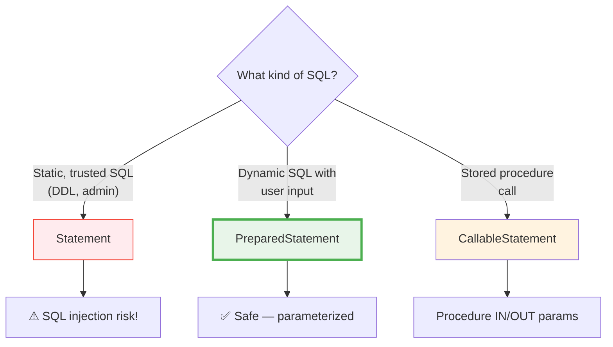

# 03 — Statement Types

## Three Ways to Execute SQL

JDBC provides three statement types, each for different use cases:



## Statement (Avoid for User Input!)

```java
// DANGEROUS — SQL injection vulnerable
Statement stmt = conn.createStatement();
String name = userInput; // e.g., "'; DROP TABLE users; --"
ResultSet rs = stmt.executeQuery("SELECT * FROM users WHERE name = '" + name + "'");
```

**Python equivalent:**
```python
# DANGEROUS — same SQL injection risk
cursor.execute(f"SELECT * FROM users WHERE name = '{user_input}'")
```

## PreparedStatement (USE THIS!)

```java
// SAFE — parameterized (the database treats parameters as DATA, not SQL)
PreparedStatement pstmt = conn.prepareStatement(
    "SELECT * FROM users WHERE name = ? AND age > ?"
);
pstmt.setString(1, name);   // Parameter index starts at 1!
pstmt.setInt(2, minAge);
ResultSet rs = pstmt.executeQuery();
```

**Python equivalent:**
```python
# SAFE — parameterized query
cursor.execute("SELECT * FROM users WHERE name = %s AND age > %s", (name, min_age))
```

## Comparison Table

| Feature | Statement | PreparedStatement | CallableStatement |
|---|---|---|---|
| **SQL injection safe** | ❌ No | ✅ Yes | ✅ Yes |
| **Precompiled** | ❌ No | ✅ Yes | ✅ Yes |
| **Parameters** | String concatenation | `?` placeholders | `?` + IN/OUT |
| **Performance** | Compile every time | Compile once | Compile once |
| **Use case** | DDL, admin SQL | All CRUD operations | Stored procedures |
| **Python equiv.** | `f"SELECT {x}"` | `execute(sql, params)` | `callproc("func")` |

## SQL Injection Visual

```mermaid
sequenceDiagram
    participant User as Attacker
    participant App as Java App
    participant DB as Database

    Note over User,DB: VULNERABLE (Statement with concatenation)
    User->>App: name = "'; DROP TABLE users; --"
    App->>DB: SELECT * FROM users WHERE name = ''; DROP TABLE users; --'
    DB-->>App: ⚡ TABLE DROPPED! Data lost!

    Note over User,DB: SAFE (PreparedStatement with ?)
    User->>App: name = "'; DROP TABLE users; --"
    App->>DB: SELECT * FROM users WHERE name = ?<br/>param1 = "'; DROP TABLE users; --"
    DB-->>App: 0 rows (treats entire string as a name value)
```

## CallableStatement (Stored Procedures)

```java
// Calling a stored procedure
CallableStatement cs = conn.prepareCall("{call calculate_tax(?, ?)}");
cs.setDouble(1, salary);                           // IN parameter
cs.registerOutParameter(2, Types.DOUBLE);           // OUT parameter
cs.execute();
double tax = cs.getDouble(2);                       // Read OUT result
```

**Python equivalent:**
```python
cursor.callproc("calculate_tax", [salary])
tax = cursor.fetchone()[0]
```

## Interview Questions

### Conceptual

**Q1: Why is PreparedStatement safer than Statement?**
> PreparedStatement sends the SQL structure and parameter values separately to the database. The database compiles the SQL first, THEN binds the parameters as data. An attacker's input is never parsed as SQL syntax — it's always treated as a string/number value.

**Q2: What performance advantage does PreparedStatement have?**
> The SQL is compiled (parsed and planned) once. If you execute the same query 1000 times with different parameters, the database reuses the execution plan. Statement compiles the SQL fresh each time.

### Scenario/Debug

**Q3: You're using PreparedStatement but still vulnerable to SQL injection. How?**
> You're probably concatenating user input into the SQL string instead of using `?` placeholders. `conn.prepareStatement("SELECT * FROM users WHERE name = '" + name + "'")` is STILL vulnerable even though it's a PreparedStatement — because you're putting user input inside the SQL template.

### Quick Fire

**Q4: What exception does `pstmt.setString(0, "test")` throw?**
> `SQLException` — JDBC parameter indices start at **1**, not 0.

**Q5: Python equivalent of `?` placeholder in JDBC?**
> `%s` for psycopg2, `?` for sqlite3.
