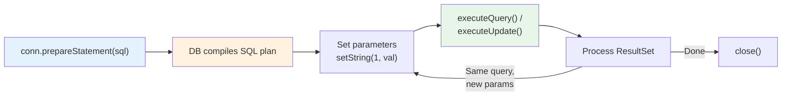
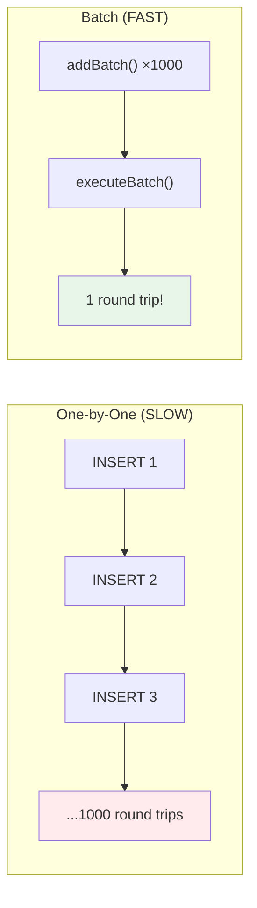

# 04 — PreparedStatement Deep Dive

## Why PreparedStatement Matters

PreparedStatement is the **single most important JDBC class** for application developers. It's your primary tool for safe, efficient database interaction.

## Lifecycle



## Parameter Binding

JDBC uses **1-indexed** positional parameters (not 0-indexed like Java arrays!):

```java
PreparedStatement pstmt = conn.prepareStatement(
    "INSERT INTO products (name, price, category, created_at) VALUES (?, ?, ?, ?)"
);
pstmt.setString(1, "Wireless Mouse");      // Index 1 = name
pstmt.setBigDecimal(2, new BigDecimal("29.99")); // Index 2 = price
pstmt.setString(3, "ELECTRONICS");          // Index 3 = category
pstmt.setTimestamp(4, Timestamp.valueOf(LocalDateTime.now())); // Index 4

int rowsAffected = pstmt.executeUpdate();   // Returns number of rows inserted
```

**Python comparison:**
```python
cursor.execute(
    "INSERT INTO products (name, price, category, created_at) VALUES (%s, %s, %s, %s)",
    ("Wireless Mouse", Decimal("29.99"), "ELECTRONICS", datetime.now())
)
```

## Type Mapping Table

| Java Type | JDBC Setter | SQL Type | Python Type |
|---|---|---|---|
| `String` | `setString()` | VARCHAR, TEXT | `str` |
| `int` | `setInt()` | INTEGER | `int` |
| `long` | `setLong()` | BIGINT | `int` |
| `BigDecimal` | `setBigDecimal()` | DECIMAL, NUMERIC | `Decimal` |
| `boolean` | `setBoolean()` | BOOLEAN | `bool` |
| `LocalDate` | `setDate()` | DATE | `date` |
| `LocalDateTime` | `setTimestamp()` | TIMESTAMP | `datetime` |
| `byte[]` | `setBytes()` | BYTEA, BLOB | `bytes` |
| `null` | `setNull(idx, type)` | NULL | `None` |

## Batch Operations

When inserting thousands of rows, executing one-by-one is **100x slower** than batching:

```java
conn.setAutoCommit(false);  // CRITICAL for batch performance

PreparedStatement pstmt = conn.prepareStatement(
    "INSERT INTO products (name, price) VALUES (?, ?)"
);

for (Product p : products) {
    pstmt.setString(1, p.getName());
    pstmt.setBigDecimal(2, p.getPrice());
    pstmt.addBatch();            // ← Add to batch, don't execute yet
}

int[] results = pstmt.executeBatch();  // ← Execute all at once!
conn.commit();                          // ← Commit the transaction
```



**Python comparison:**
```python
# Python psycopg2 batch
cursor.executemany(
    "INSERT INTO products (name, price) VALUES (%s, %s)",
    [(p.name, p.price) for p in products]
)
conn.commit()
```

## executeQuery vs executeUpdate vs execute

| Method | Use For | Returns |
|---|---|---|
| `executeQuery()` | SELECT | `ResultSet` |
| `executeUpdate()` | INSERT, UPDATE, DELETE, DDL | `int` (rows affected) |
| `execute()` | Any SQL (when type unknown) | `boolean` (true=ResultSet, false=update count) |

## Interview Questions

### Conceptual

**Q1: Why are PreparedStatement parameters 1-indexed instead of 0-indexed?**
> Historical convention from the SQL standard. It aligns with the JDBC specification and matches how SQL parameters are counted in stored procedures (`$1`, `$2` in PostgreSQL).

**Q2: When should you use `executeBatch()` instead of `executeUpdate()` in a loop?**
> Always when inserting/updating more than ~10 rows. Batch operations send all SQL to the database in one network round-trip, vs one round-trip per row. With `setAutoCommit(false)`, batch inserts are typically 50-100x faster.

### Scenario/Debug

**Q3: Your batch insert of 100,000 rows causes an OutOfMemoryError. Why?**
> The JDBC driver may be accumulating all batch entries in memory. Fix: Split into smaller batches (e.g., 1000 at a time), calling `executeBatch()` + `clearBatch()` after each chunk. Some drivers also support `reWriteBatchedInserts=true` (PostgreSQL) for server-side optimization.

**Q4: You use `setDate()` but the time portion is always midnight. How to fix?**
> `setDate()` truncates to date-only (`java.sql.Date`). Use `setTimestamp()` with a `java.sql.Timestamp` (which preserves time) if you need date + time.

### Quick Fire

**Q5: What happens if you call `executeQuery()` on an INSERT statement?**
> Throws `SQLException` — `executeQuery()` is only for SELECT statements that return a `ResultSet`.
