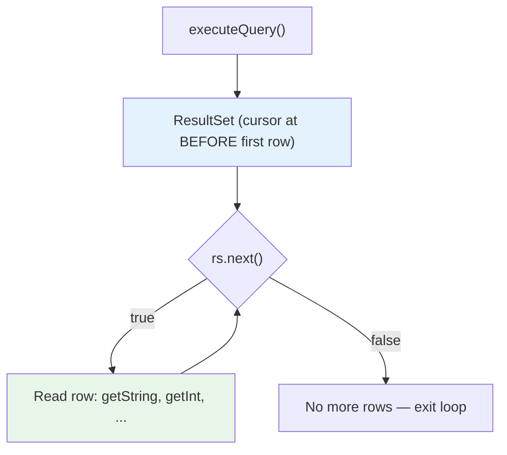
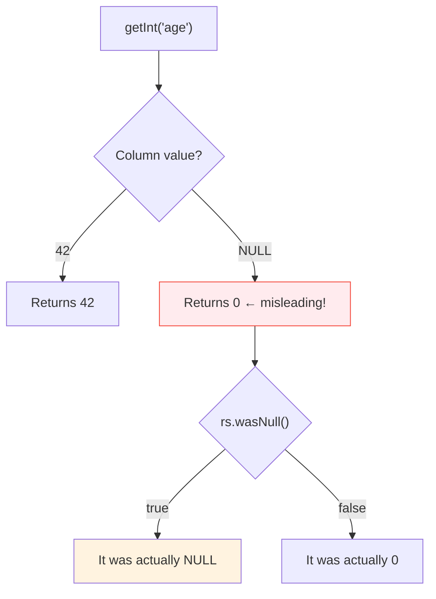

# 05 — ResultSet

## What is a ResultSet?

A `ResultSet` is a **cursor** that iterates over query results row by row. It represents the data returned by `executeQuery()`.

> **Python Bridge:** Think of it as `cursor.fetchone()` in a while loop, but with typed getters instead of tuple indexing.

## Iteration Pattern



```java
// Standard JDBC ResultSet iteration
try (PreparedStatement pstmt = conn.prepareStatement("SELECT id, name, price FROM products")) {
    try (ResultSet rs = pstmt.executeQuery()) {
        while (rs.next()) {   // Advances cursor to next row
            long id = rs.getLong("id");           // By column NAME (preferred)
            String name = rs.getString("name");
            BigDecimal price = rs.getBigDecimal("price");

            // Alternative: by column INDEX (1-indexed, fragile — avoid)
            // long id = rs.getLong(1);
        }
    }
}
```

**Python comparison:**
```python
cursor.execute("SELECT id, name, price FROM products")

# Python option 1: fetchall (loads all into memory)
for row in cursor.fetchall():
    print(row[0], row[1], row[2])  # tuple indexing

# Python option 2: iterate cursor (streaming)
for row in cursor:
    print(row['id'], row['name'])  # dict-like with RealDictCursor
```

## Column Access Methods

| SQL Type | JDBC Getter | Returns | Null Handling |
|---|---|---|---|
| VARCHAR | `getString("col")` | `String` | Returns `null` |
| INTEGER | `getInt("col")` | `int` | Returns `0` (use `wasNull()`) |
| BIGINT | `getLong("col")` | `long` | Returns `0` (use `wasNull()`) |
| DECIMAL | `getBigDecimal("col")` | `BigDecimal` | Returns `null` |
| BOOLEAN | `getBoolean("col")` | `boolean` | Returns `false` (use `wasNull()`) |
| DATE | `getDate("col")` | `java.sql.Date` | Returns `null` |
| TIMESTAMP | `getTimestamp("col")` | `java.sql.Timestamp` | Returns `null` |
| BYTEA/BLOB | `getBytes("col")` | `byte[]` | Returns `null` |

## The wasNull() Trap



```java
int age = rs.getInt("age");
if (rs.wasNull()) {
    // age is NULL in the database (not zero!)
    System.out.println("Age not provided");
} else {
    System.out.println("Age: " + age);
}
```

> **Python:** This problem doesn't exist in Python — `None` is returned for NULL columns, which is distinct from `0`.

## By Name vs By Index

| Approach | Example | Pros | Cons |
|---|---|---|---|
| **By name** (preferred) | `getString("name")` | Readable, survives column reorder | Slightly slower |
| **By index** (avoid) | `getString(2)` | Slightly faster | Breaks if columns change |

## Interview Questions

### Conceptual

**Q1: Why does `getInt()` return 0 for NULL columns instead of throwing?**
> Java primitive types (`int`, `long`, `boolean`) cannot be `null`. JDBC returns the type's default value (0, false) and requires you to call `wasNull()` afterward. This is a design flaw — modern code should use `getObject(col, Integer.class)` which returns `null` for NULL columns.

**Q2: What's the difference between `rs.next()` and Python's `cursor.fetchone()`?**
> `rs.next()` advances the cursor AND returns a boolean. `cursor.fetchone()` advances AND returns the data. In JDBC, you call `next()` first, then read with getters. In Python, `fetchone()` does both in one call.

### Scenario/Debug

**Q3: Your query returns 1 million rows and causes OutOfMemoryError. How do you fix it?**
> By default, some JDBC drivers fetch ALL results into memory. Fix: Use `stmt.setFetchSize(100)` to stream results in batches of 100. For PostgreSQL, you ALSO need `conn.setAutoCommit(false)` for server-side cursors to work.

### Quick Fire

**Q4: What happens if you call `getString("name")` before calling `rs.next()`?**
> Throws `SQLException` — the cursor is positioned BEFORE the first row. You must call `next()` first.

**Q5: Python equivalent of `rs.next()` + `rs.getString("name")`?**
> `row = cursor.fetchone(); row['name']` (with `RealDictCursor`).
