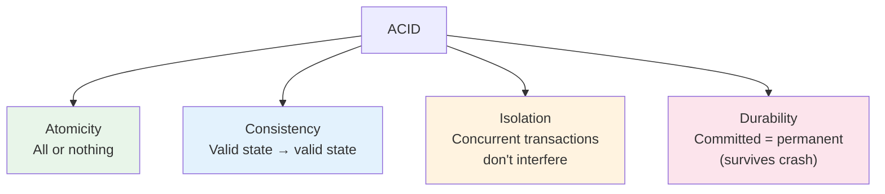
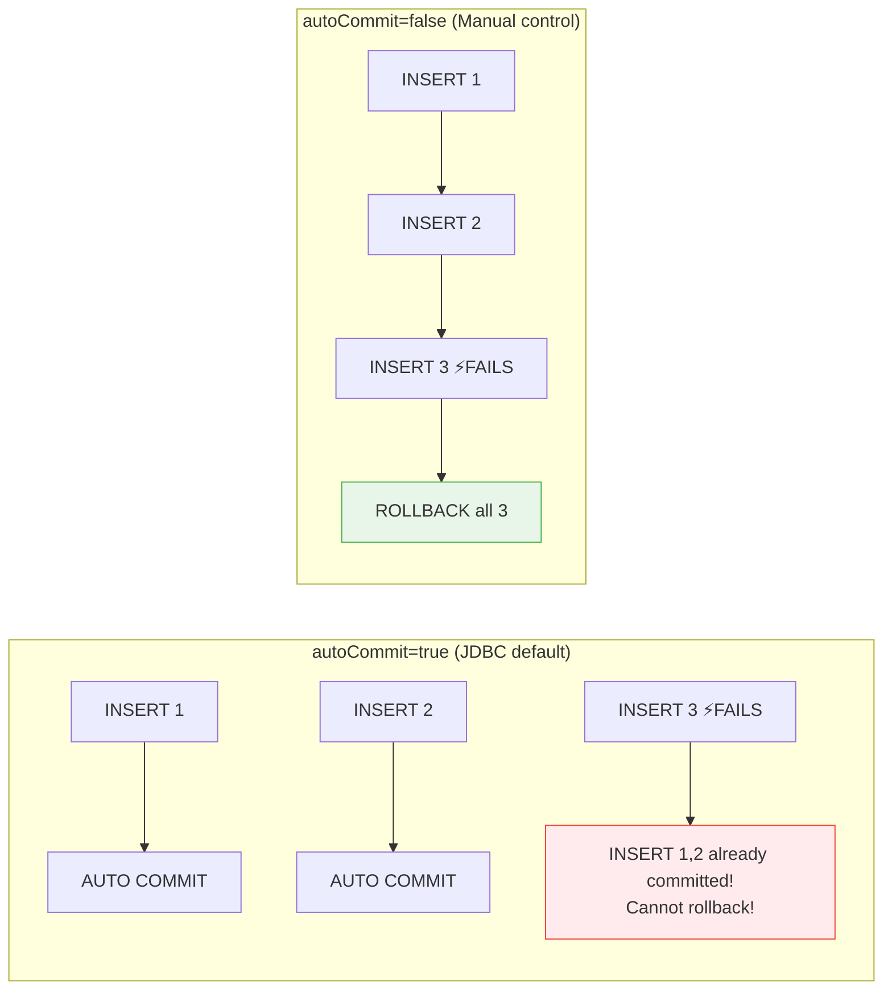
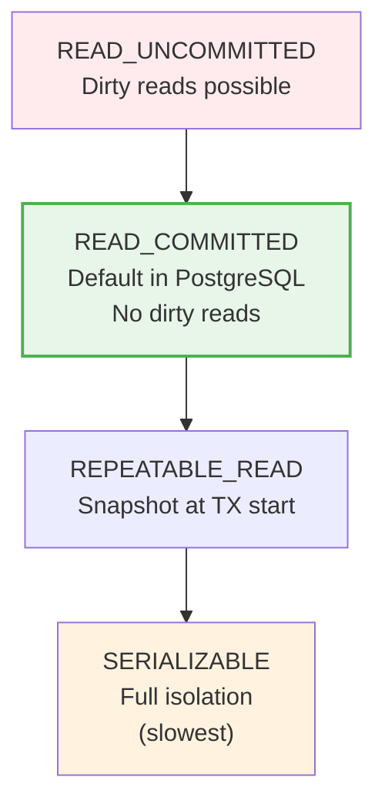

# 06 — Transactions

## What is a Transaction?

A transaction is a **group of SQL operations** that either ALL succeed or ALL fail together. This is the foundation of data integrity.

> **Python Bridge:** `conn.commit()` / `conn.rollback()` work the same in Python. The key difference: **JDBC defaults to autocommit=true**, while psycopg2 defaults to autocommit=false.

## ACID Properties



## AutoCommit Behavior



## Manual Transaction Management

```java
Connection conn = dataSource.getConnection();
conn.setAutoCommit(false);  // ← CRITICAL: disable autocommit

try {
    // Debit
    PreparedStatement debit = conn.prepareStatement(
        "UPDATE accounts SET balance = balance - ? WHERE id = ?");
    debit.setBigDecimal(1, amount);
    debit.setLong(2, fromAccountId);
    debit.executeUpdate();

    // Credit
    PreparedStatement credit = conn.prepareStatement(
        "UPDATE accounts SET balance = balance + ? WHERE id = ?");
    credit.setBigDecimal(1, amount);
    credit.setLong(2, toAccountId);
    credit.executeUpdate();

    conn.commit();    // ← Both succeed → commit
} catch (SQLException e) {
    conn.rollback();  // ← Any failure → rollback both
    throw e;
} finally {
    conn.setAutoCommit(true);  // Reset for connection pool reuse
    conn.close();
}
```

**Python comparison:**
```python
conn = psycopg2.connect(dsn)
try:
    with conn.cursor() as cursor:
        cursor.execute("UPDATE accounts SET balance = balance - %s WHERE id = %s", (amount, from_id))
        cursor.execute("UPDATE accounts SET balance = balance + %s WHERE id = %s", (amount, to_id))
    conn.commit()
except Exception:
    conn.rollback()
    raise
finally:
    conn.close()
```

## Savepoints

Savepoints let you **partially rollback** within a transaction:

```java
conn.setAutoCommit(false);
Savepoint sp = null;

try {
    // Operation 1 — must succeed
    stmt.executeUpdate("INSERT INTO orders ...");

    sp = conn.setSavepoint("before_notification");

    // Operation 2 — optional (can fail without losing Order)
    stmt.executeUpdate("INSERT INTO notifications ...");

} catch (SQLException e) {
    if (sp != null) {
        conn.rollback(sp);  // ← Rollback to savepoint (keeps Order)
    } else {
        conn.rollback();    // ← Rollback everything
    }
}
conn.commit();  // ← Commits Order even if notification failed
```

## Isolation Levels



| Level | Dirty Read | Non-Repeatable Read | Phantom Read | Performance |
|---|---|---|---|---|
| READ_UNCOMMITTED | ✅ Yes | ✅ Yes | ✅ Yes | Fastest |
| **READ_COMMITTED** | ❌ No | ✅ Yes | ✅ Yes | **Default** |
| REPEATABLE_READ | ❌ No | ❌ No | ✅ Yes | Slower |
| SERIALIZABLE | ❌ No | ❌ No | ❌ No | Slowest |

```java
conn.setTransactionIsolation(Connection.TRANSACTION_READ_COMMITTED);
```

## Interview Questions

### Conceptual

**Q1: Why does JDBC default to autocommit=true while Python's psycopg2 defaults to autocommit=false?**
> Historical design choice. JDBC was designed for simple CRUD where each statement should be its own transaction by default. psycopg2 follows Python's explicit-is-better-than-implicit philosophy. In practice, you almost always set `autoCommit(false)` in JDBC for any multi-statement operation.

**Q2: What happens if you forget to call `commit()` after `setAutoCommit(false)`?**
> When the connection is closed (or returned to a pool), the database implicitly rolls back any uncommitted transaction. Your changes are silently lost.

### Scenario/Debug

**Q3: Two users simultaneously update the same bank balance. User A reads $100, User B reads $100. Both debit $50. Final balance is $50 (should be $0). What isolation level fixes this?**
> This is a **lost update** problem. `REPEATABLE_READ` or `SERIALIZABLE` prevents it. Alternatively, use `SELECT ... FOR UPDATE` (pessimistic locking) which locks the row during the read, forcing User B to wait until A commits.

**Q4: You use savepoints but get "Cannot rollback to savepoint after transaction has been committed". What happened?**
> You called `conn.commit()` before `conn.rollback(savepoint)`. Once committed, savepoints are released. Solution: rollback to savepoint BEFORE commit.

### Quick Fire

**Q5: What SQL is executed when you call `conn.setAutoCommit(false)`?**
> `BEGIN` (or `START TRANSACTION`) — it starts a new transaction block.
