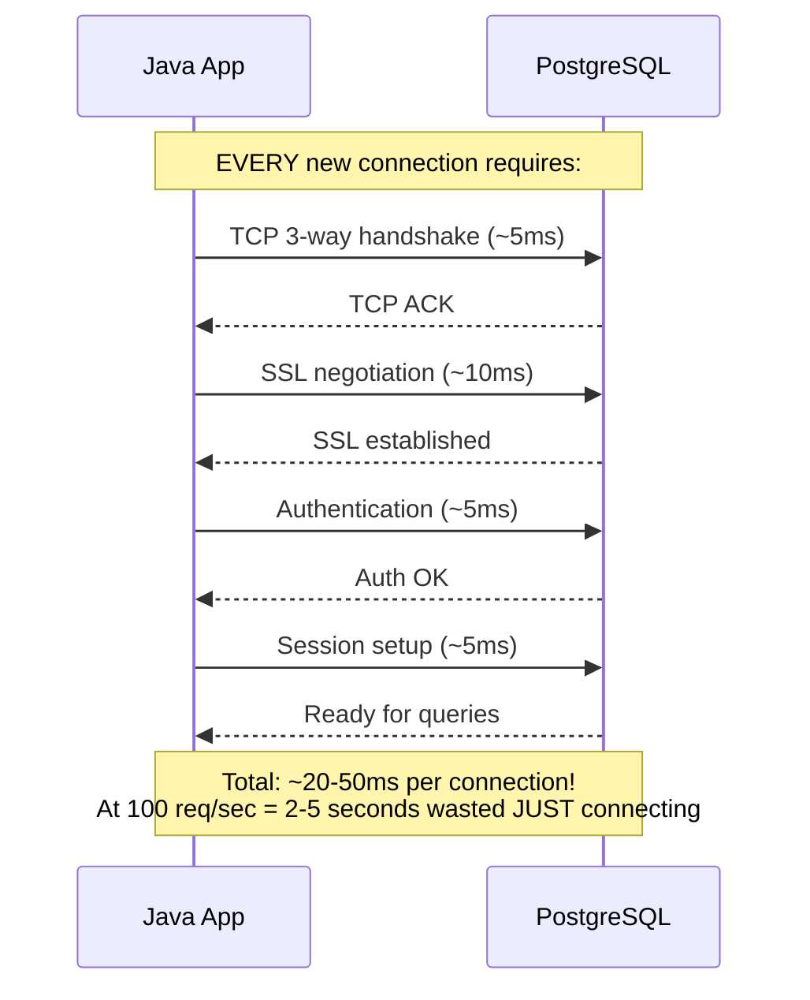
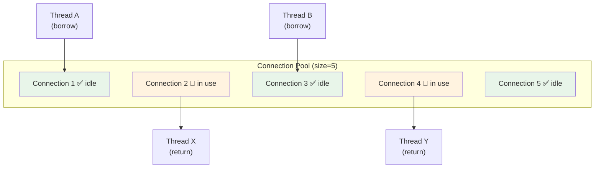
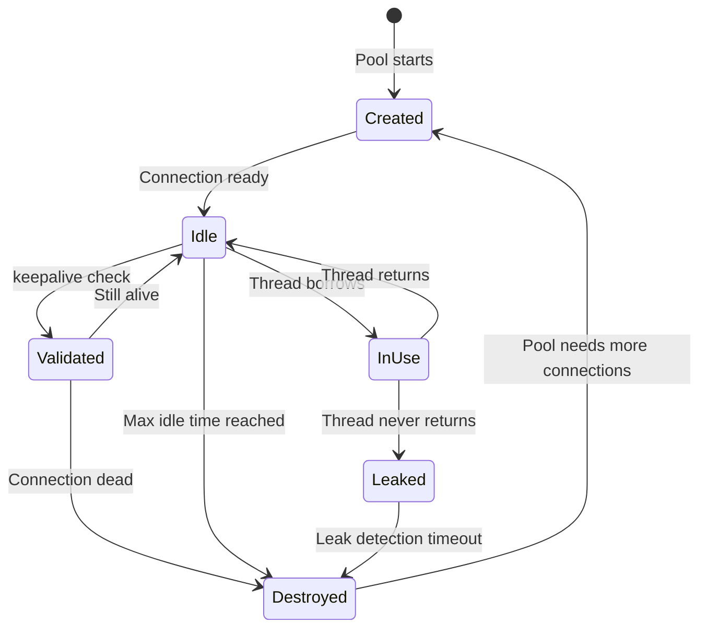

# 07 — Connection Pooling

## The Problem: Connection Creation is Expensive



## Solution: Connection Pool

A pool pre-creates connections at startup and **reuses** them:



## Pool Lifecycle



## Pool Sizing Formula

```
Optimal pool size = CPU cores × 2 + disk spindles

Example:
  4 CPU cores × 2 + 1 SSD = 9 connections
  8 CPU cores × 2 + 1 SSD = 17 connections
```

> **Python Bridge:** SQLAlchemy uses the same concept: `create_engine("...", pool_size=5, max_overflow=10)`. Same math, same principles.

## Without Pool vs With Pool

| Metric | No Pool | With Pool (size=10) |
|---|---|---|
| Connection time | ~30ms per request | ~0.1ms (borrow from pool) |
| Max concurrent connections | Unlimited (crashes DB) | 10 (bounded) |
| Memory per connection | ~10MB at DB | Shared across requests |
| Time for 1000 requests | 30,000ms in connections | 100ms in borrows |

## Common Pool Configurations

```java
// Manual HikariCP setup (Spring Boot does this automatically)
HikariConfig config = new HikariConfig();
config.setJdbcUrl("jdbc:postgresql://localhost:5432/mydb");
config.setUsername("user");
config.setPassword("pass");
config.setMaximumPoolSize(10);        // Max connections
config.setMinimumIdle(5);            // Keep 5 idle connections ready
config.setConnectionTimeout(30000);   // Wait 30s for a connection
config.setIdleTimeout(600000);       // Close idle after 10 minutes
config.setMaxLifetime(1800000);      // Recreate after 30 minutes

DataSource ds = new HikariDataSource(config);
```

## Interview Questions

### Conceptual

**Q1: Why is connection pooling essential for production applications?**
> Creating a new connection takes 20-50ms (TCP + SSL + auth). At 100 requests/second, that's 2-5 seconds wasted just connecting. A pool pre-creates connections and reuses them, reducing borrow time to sub-millisecond. It also prevents overwhelming the database with too many connections.

**Q2: What happens when all pool connections are in use and a new request arrives?**
> The requesting thread blocks (waits) until a connection is returned to the pool or `connectionTimeout` expires. If timeout expires, a `SQLException` is thrown ("Connection is not available, request timed out").

### Scenario/Debug

**Q3: Your app works fine with 10 concurrent users but gets "Connection is not available" errors with 50 users. Pool size is 10. What's the fix?**
> Option A: Increase pool size (but watch DB limits!). Option B: Reduce connection hold time — make queries faster, reduce transaction scope, ensure connections are returned immediately after use. Option C: Check for connection leaks (connections borrowed but never returned).

### Quick Fire

**Q4: What's the formula for optimal connection pool size?**
> `CPU cores × 2 + disk spindles` (e.g., 4 cores + 1 SSD = 9).

**Q5: Python equivalent of HikariCP?**
> SQLAlchemy's `QueuePool` (the default pool in `create_engine()`), or `pgbouncer` for external pooling.
