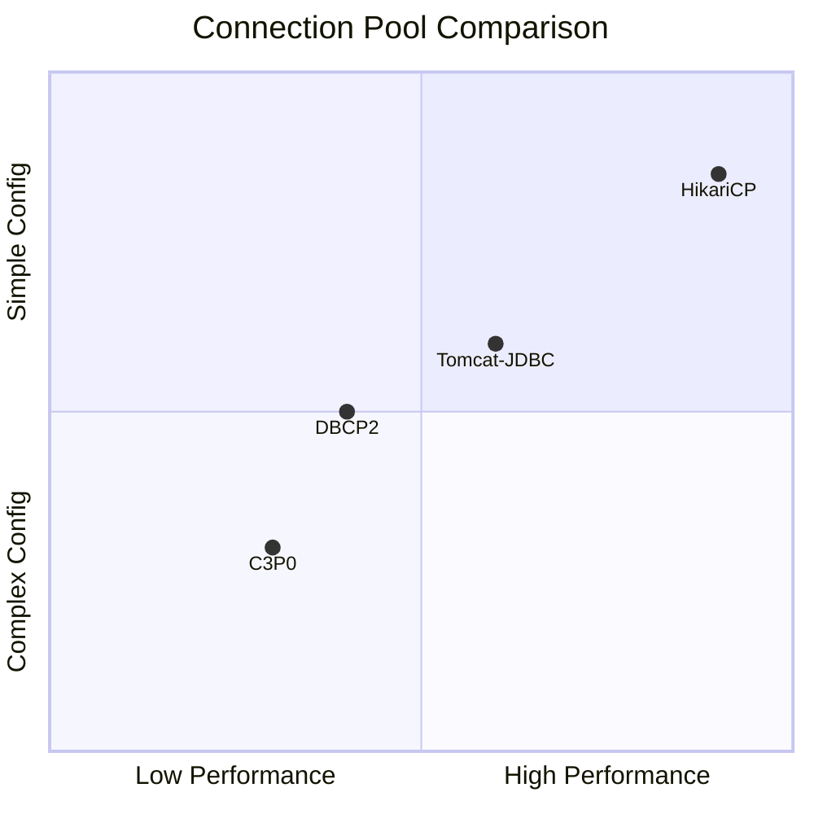
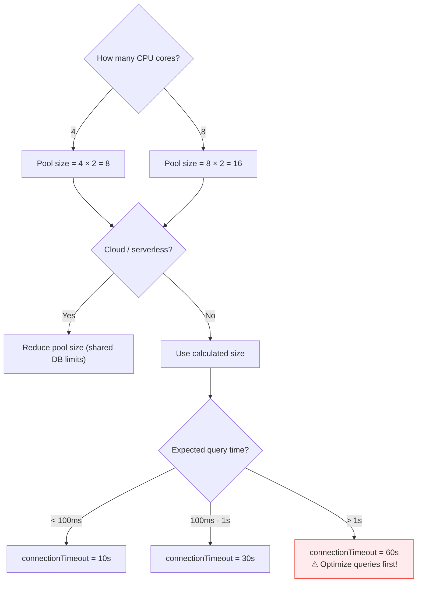
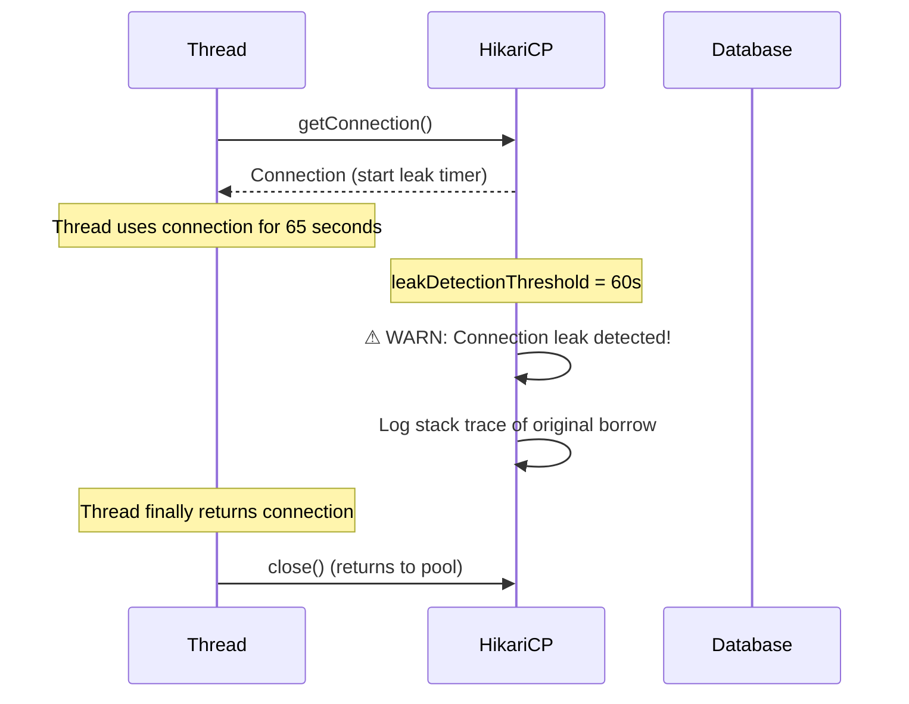

# 08 — HikariCP

## What is HikariCP?

HikariCP (光 = "light" in Japanese) is the **fastest JDBC connection pool** in the Java ecosystem. Spring Boot chose it as the **default** connection pool since Spring Boot 2.0. No configuration needed — just add a database driver dependency.

> **Python Bridge:** HikariCP is to Java what SQLAlchemy's internal pool (`QueuePool`) is to Python. Both manage a pool of database connections. An external equivalent in the Python world would be `pgbouncer`.

## Why HikariCP Won



| Feature | HikariCP | Tomcat-JDBC | DBCP2 | C3P0 |
|---|---|---|---|---|
| Connection borrow time | ~200ns | ~2μs | ~5μs | ~10μs |
| Memory per connection | Low | Medium | Medium | High |
| Spring Boot default | ✅ Yes | ❌ | ❌ | ❌ |
| Leak detection | ✅ Built-in | ❌ | ❌ | ❌ |
| Metrics support | ✅ Micrometer | ❌ | ❌ | ❌ |

## Spring Boot Auto-Configuration

Just add the dependency — Spring Boot does the rest:

```groovy
// build.gradle — HikariCP is included automatically with any Spring Boot starter
dependencies {
    implementation 'org.springframework.boot:spring-boot-starter-data-jpa'
    runtimeOnly 'org.postgresql:postgresql'
    // HikariCP is already included transitively!
}
```

```yaml
# application.yml — HikariCP configuration
spring:
  datasource:
    url: jdbc:postgresql://localhost:5432/mydb
    username: postgres
    password: secret
    hikari:
      maximum-pool-size: 10          # Max connections
      minimum-idle: 5                # Keep 5 idle connections ready
      connection-timeout: 30000      # Wait 30s for a connection (ms)
      idle-timeout: 600000           # Close idle after 10min (ms)
      max-lifetime: 1800000          # Recreate after 30min (ms)
      leak-detection-threshold: 60000 # Log warning if conn held >60s
      pool-name: MyAppPool           # Name for metrics/logging
```

## Configuration Decision Tree



## Leak Detection



```
# Example log output:
WARN  HikariPool - Connection leak detection triggered for connection1
       on thread http-nio-8080-exec-5, stack trace follows:
       at com.example.UserService.getUserDetails(UserService.java:42)
       at com.example.UserController.getUser(UserController.java:28)
```

## Monitoring with Micrometer

```java
@Configuration
public class HikariMetricsConfig {

    @Autowired
    public void configureHikariMetrics(DataSource dataSource, MeterRegistry registry) {
        if (dataSource instanceof HikariDataSource hikariDS) {
            hikariDS.setMetricRegistry(registry);
            // Now you get metrics:
            // hikaricp.connections.active — currently borrowed
            // hikaricp.connections.idle — available in pool
            // hikaricp.connections.pending — waiting for a connection
            // hikaricp.connections.timeout — borrow timeouts
        }
    }
}
```

## Interview Questions

### Conceptual

**Q1: Why is HikariCP the default pool in Spring Boot?**
> HikariCP is 10-100x faster than alternatives (C3P0, DBCP2) in benchmarks. It achieves this through lock-free operations (ConcurrentBag), bytecode-level optimizations, and compact codebase (~130KB JAR). It also has built-in leak detection and Micrometer metrics integration.

**Q2: What does `max-lifetime` protect against?**
> Database servers and network infrastructure (firewalls, load balancers) silently close idle connections after a timeout. `max-lifetime` ensures connections are recycled BEFORE the server kills them, preventing "connection reset" errors in production.

### Scenario/Debug

**Q3: Your app starts throwing "Connection is not available" after running for 2 hours. Pool size is 20, but `active` metric shows all 20 in use. What's wrong?**
> Connection leak — threads borrow connections but never return them (missing `close()` or try-with-resources). Fix: Set `leak-detection-threshold: 60000` to identify the leaking code. Then ensure all connections are obtained inside try-with-resources blocks.

**Q4: You set `maximum-pool-size: 100` but PostgreSQL crashes with "too many clients". Why?**
> If you have 5 application instances, each with pool size 100, that's 500 connections. PostgreSQL defaults to `max_connections = 100`. Fix: Pool size should be `DB max_connections / number_of_app_instances`, minus some headroom for admin connections.

### Quick Fire

**Q5: Default HikariCP `maximumPoolSize` in Spring Boot?**
> 10 connections.

**Q6: Python equivalent of leak detection?**
> SQLAlchemy's `pool_recycle` and `pool_pre_ping` options. For explicit leak detection, set `QueuePool(timeout=30)` and enable echo_pool logging.
