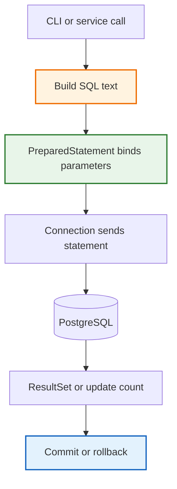

# CRUD With JDBC

Raw JDBC CRUD is the point where you stop relying on framework magic and see the full database contract: SQL text, parameter binding, connection lifetime, and transaction boundaries. We teach this before JPA on purpose. Hibernate and Spring Data are powerful, but they only make sense once you understand what they are hiding for you.

## Python Bridge

| Concept | Python / FastAPI World | Java / JDBC World |
|---|---|---|
| Open a connection | `psycopg2.connect(dsn)` | `DataSource.getConnection()` |
| Run SQL | `cursor.execute(sql, params)` | `PreparedStatement.executeQuery()` / `executeUpdate()` |
| Read rows | `cursor.fetchone()` / `fetchall()` | `ResultSet.next()` + getters |
| Commit work | `conn.commit()` | `conn.commit()` |
| Roll back work | `conn.rollback()` | `conn.rollback()` |
| Batch writes | `executemany()` | `addBatch()` + `executeBatch()` |

Python feels lighter because the ceremony is smaller, but the design problem is the same: you still need a safe way to bind parameters, manage transactions, and close resources. JDBC makes every step explicit, which is exactly why it is such a good foundation before JPA.

## CRUD Flow



## Why Raw JDBC Exists Before JPA

JPA is not replacing JDBC. It is a higher-level layer built on top of it.

| JDBC teaches | JPA later automates |
|---|---|
| How SQL is shaped | Entity state transitions |
| How transactions begin and end | Transaction demarcation with `@Transactional` |
| How parameters are bound | Dirty checking and flush behavior |
| How rows become objects | Object-relational mapping |

If you skip JDBC, JPA can feel like a black box. If you learn JDBC first, JPA becomes understandable abstraction instead of opaque magic.

## Code Walkthrough

```java
PreparedStatement stmt = conn.prepareStatement(
    "UPDATE employees SET salary = ? WHERE id = ?"
);
stmt.setBigDecimal(1, newSalary);
stmt.setLong(2, employeeId);
int updated = stmt.executeUpdate();
```

This small block carries the full JDBC story:

1. The SQL is visible.
2. The parameters are safe.
3. The return value tells you exactly how many rows changed.
4. The connection boundary is under your control.

## Real-World Use Cases

- Migration scripts that need precise control over schema and data changes.
- Background maintenance jobs that write many rows in one transaction.
- Debugging production issues where you need to see the exact SQL sent to the database.

## Anti-Patterns

- Building SQL with string concatenation. Use `PreparedStatement` placeholders instead.
- Leaving autocommit on for multi-step writes. Wrap the unit of work in one transaction.
- Borrowing a connection and forgetting to close it. Always use try-with-resources.

## Interview Questions

### Conceptual

**Q1: Why do we teach raw JDBC before Spring Data JPA?**
> Because JPA is built on JDBC. If you understand raw SQL, parameters, connections, and transactions first, JPA becomes a useful abstraction instead of hidden magic.

**Q2: What problem does `PreparedStatement` solve that `Statement` does not?**
> It gives you parameter binding and query-plan reuse, which protects against SQL injection and avoids reparsing the same SQL repeatedly.

### Scenario/Debug

**Q3: Your JDBC batch insert saves the first few rows and then crashes. What should you check first?**
> Check whether `autoCommit` was turned off and whether the code calls `rollback()` on failure. If the batch is not wrapped in one transaction, partial writes can leak into the database.

**Q4: A developer says, "JPA should be enough, we never need JDBC." What is the risk in that mindset?**
> They may miss the cost of hidden SQL, lazy loading, and transaction boundaries. JDBC is still the layer that executes every ORM operation, so understanding it is how you debug the hard failures.

### Quick Fire

**Q5: What JDBC class returns the number of rows changed by `UPDATE` or `DELETE`?**
> `executeUpdate()`

**Q6: What method is used to move from one row to the next in a `ResultSet`?**
> `next()`
