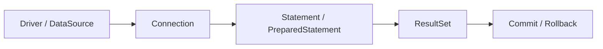

# JDBC Fundamentals One-Page Cheat Sheet

## Connection Flow

## Python Bridge

| JDBC Concept | Python Equivalent | Short Memory Hook |
|---|---|---|
| `DataSource` | Database client / pool config | Preferred connection source |
| `PreparedStatement` | Parameterized cursor query | Safe SQL |
| `ResultSet` | Cursor rows | Read one row at a time |
| `commit()` | `commit()` | Persist the unit of work |
| `rollback()` | `rollback()` | Undo the unit of work |

## Fast Reference

| Topic | Use It When | Watch Out For |
|---|---|---|
| `DriverManager` | You need a simple connection example | Avoid using it directly in production code when a pool is available |
| `DataSource` | You want pool-friendly connection access | Configure the driver correctly |
| `PreparedStatement` | You bind parameters safely | Do not build SQL by string concatenation |
| `ResultSet` | You need to read query rows | Always advance with `next()` |
| `commit()` / `rollback()` | You need transaction control | Forgetting to commit can lose work |
| HikariCP | You need a fast, reliable pool | Size the pool for the database, not just the app |

## Debug Checklist

1. Check the connection string and driver.
2. Confirm the SQL text and bound parameters.
3. Verify transaction boundaries.
4. Inspect resource closing and pooling.
5. Look for repeated queries that should be batched.

## Mental Model

- JDBC exposes the real database contract.
- `PreparedStatement` protects your SQL.
- `ResultSet` is the row reader.
- The pool makes repeated access practical.

## Interview Questions

1. Why is `DataSource` usually preferred over `DriverManager`?
2. What problem does `PreparedStatement` solve?
3. Why is connection pooling needed?
4. What is the most common `ResultSet` mistake?
5. How does raw JDBC prepare you for Hibernate or Spring Data JPA?
