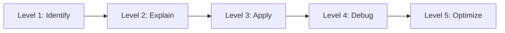

# JDBC Fundamentals Progressive Quiz Drill

## What This Drill Covers

This drill moves from connection basics to pooling and transactions.

## Python Bridge

| JDBC Concept | Python Equivalent | Why It Helps |
|---|---|---|
| `DriverManager.getConnection()` | `connect()` | Opens a DB session |
| `PreparedStatement` | Parameterized SQL | Protects against injection |
| `ResultSet` | Cursor / row iterator | Reads results one row at a time |
| `commit()` / `rollback()` | Transaction control | Keeps work atomic |
| HikariCP | Connection pool | Reuses DB connections efficiently |

## Progressive Questions

### Level 1 - Identify

1. What object opens a JDBC connection?
2. What API should you use for parameterized SQL?
3. What does `ResultSet.next()` do?

### Level 2 - Explain

1. Why is `PreparedStatement` safer than string concatenation?
2. Why is connection pooling important?
3. Why do we close JDBC resources in a deterministic order?

### Level 3 - Apply

1. Write the steps for insert -> query -> commit.
2. Decide when to use `rollback()`.
3. Choose between `Statement` and `PreparedStatement`.

### Level 4 - Debug

1. A query returns no rows even though the table has data. What should you inspect first?
2. A connection leak appears under load. Which layer might be mismanaged?
3. Why does a transaction sometimes need an explicit commit?

### Level 5 - Optimize

1. How do you choose a reasonable connection pool size?
2. When would you prefer `DataSource` over `DriverManager`?
3. What checks help you keep JDBC code safe and maintainable?

## Self-Check Answers

- `DriverManager.getConnection()` or a `DataSource` opens the connection.
- `PreparedStatement` is the correct choice for parameterized SQL.
- `ResultSet.next()` advances to the next row.
- Pooling reduces the cost of repeatedly opening and closing connections.

## Interview Questions

1. Why is pooling a production requirement?
2. What is the difference between `Statement` and `PreparedStatement`?
3. Why should JDBC resources be closed reliably?
4. What is the role of `commit()` in a transaction?
5. How does JDBC help you understand JPA and Spring Data later?
