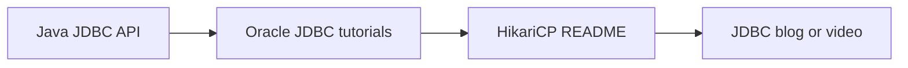

# JDBC Fundamentals Top Resource Guide

## Best Starting Points

## Curated External Resources

1. [Java JDBC API](https://docs.oracle.com/javase/8/docs/technotes/guides/jdbc/) - The official Java API overview for core JDBC concepts and packages.
2. [Trail: JDBC Database Access](https://docs.oracle.com/javase/tutorial/jdbc/) - Oracle's tutorial trail for connections, statements, transactions, and result sets.
3. [Lesson: JDBC Basics](https://docs.oracle.com/javase/tutorial/jdbc/basics/) - The most useful Oracle tutorial section for hands-on JDBC fundamentals.
4. [HikariCP GitHub repository](https://github.com/brettwooldridge/HikariCP) - The canonical connection-pool reference used by Spring Boot.
5. [N+1 query problem with JPA and Hibernate](https://vladmihalcea.com/n-plus-1-query-problem/) - Helpful when you want to see why JDBC-level thinking still matters after moving to ORM.
6. [A beginner's guide to Hibernate fetching strategies](https://vladmihalcea.com/hibernate-facts-the-importance-of-fetch-strategy/) - A practical bridge from raw JDBC thinking to ORM fetch planning.

## How To Use These Resources

- Start with Oracle when you want the API contract and raw mechanics.
- Read HikariCP when you need connection-pool behavior and tuning context.
- Use Vlad Mihalcea's articles when you want to connect JDBC thinking to ORM performance.

## Interview Questions

1. Why should raw JDBC be understood before ORM?
2. Why is the Oracle tutorial still useful even though it is older?
3. What makes HikariCP the default mental model for pooling in Spring Boot?
4. How does JDBC-level reasoning help you debug ORM issues?
5. Which resource would you open first for connection management questions?
