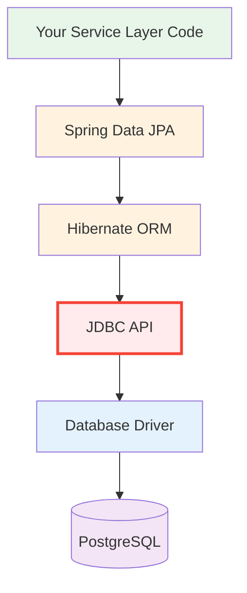

# 03 — JDBC (Java Database Connectivity)

## Overview
JDBC is Java's **foundational API for database access** — every framework (Hibernate, Spring Data, MyBatis) is ultimately built on top of JDBC. Understanding JDBC is understanding the "metal" that all higher-level abstractions hide from you.

> **Python Bridge:** If you've used `psycopg2` or `sqlite3` in Python, you already know the concepts. JDBC is Java's equivalent of Python's DB-API 2.0 (PEP 249).

## Why Learn JDBC Before Spring Data?



**You are here:** Learning Layer D (JDBC) before Layers B-C (JPA/Hibernate).

## Module Structure

| Sub-Topic | Focus | Key Files |
|---|---|---|
| **01-jdbc-fundamentals** | Architecture, connections, statements, transactions, connection pooling | 8 explanations, 4 demos, 2 exercises |
| **mini-project-03-employee-jdbc** | Full CRUD application using raw JDBC | Complete runnable app |

## Python ↔ Java Quick Reference

| Python (psycopg2) | Java (JDBC) |
|---|---|
| `conn = psycopg2.connect(...)` | `conn = DriverManager.getConnection(url)` |
| `cursor = conn.cursor()` | `stmt = conn.createStatement()` |
| `cursor.execute(sql, params)` | `pstmt.executeQuery()` |
| `rows = cursor.fetchall()` | `ResultSet rs = stmt.executeQuery()` |
| `conn.commit()` | `conn.commit()` |
| `conn.close()` | `conn.close()` (or try-with-resources) |
| `with conn:` (context manager) | `try (Connection c = ...) {}` |

## How to Run
```bash
# Run the JDBC mini-project
./gradlew :03-jdbc:bootRun

# Run a specific demo (if configured)
./gradlew :03-jdbc:run
```
