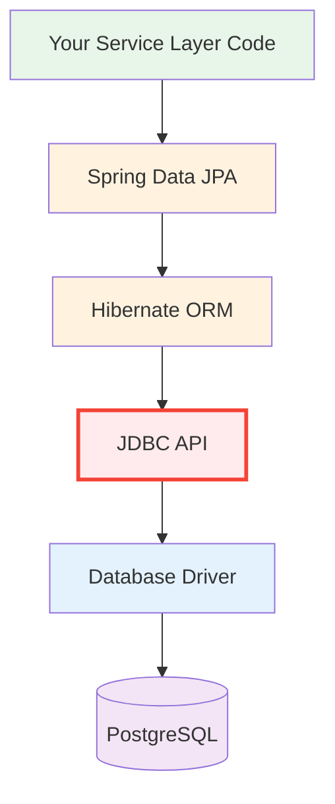

# 03 — JDBC (Java Database Connectivity)

## Overview

JDBC is Java's **foundational API for database access** — every framework (Hibernate, Spring Data, MyBatis) is ultimately built on top of JDBC. Understanding JDBC is understanding the "metal" that all higher-level abstractions hide from you.

## Why Raw JDBC Comes First

Spring Data JPA and Hibernate do not replace JDBC. They sit on top of it. We start with raw JDBC so you can see the exact SQL, parameter binding, and transaction boundary before an ORM adds convenience.

That matters for Python/FastAPI engineers because the mental model is the same as moving from `psycopg2` or SQLAlchemy Core into the ORM layer. If you know the lower layer first, the higher layer is easier to trust and debug.

## Python Bridge

If you've used `psycopg2` or `sqlite3` in Python, you already know the concepts. JDBC is Java's equivalent of Python's DB-API 2.0 (PEP 249).

## Why Learn JDBC Before Spring Data?



**You are here:** Learning Layer D (JDBC) before Layers B-C (JPA/Hibernate).

## Module Structure

| Sub-Topic | Focus | Key Files |
|---|---|---|
| **01-jdbc-fundamentals** | Architecture, connections, statements, transactions, connection pooling | 8 explanations, 5 demos, 2 exercises |
| **CRUDWithJDBC.java** | Runnable CRUD walkthrough that shows the raw JDBC lifecycle | Explains the layer JPA later hides |
| **mini-project-03-employee-jdbc** | Full CRUD application using raw JDBC | Complete runnable app |

## Python -> Java Quick Reference

| Python (psycopg2) | Java (JDBC) |
|---|---|
| `conn = psycopg2.connect(...)` | `conn = DriverManager.getConnection(url)` |
| `cursor = conn.cursor()` | `stmt = conn.createStatement()` |
| `cursor.execute(sql, params)` | `pstmt.executeQuery()` |
| `rows = cursor.fetchall()` | `ResultSet rs = stmt.executeQuery()` |
| `conn.commit()` | `conn.commit()` |
| `conn.close()` | `conn.close()` (or try-with-resources) |
| `with conn:` (context manager) | `try (Connection c = ...) {}` |

## How to Run

```bash
# Run the JDBC walkthrough demo
./gradlew :03-jdbc:run -PmainClass=com.springmastery.jdbc.demo.CRUDWithJDBC

# Run the JDBC mini-project
./gradlew :03-jdbc:mini-project-03-employee-jdbc:run

# Run a specific demo (if configured)
./gradlew :03-jdbc:run
```

## Support Pack

- [Progressive Quiz Drill](resources/progressive-quiz-drill.md)
- [One-Page Cheat Sheet](resources/one-page-cheat-sheet.md)
- [Top Resource Guide](resources/top-resource-guide.md)
