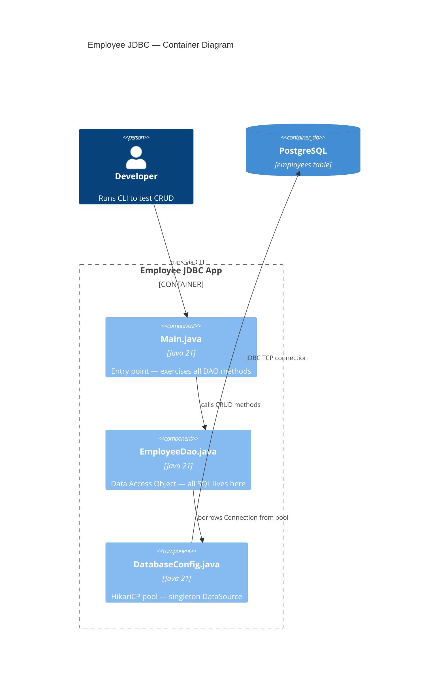
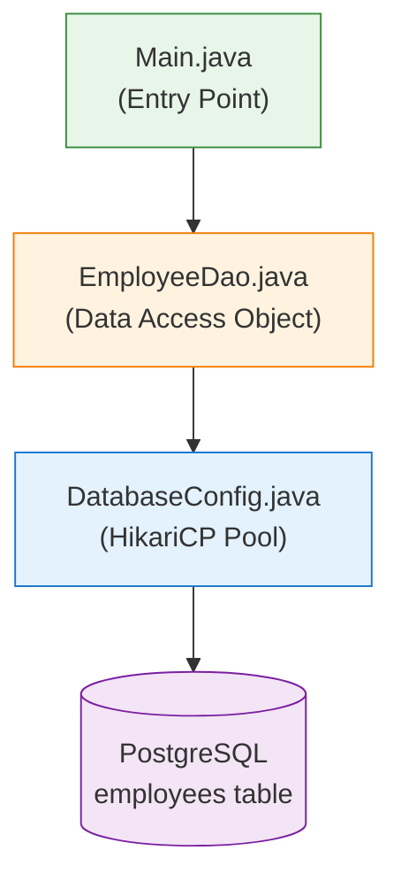
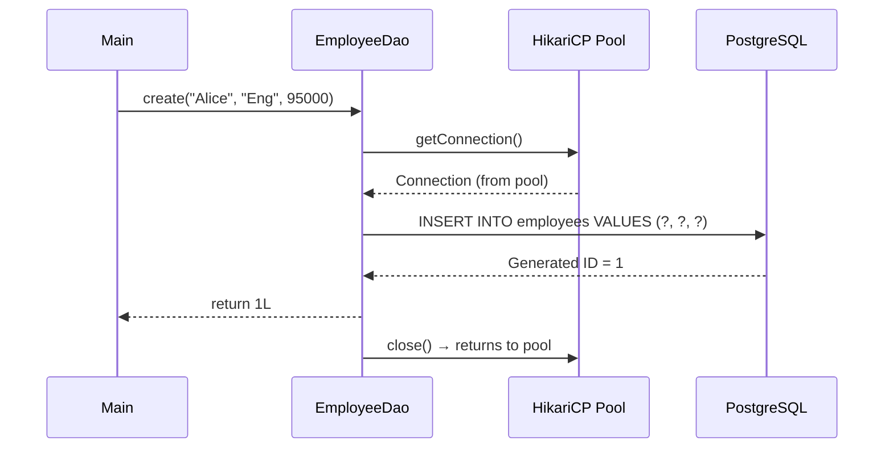
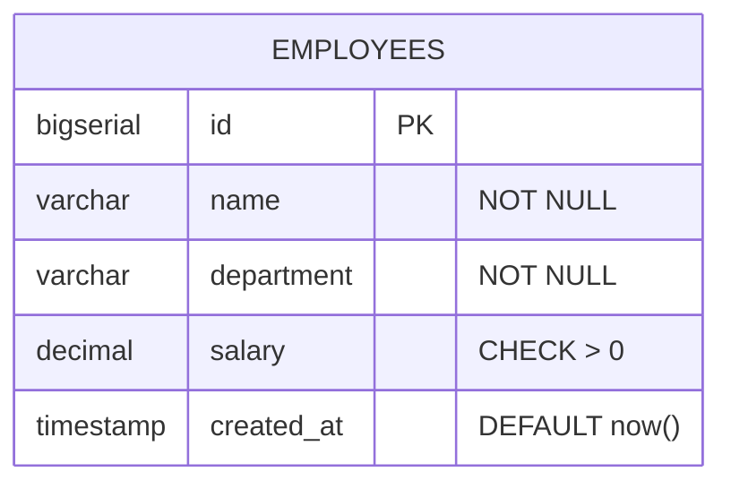

# Architecture — Employee JDBC Mini-Project

## Overview

A complete **CRUD application** demonstrating raw JDBC with HikariCP connection pooling. This project applies every concept from `01-jdbc-fundamentals` into a working, production-patterned application.

> **Python Bridge:** This is equivalent to a Python project with `create_engine()` → `Repository` class → `main.py` CLI runner.

---

## System Architecture



## Component Diagram



## Layer Responsibilities

| Component | Responsibility | Design Pattern | Python Equivalent |
|---|---|---|---|
| `Main.java` | CLI entry point, demo orchestration | Application entry | `if __name__ == "__main__":` |
| `EmployeeDao.java` | All SQL operations (CRUD + batch + search) | DAO (Data Access Object) | Repository class with `cursor.execute()` |
| `DatabaseConfig.java` | HikariCP pool lifecycle (init + shutdown) | Singleton | `engine = create_engine(url, pool_size=10)` |

## Data Flow



## Key Design Decisions

| Decision | Rationale |
|---|---|
| **DAO pattern** (not Repository) | Raw JDBC has no framework — DAO isolates SQL from business logic |
| **DataSource injection** | DAO accepts `DataSource`, not raw URL — enables pool sharing and testing |
| **PreparedStatement everywhere** | Prevents SQL injection; enables parameter binding |
| **try-with-resources** | Guarantees `Connection`, `PreparedStatement`, `ResultSet` are closed |
| **RETURN_GENERATED_KEYS** | Gets DB-assigned ID after INSERT without a separate SELECT |
| **Manual transaction in batch** | `setAutoCommit(false)` + `commit()` / `rollback()` for atomicity |

## Database Schema

```sql
CREATE TABLE employees (
    id          BIGSERIAL       PRIMARY KEY,
    name        VARCHAR(100)    NOT NULL,
    department  VARCHAR(50)     NOT NULL,
    salary      DECIMAL(10,2)   NOT NULL CHECK (salary > 0),
    created_at  TIMESTAMP       DEFAULT CURRENT_TIMESTAMP
);
```



## Interview Questions

### Conceptual
1. **Why use the DAO pattern instead of putting SQL directly in Main?**
   *Hint:* Separation of concerns — DAO isolates data access, making it testable and swappable.

2. **Why inject `DataSource` instead of creating connections with `DriverManager` inside the DAO?**
   *Hint:* Pool management — `DataSource` wraps HikariCP, enabling connection reuse. `DriverManager` creates a new TCP connection every time (~50ms overhead).

### Scenario/Debug
3. **What happens if you forget `conn.setAutoCommit(true)` in the finally block of `batchCreate()`?**
   *Hint:* The connection is returned to the pool still in manual-commit mode. The next borrower's operations won't commit automatically — silent data loss.

### Quick Fire
4. **`Statement.RETURN_GENERATED_KEYS` — what SQL does this translate to in PostgreSQL?**
   *Answer:* `INSERT ... RETURNING *` (PostgreSQL-specific; JDBC driver handles the translation).
