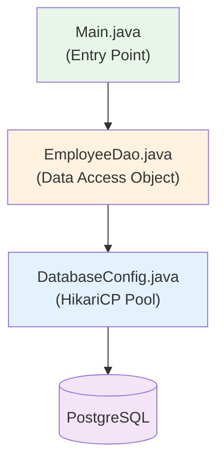

# Mini-Project 03 — Employee JDBC Application

## Overview
A complete **CRUD application** using raw JDBC with HikariCP connection pooling. This project applies everything learned in `01-jdbc-fundamentals` into a working application.

## Architecture



## Files

| File | Responsibility |
|---|---|
| `DatabaseConfig.java` | HikariCP pool setup — single DataSource for the app |
| `EmployeeDao.java` | All SQL operations (CRUD + batch + search) |
| `Main.java` | CLI demo — exercises all DAO methods |

## Python Comparison

| Java (this project) | Python Equivalent |
|---|---|
| `DatabaseConfig` → `HikariDataSource` | `create_engine(url, pool_size=10)` |
| `EmployeeDao` with `PreparedStatement` | `cursor.execute(sql, params)` |
| `try (Connection conn = ds.getConnection())` | `with engine.connect() as conn:` |

## How to Run
```bash
# Ensure PostgreSQL is running with springmastery database
./gradlew :03-jdbc:run
```

## Database Setup
```sql
CREATE DATABASE springmastery;

CREATE TABLE employees (
    id BIGSERIAL PRIMARY KEY,
    name VARCHAR(100) NOT NULL,
    department VARCHAR(50) NOT NULL,
    salary DECIMAL(10,2) NOT NULL CHECK (salary > 0),
    created_at TIMESTAMP DEFAULT CURRENT_TIMESTAMP
);
```
