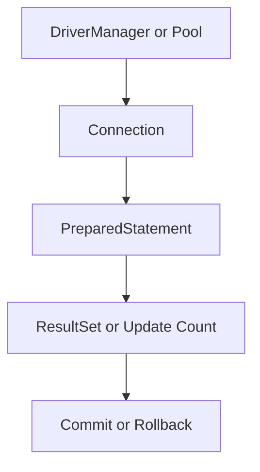

# JDBC One-Page Cheat Sheet

## Fast Mapping

| JDBC concept | What to remember |
|---|---|
| `Connection` | database session and transaction boundary |
| `PreparedStatement` | safe SQL with bound parameters |
| `ResultSet` | cursor-style row access |
| `commit()` / `rollback()` | explicit unit-of-work control |
| HikariCP | connection reuse for production workloads |

## Python Bridge

| Java | Python |
|---|---|
| `DriverManager.getConnection()` | `psycopg2.connect()` |
| `PreparedStatement` | `cursor.execute(sql, params)` |
| try-with-resources | context manager / explicit cleanup |
| HikariCP | SQLAlchemy pool |

## Red Flags

| Red flag | Risk |
|---|---|
| SQL string concatenation | injection and escaping bugs |
| no rollback path | partial writes |
| opening new physical connections in tight loops | severe latency and load issues |
| forgetting to close `ResultSet` / statements | leaks and unstable behavior |

## Fast Rules

1. Use `PreparedStatement` by default.
2. Treat transactions as business units, not incidental API calls.
3. Treat connection reuse as mandatory in production.

## Interview Questions

1. Why does JDBC still matter even when teams mainly use JPA?
2. When should you disable auto-commit?
3. What makes a connection pool a correctness concern as well as a performance concern?
