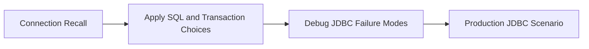

# JDBC Progressive Quiz Drill

Use this drill after studying connections, statements, transactions, pooling, and CRUD together.



## Round 1 - Core Recall

**Q1.** Why is `PreparedStatement` safer than plain `Statement` for application queries?

**Q2.** What problem does connection pooling solve?

**Q3.** Why should JDBC code usually use try-with-resources for `Connection`, `Statement`, and `ResultSet`?

**Q4.** What is the difference between auto-commit mode and an explicit transaction?

## Round 2 - Apply and Compare

**Q5.** You need to insert many rows as one business action. Would you rely on auto-commit or disable it and commit once? Why?

**Q6.** A service runs frequent database calls. Would you open a new physical connection each time or use a pool like HikariCP? Why?

**Q7.** You need to load one employee by id. Would you build SQL through string concatenation or use a parameterized query? Explain why.

## Round 3 - Debug the Bug

**Q8.** What is wrong with this code?

```java
String sql = "SELECT * FROM users WHERE email = '" + email + "'";
Statement stmt = conn.createStatement();
ResultSet rs = stmt.executeQuery(sql);
```

**Q9.** Why is this transaction flow dangerous?

```java
conn.setAutoCommit(false);
insertEmployee(conn);
updateAudit(conn);
conn.commit();
```

An exception happens after `insertEmployee(conn)` and there is no rollback in the catch path.

**Q10.** Why can this become a production performance bug?

```java
for (Employee employee : employees) {
    try (Connection conn = DriverManager.getConnection(url, user, pass)) {
        saveEmployee(conn, employee);
    }
}
```

## Round 4 - Staff-Level Scenario

**Q11.** A batch import sometimes leaves half-written data when one row fails. What JDBC transaction questions would you ask first?

**Q12.** A team says "JPA is enough; we do not need JDBC knowledge." What concrete debugging situations would prove otherwise?

---

## Answer Key

### Round 1 - Core Recall

**A1.** `PreparedStatement` separates SQL structure from data values. That prevents SQL injection and lets the driver reuse query plans more effectively.

**A2.** Pooling avoids paying the full cost of creating a brand-new physical database connection for every operation. It improves performance and stabilizes throughput under load.

**A3.** JDBC resources are expensive and easy to leak. Try-with-resources guarantees cleanup even when an exception interrupts the normal path.

**A4.** Auto-commit commits each statement immediately. An explicit transaction groups multiple statements into one unit of work that can commit or roll back together.

### Round 2 - Apply and Compare

**A5.** Disable auto-commit and commit once. That makes the full batch one unit of work and avoids partial success if something fails halfway through.

**A6.** Use a connection pool. Reusing warm connections is far more efficient and production-friendly than repeatedly opening physical connections.

**A7.** Use a parameterized query. String concatenation is unsafe, error-prone, and makes escaping rules the application's problem.

### Round 3 - Debug the Bug

**A8.** The bug is SQL injection risk. User input is being inserted directly into the SQL string. Replace it with `PreparedStatement` and bind the parameter safely.

**A9.** Without rollback, the first write can remain pending or behave unpredictably depending on how the exception is handled. The transaction path must always include explicit rollback on failure.

**A10.** The loop opens a brand-new connection per employee. That adds heavy connection setup cost and ignores pooling, which can destroy performance at scale.

### Round 4 - Staff-Level Scenario

**A11.** Ask whether auto-commit was disabled, whether rollback happens on every failure path, whether the whole batch is one transaction, and whether partial-success behavior is intentional or accidental.

**A12.** JDBC knowledge is essential when debugging SQL shape, transaction boundaries, connection leaks, pool exhaustion, batch behavior, and database-driver-level failures that ORM abstractions hide.
