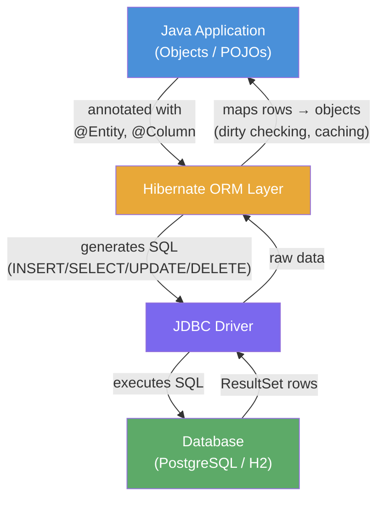

# 01 — Hibernate Basics

> **Module:** 04-hibernate-jpa → 01-hibernate-basics
> **Track:** Java/Spring Boot Mastery (Staff Engineer Interview Prep)
> **Estimated time:** 6–8 hours

---

## What This Sub-Module Covers

Before JPA and Hibernate, every database interaction meant writing raw JDBC: manually mapping
`ResultSet` rows to Java objects, writing `PreparedStatement` boilerplate for every query, and
duplicating the same try/catch/finally connection-cleanup pattern for every operation. For a system
with 50 tables that is 50 entity classes, each with hand-written INSERT, SELECT, UPDATE, and DELETE
SQL — thousands of lines of mechanical, error-prone code.

Hibernate solved this with **Object-Relational Mapping (ORM)**: you annotate Java classes once, and
Hibernate generates all SQL automatically, tracks which fields changed (dirty checking), and manages
connection pooling and transactions for you.

This sub-module builds the foundational mental model before you encounter Spring Data JPA, which
wraps Hibernate in yet another layer of magic. Understanding the layer underneath makes every Spring
Data debug session 10× faster.

---

## Learning Outcomes

After completing this sub-module you will be able to:

1. Explain the **object-relational impedance mismatch** and why ORM exists
2. Describe Hibernate's internal architecture: `SessionFactory`, `Session`, `Transaction`, and `ConnectionProvider`
3. Annotate a Java class as a JPA entity with `@Entity`, `@Table`, `@Id`, `@GeneratedValue`, `@Column`, `@Enumerated`, and `@Transient`
4. Understand all four **entity lifecycle states** (Transient, Persistent, Detached, Removed) and the transitions between them
5. Perform all five CRUD operations using `Session`/`EntityManager` and manage transactions correctly
6. Configure a `SessionFactory` programmatically using H2 for demos and PostgreSQL for production
7. Identify and avoid the five most common Hibernate mistakes that cause production incidents

---

## Table of Explanation Files

| File | What It Covers |
|------|---------------|
| `explanation/01-orm-concept.md` | Impedance mismatch problem, what ORM solves, Hibernate vs raw JDBC |
| `explanation/02-hibernate-architecture.md` | SessionFactory, Session, entity lifecycle states, JPA vs Hibernate API |
| `explanation/03-entity-annotations.md` | All core JPA annotations with WHY for each, anti-patterns |
| `explanation/04-session-factory.md` | Configuration, hibernate.cfg.xml vs programmatic setup, hbm2ddl.auto dangers |
| `explanation/05-crud-operations.md` | persist/find/merge/remove, dirty checking, flush, transaction management |

---

## Runnable Demos

| File | What It Demonstrates |
|------|---------------------|
| `explanation/ORMConceptDemo.java` | Side-by-side JDBC vs Hibernate for the same INSERT |
| `explanation/EntityAnnotationsDemo.java` | Fully-annotated `Book` entity, shows generated DDL |
| `explanation/SessionFactoryDemo.java` | SessionFactory lifecycle, entity state transitions |
| `explanation/CrudDemo.java` | All 5 CRUD operations with transaction boundaries |

---

## Exercises

| File | Level | Time | Topic |
|------|-------|------|-------|
| `exercises/Ex01_ProductEntity.java` | Level 1 — Guided | < 20 min | Annotating a JPA entity from scratch |
| `exercises/Ex02_EntityLifecycle.java` | Level 2 — Practitioner | 20–45 min | Full lifecycle: persist, detach, merge, remove |
| `exercises/solutions/Sol01_ProductEntity.java` | Solution | — | Ex01 with full WHY comments |
| `exercises/solutions/Sol02_EntityLifecycle.java` | Solution | — | Ex02 with full WHY comments |

---

## Resources

| File | What It Contains |
|------|-----------------|
| `resources/progressive-quiz-drill.md` | 4-round quiz: recall → apply → debug → staff-level scenario |
| `resources/one-page-cheat-sheet.md` | Annotations, lifecycle states, CRUD snippets at a glance |
| `resources/top-resource-guide.md` | Curated external docs, books, and videos |

---

## Prerequisites

- **Java OOP**: classes, interfaces, inheritance, generics — you must be comfortable with these
- **JDBC Basics**: you should have completed `03-jdbc/01-jdbc-fundamentals` and understand `Connection`, `PreparedStatement`, `ResultSet`
- **Gradle**: able to run `./gradlew tasks` and understand subproject dependencies

---

## How the ORM Layer Fits In



---

## Python Bridge: SQLAlchemy → Hibernate

If you have used SQLAlchemy's declarative ORM, Hibernate is the same concept with different syntax:

| SQLAlchemy (Python) | Hibernate / JPA (Java) |
|---------------------|------------------------|
| `Base = declarative_base()` | `@Entity` on the class |
| `class Product(Base):` | `public class Product { }` |
| `__tablename__ = "products"` | `@Table(name = "products")` |
| `id = Column(Integer, primary_key=True)` | `@Id @GeneratedValue Long id` |
| `name = Column(String(100), nullable=False)` | `@Column(nullable=false, length=100)` |
| `engine = create_engine(url)` | `SessionFactory` via `Configuration` |
| `Session = sessionmaker(bind=engine)` | `sessionFactory.openSession()` |
| `session.add(obj)` | `session.persist(obj)` |
| `session.query(Product).get(1)` | `session.find(Product.class, 1L)` |
| `session.delete(obj)` | `session.remove(obj)` |
| `session.commit()` | `transaction.commit()` |

The key difference: SQLAlchemy is dynamically typed and introspects at runtime. Hibernate is
statically typed — your entity annotations are checked at `SessionFactory` build time, which means
configuration errors are caught at startup rather than at 3 AM in production.

---

## How to Run the Demos

```bash
# Run the ORM concept demo (JDBC vs Hibernate side-by-side)
./gradlew :04-hibernate-jpa:run -PmainClass=com.learning.hibernate.basics.ORMConceptDemo

# Run the entity annotations demo
./gradlew :04-hibernate-jpa:run -PmainClass=com.learning.hibernate.basics.EntityAnnotationsDemo

# Run the SessionFactory lifecycle demo
./gradlew :04-hibernate-jpa:run -PmainClass=com.learning.hibernate.basics.SessionFactoryDemo

# Run the CRUD operations demo
./gradlew :04-hibernate-jpa:run -PmainClass=com.learning.hibernate.basics.CrudDemo
```

All demos use **H2 in-memory database** — no Docker required. PostgreSQL is used in exercises that
target a real DB:

```bash
# Start PostgreSQL for exercises (optional)
docker run --name hibernate-demo -e POSTGRES_PASSWORD=secret \
  -e POSTGRES_DB=hibernatedemo -p 5432:5432 -d postgres:15
```

---

## Study Path

```
01-orm-concept.md          ← Start here (the "why")
        ↓
02-hibernate-architecture.md   ← Internal model
        ↓
03-entity-annotations.md       ← Annotation toolkit
        ↓
04-session-factory.md          ← Configuration
        ↓
05-crud-operations.md          ← Operations
        ↓
Run ORMConceptDemo.java        ← See it in action
Run EntityAnnotationsDemo.java
Run SessionFactoryDemo.java
Run CrudDemo.java
        ↓
Ex01_ProductEntity.java        ← Practice
Ex02_EntityLifecycle.java
        ↓
progressive-quiz-drill.md      ← Verify retention
```
