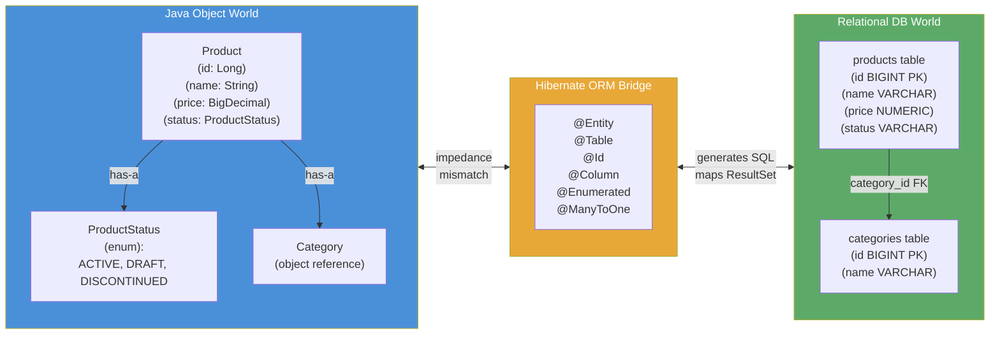

# 01 — ORM Concept: Why Hibernate Exists

## The Pain That Came Before

Imagine you are building an e-commerce platform in 2001. Your `Product` class has twelve fields:
`id`, `name`, `description`, `price`, `stockQuantity`, `sku`, `category`, `status`, `createdAt`,
`updatedAt`, `weight`, and `imageUrl`. To store one product in a relational database using raw JDBC
you write something like this:

```java
// Before ORM — the JDBC nightmare for a single INSERT
String sql = "INSERT INTO products (name, description, price, stock_quantity, sku, " +
             "category, status, created_at, updated_at, weight, image_url) " +
             "VALUES (?, ?, ?, ?, ?, ?, ?, ?, ?, ?, ?)";

try (Connection conn = dataSource.getConnection();
     PreparedStatement ps = conn.prepareStatement(sql, Statement.RETURN_GENERATED_KEYS)) {

    ps.setString(1, product.getName());
    ps.setString(2, product.getDescription());
    ps.setBigDecimal(3, product.getPrice());
    ps.setInt(4, product.getStockQuantity());
    ps.setString(5, product.getSku());
    ps.setString(6, product.getCategory());
    ps.setString(7, product.getStatus().name());  // Enum → String manually
    ps.setTimestamp(8, Timestamp.from(product.getCreatedAt()));
    ps.setTimestamp(9, Timestamp.from(product.getUpdatedAt()));
    ps.setBigDecimal(10, product.getWeight());
    ps.setString(11, product.getImageUrl());
    ps.executeUpdate();

    ResultSet keys = ps.getGeneratedKeys();
    if (keys.next()) {
        product.setId(keys.getLong(1));
    }
} catch (SQLException e) {
    throw new RuntimeException("Insert failed", e);
}
```

That is 25 lines for one INSERT. Now multiply by four operations (INSERT, SELECT, UPDATE, DELETE)
times 50 entities in a medium application — that is roughly 5,000 lines of mechanical, repetitive,
error-prone boilerplate. When your DBA adds a `discount_price` column, you find and update every
SQL string in the codebase. Miss one and the bug surfaces at runtime, not at compile time.

The SELECT mapping is equally painful. Every `executeQuery()` produces a `ResultSet` and you must
manually call `rs.getString("name")`, `rs.getBigDecimal("price")`, and so on for every field. The
mapping has no compile-time safety — mistype a column name and the bug is invisible until the row
is read in production.

This is not hypothetical. Before Hibernate, teams at major enterprises maintained entire
"persistence layers" — sometimes 40% of the codebase — that was nothing but JDBC boilerplate. It
was the single largest source of bugs, maintenance cost, and developer frustration in Java
enterprise development throughout the 1990s.

## The Impedance Mismatch Problem

The deeper issue is structural. Relational databases and object-oriented languages speak different
conceptual languages, and translating between them is inherently complex. This mismatch has five
distinct dimensions:

**Identity**: Java has reference equality (`==`) and `.equals()`. Databases have primary keys. A
Java `Product` and a database row are the "same" entity in completely different ways. ORM must
maintain a mapping between Java object identity and database row identity.

**Inheritance**: Java has single and multiple inheritance, interfaces, and polymorphism. SQL has
tables — flat, with no concept of "subtype". Mapping a `Vehicle` → `Car`/`Truck`/`Motorcycle`
hierarchy to relational tables requires explicit strategies (single table, joined tables, table per
class) that are non-trivial to implement manually.

**Associations**: Java objects hold references to other objects (`order.getCustomer()` returns a
`Customer` object). SQL tables hold foreign keys (`order.customer_id` is a `BIGINT`). Loading an
`Order` from the database does not automatically give you the `Customer` object — you have to join
or separately query. Manual JDBC code must decide when to do this join, for every association in
the entire graph.

**Type system**: Java has `String`, `BigDecimal`, `Instant`, `enum`, `byte[]`, custom value types.
SQL has `VARCHAR`, `NUMERIC`, `TIMESTAMP`, `INTEGER`, `BLOB`. The mapping between them is not
always obvious (`boolean` → `TINYINT(1)` in MySQL, `BOOLEAN` in PostgreSQL, `NUMBER(1,0)` in
Oracle) and differs by database vendor.

**Granularity**: Java models want many small, focused classes (`Address`, `Money`, `DateRange`).
SQL wants fewer tables (joins are expensive). Flattening Java's fine-grained model into a coarser
relational schema — and then reconstructing the fine-grained model when reading back — is entirely
mechanical but requires code.

Gavin King created Hibernate in 2001 specifically to automate the mechanical parts of this
translation. You declare the mapping once (first in XML, later in annotations), and Hibernate
handles SQL generation, type conversion, association loading, and transaction integration for you.

## What Hibernate Solves

With Hibernate, the same INSERT becomes:

```java
// With Hibernate — the same operation in 3 lines
try (Session session = sessionFactory.openSession()) {
    Transaction tx = session.beginTransaction();
    session.persist(product);  // WHY: tells Hibernate to track this object and INSERT it
    tx.commit();               // WHY: flushes pending SQL and commits the DB transaction
}
```

Hibernate generates the SQL, sets every parameter, retrieves the generated key, and sets it back
on the `product` object — all automatically, based on the annotations on the `Product` class.

Beyond saving lines, Hibernate provides:

- **Dirty checking**: Load a `Product`, change `product.setPrice(newPrice)`, commit — Hibernate
  generates `UPDATE products SET price = ? WHERE id = ?` automatically. You never explicitly call
  "save the update."
- **First-level cache**: Within a single `Session`, Hibernate never fetches the same entity twice.
  It returns the same Java object instance for the same primary key, preventing duplicate queries.
- **Lazy loading**: Associations (`order.getItems()`) are not loaded until accessed, preventing the
  SELECT-everything-at-startup performance disaster.
- **HQL**: Write queries in terms of your Java classes, not table names — `FROM Order WHERE
  customer.email = :email` works regardless of how tables are named.
- **Database portability**: Switch from H2 (tests) to PostgreSQL (staging) to Oracle (enterprise
  client) by changing one dialect property, not rewriting SQL.

---

## Python Bridge: SQLAlchemy vs Hibernate

| Concept | SQLAlchemy (Python) | Hibernate / JPA (Java) |
|---------|--------------------|-----------------------|
| ORM base | `declarative_base()` | `@Entity` annotation |
| Table name | `__tablename__ = "products"` | `@Table(name = "products")` |
| Column | `Column(String(100), nullable=False)` | `@Column(length=100, nullable=false)` |
| Primary key | `Column(Integer, primary_key=True)` | `@Id @GeneratedValue` |
| Auto-increment | `Column(Integer, autoincrement=True)` | `@GeneratedValue(strategy=IDENTITY)` |
| Engine | `create_engine(url)` | `SessionFactory` via `Configuration` |
| Session factory | `sessionmaker(bind=engine)` | `sessionFactory.openSession()` |
| Add object | `session.add(obj)` | `session.persist(entity)` |
| Fetch by PK | `session.query(Product).get(1)` | `session.find(Product.class, 1L)` |
| Delete | `session.delete(obj)` | `session.remove(entity)` |
| Commit | `session.commit()` | `transaction.commit()` |
| Rollback | `session.rollback()` | `transaction.rollback()` |

**Mental model**: SQLAlchemy and Hibernate are solving the identical problem for their respective
ecosystems. The API surface looks different, but the concepts map one-to-one. The critical
difference is type safety: Hibernate validates entity mappings at `SessionFactory` build time
(startup). SQLAlchemy validates at runtime when the first query executes. This means a misconfigured
Hibernate entity crashes the application immediately on startup — loud, early, debuggable. A
misconfigured SQLAlchemy model might only surface when a specific code path is hit in production.

---

## Mermaid Diagram: The Object-Relational Impedance Mismatch



---

## Working Java Code: Annotated Entity with Hibernate

```java
package com.learning.hibernate.basics;

import jakarta.persistence.*;
import java.math.BigDecimal;
import java.time.Instant;

// WHY @Entity: tells Hibernate's classpath scanner that this class maps to a DB table.
// Without this, Hibernate ignores the class entirely.
@Entity
// WHY @Table: explicitly names the table. Without this, Hibernate uses the class name
// "Product" as the table name — works, but explicit naming is more maintainable.
@Table(name = "products")
public class Product {

    // WHY @Id: identifies this field as the primary key mapping
    @Id
    // WHY @GeneratedValue(IDENTITY): instructs Hibernate to use the DB's auto-increment
    // mechanism rather than generating IDs in Java. Avoids an extra SELECT before INSERT.
    @GeneratedValue(strategy = GenerationType.IDENTITY)
    private Long id;

    // WHY nullable=false: adds NOT NULL to the DDL. Hibernate validates at flush time too.
    // WHY length=100: maps to VARCHAR(100) in generated DDL — prevents silent truncation.
    @Column(nullable = false, length = 100)
    private String name;

    // WHY BigDecimal for price: floating-point (double/float) loses precision for money.
    // precision=10, scale=2 → up to 99,999,999.99 with exactly 2 decimal places.
    @Column(nullable = false, precision = 10, scale = 2)
    private BigDecimal price;

    // WHY EnumType.STRING: stores "ACTIVE" / "DRAFT" / "DISCONTINUED" as VARCHAR.
    // If we used ORDINAL (the default!), reordering the enum breaks all existing data.
    @Enumerated(EnumType.STRING)
    @Column(nullable = false, length = 20)
    private ProductStatus status;

    // WHY @Transient: this is a computed field (name + " [$" + price + "]").
    // We never want Hibernate to try storing or loading this from the DB.
    @Transient
    private String displayLabel;

    // WHY: JPA requires a no-arg constructor (can be protected) for proxy creation.
    // Hibernate creates subclass proxies for lazy loading — those proxies need
    // to call super() without arguments.
    protected Product() {}

    public Product(String name, BigDecimal price, ProductStatus status) {
        this.name = name;
        this.price = price;
        this.status = status;
    }

    // Getters and setters omitted for brevity but required in real entities

    public enum ProductStatus { ACTIVE, DRAFT, DISCONTINUED }
}
```

---

## Real-World Use Cases

### E-Commerce: Product Catalog Management

**Industry**: Retail e-commerce (Amazon, Shopify merchants)

**Scenario**: A catalog service manages 500,000 SKUs. Each product has 15 attributes. The
merchandising team updates prices daily, activates/deactivates products, and adds new attributes
every quarter.

**What Hibernate provides**: Dirty checking means the nightly price-update job loads 50,000
`Product` entities, updates their `price` field, and commits — Hibernate generates `UPDATE products
SET price = ? WHERE id = ?` for only the products whose price actually changed. Without ORM, this
requires either blindly updating all rows (slow, wastes I/O) or hand-writing comparison logic for
every field (expensive maintenance burden).

**Consequence if skipped**: Adding a `sustainabilityScore` column requires updating the INSERT SQL,
SELECT SQL, UPDATE SQL, and `ResultSet` mapping in the JDBC DAO by hand. Multiply by every
developer touching that code over five years. Real cost: at one major UK retailer, a missing column
in a single JDBC DAO caused incorrect pricing data to persist for 48 hours before detection.

### Banking: Transaction Audit Trail

**Industry**: Financial services (Chase, Barclays, Stripe)

**Scenario**: Every financial transaction must be immutably recorded with a `createdAt` timestamp
and a `version` for optimistic locking (to prevent double-submission under concurrent requests).

**What Hibernate provides**: `@CreationTimestamp` sets the timestamp automatically on first persist.
`@Version` enables optimistic locking — if two threads try to UPDATE the same `Transaction` row
simultaneously, one will get an `OptimisticLockException` and retry rather than silently overwriting
the other's data.

**Consequence if skipped**: Without `@Version`, two concurrent requests can both read a balance,
both apply a debit, and both write back — the second write overwrites the first. This is a
lost-update concurrency bug. In 2012, a UK bank suffered exactly this class of bug in a manual JDBC
layer, resulting in incorrect balances that took 3 days to reconcile.

---

## Anti-Patterns

### Anti-Pattern 1: Not Using ORM at All — "We Just Use Raw JDBC for Simplicity"

**WRONG approach**:
```java
// Seen in codebases that "kept it simple" — now has 12,000 lines of JDBC boilerplate
public Product findById(Long id) throws SQLException {
    String sql = "SELECT id, name, description, price, stock_qty, sku, category_id, " +
                 "status, created_at, updated_at, weight, image_url FROM products WHERE id = ?";
    try (Connection conn = dataSource.getConnection();
         PreparedStatement ps = conn.prepareStatement(sql)) {
        ps.setLong(1, id);
        ResultSet rs = ps.executeQuery();
        if (rs.next()) {
            Product p = new Product();
            p.setId(rs.getLong("id"));
            p.setName(rs.getString("name"));
            p.setDescription(rs.getString("description"));
            p.setPrice(rs.getBigDecimal("price"));
            // ... 8 more setXxx() calls
            return p;
        }
        return null;
    }
}
```

**WHY it fails in production**: When the schema gains a `discount_price` column, you must find every
occurrence of this SELECT and add it. Miss one `ProductSearchDAO`, and a subset of product views
shows stale prices. The bug is silent — no compile error, no test failure if search tests don't
check that field. After 3 years, the codebase has 40 different JDBC methods touching the products
table and schema changes take a week of risky manual editing.

**RIGHT approach**: Annotate `Product` once with `@Entity`. Every query automatically includes all
mapped columns. Adding a new field is one line in the entity class, and Hibernate handles the rest.

---

### Anti-Pattern 2: Treating Session Like a Long-Lived DAO (Session-Per-Application)

**WRONG approach**:
```java
// WRONG: storing Session as a class field — one session for all requests
public class ProductRepository {
    private final Session session;  // WRONG: Session is not thread-safe

    public ProductRepository(SessionFactory sf) {
        this.session = sf.openSession();  // Opened once at startup — never closed
    }

    public Product findById(Long id) {
        return session.find(Product.class, id);  // WRONG: first-level cache grows forever
    }
}
```

**WHY it fails in production**: `Session` is not thread-safe. Two concurrent HTTP requests calling
`findById` simultaneously will corrupt the Session's internal state. Even in single-threaded code,
the first-level cache (identity map) inside the Session accumulates every entity ever loaded — no
eviction — eventually consuming all heap memory and crashing the JVM with `OutOfMemoryError`. The
JDBC connection held by the Session is never returned to the pool, starving other parts of the
application.

**RIGHT approach**: One Session per request (or per unit of work). Open it, do the work, close it.
In Spring, `@Transactional` handles this automatically.

---

### Anti-Pattern 3: Mixing Persistence Concerns with Business Logic in the Entity

**WRONG approach**:
```java
@Entity
public class Order {
    @Id Long id;
    BigDecimal total;

    // WRONG: entity method directly calls session to load related data
    public List<OrderItem> getItemsFromDB() {
        Session session = HibernateUtil.currentSession();  // WRONG: hidden dependency
        return session.createQuery("FROM OrderItem WHERE orderId = :id", OrderItem.class)
                      .setParameter("id", this.id)
                      .list();
    }
}
```

**WHY it fails in production**: The entity is now coupled to the Hibernate Session infrastructure.
You cannot instantiate `Order` in a unit test without setting up a full Hibernate context. The
hidden session call may occur outside a transaction, throwing `LazyInitializationException`. It
also bypasses Hibernate's dirty checking and caching mechanisms, potentially executing redundant
queries for data already loaded.

**RIGHT approach**: Entities hold data, not session references. Use `@OneToMany` with appropriate
fetch strategy for associated collections. Queries belong in repository/service classes, not
entities.

---

## Interview Questions

### Conceptual

**Q1**: Your team is debating whether to use Hibernate for a new microservice that only has 3
tables and 200 lines of business logic. A senior developer says "Hibernate is overkill — we'll
just use JDBC." What are the actual tradeoffs, and what questions would you ask before deciding?

**A**: The key questions are: (1) How likely are schema changes? JDBC rewards stability; Hibernate
rewards evolution. (2) Will the team grow? JDBC code is high-maintenance per developer added.
(3) Are there complex associations? A `@ManyToOne` in Hibernate replaces 15 lines of JDBC JOIN
mapping. For truly simple, stable, high-throughput scenarios (think: a raw event ingest service
with one table), JDBC or even Spring's `JdbcTemplate` can be the right call. For anything
resembling domain modeling with associations and changing requirements, Hibernate's one-time
annotation cost pays off quickly. The answer is not dogmatic — but the decision should be conscious.

**Q2**: A colleague claims that "using Hibernate means you lose control over your SQL — the
generated queries are always suboptimal." How would you respond, and what mechanisms does Hibernate
provide when you need SQL control?

**A**: This is a common misconception from the early 2000s when Hibernate's SQL generation was
less mature. Modern Hibernate generates efficient SQL for standard CRUD. For complex cases,
Hibernate provides multiple escape hatches: (1) `@NamedNativeQuery` for raw SQL, (2) native SQL
via `session.createNativeQuery()`, (3) `@Formula` for computed columns in SQL, (4) `@SqlResultSetMapping`
for mapping arbitrary result sets. The right mental model is: Hibernate handles 90% of queries
excellently and gives you full control for the remaining 10%. The only genuinely "uncontrollable"
SQL Hibernate generates is for dirty checking UPDATEs — and even those can be overridden with
`@DynamicUpdate` or `@Immutable`.

### Scenario / Debug

**Q3**: You deploy a new version of your service. On startup it throws:
`org.hibernate.MappingException: Unknown entity: com.learning.Product`
Your `Product` class has `@Entity` and `@Table`. What are the 3 most likely causes and how do you
diagnose each?

**A**: (1) **Missing configuration**: the entity class is not registered with the `SessionFactory`.
In programmatic setup, `sources.addAnnotatedClass(Product.class)` must be called. In `persistence.xml`,
the class must be listed under `<class>`. Diagnose: add the class explicitly and retry. (2) **Wrong
package scan**: if using component scan, the package containing `Product` is not in the scan path.
Diagnose: check `@EntityScan` configuration or `persistence.xml` scan paths. (3) **Wrong JAR on
classpath**: in a multi-module build, the module containing `Product` may not be a dependency.
Diagnose: run `./gradlew dependencies` and verify the entity module appears in the runtime classpath.

**Q4**: After deploying a Hibernate-based order service to production, you notice that a specific
high-traffic endpoint is executing 1 SQL UPDATE per line item in an order, even when nothing
changed. What is happening and how do you fix it?

**A**: This is **unintended dirty checking triggering updates**. If the `OrderItem` entity's
`equals()` is not overridden, Hibernate's dirty check compares fields individually — if any field
comparison (like `BigDecimal.compareTo` vs `.equals`) behaves unexpectedly, Hibernate sees the
entity as "dirty" and generates an UPDATE. Fix: (1) Override `equals()` and `hashCode()` correctly
using the business key or database ID. (2) Add `@Immutable` to entities that should never change.
(3) Use `@DynamicUpdate` to only update actually-changed columns. (4) Review if `@OneToMany`
collections are being replaced (replacing a collection always marks it dirty) vs mutated in place.

### Quick Fire

**Q**: What is the difference between `session.persist()` and `session.merge()`?
**A**: `persist()` takes a Transient entity and makes it Persistent (schedules INSERT). `merge()`
takes a Detached entity and copies its state into a new/existing Persistent entity (may INSERT or
UPDATE depending on whether a row exists).

**Q**: If you call `session.persist(product)` and then immediately call
`session.find(Product.class, product.getId())`, does Hibernate hit the database?
**A**: No. The `Session`'s first-level cache returns the same in-memory object for the same ID
within a single Session. No SELECT is executed.

**Q**: Why does Hibernate require a no-arg constructor on every entity class?
**A**: Hibernate creates proxy subclasses for lazy loading. These proxies call `super()` to
instantiate the entity without arguments. Without a no-arg constructor, proxy creation fails with
an `InstantiationException`. The constructor can be `protected` — it does not need to be `public`.
