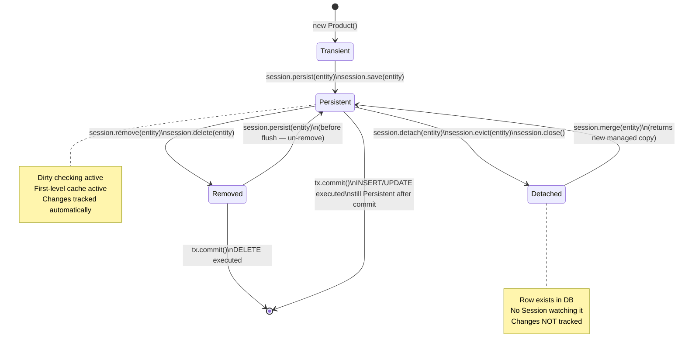

# 02 — Hibernate Architecture: SessionFactory, Session, and Entity Lifecycle

## Why This Architecture Exists

Before Hibernate's architecture was formalized, every enterprise application that talked to a
database had its own ad-hoc solution for three expensive problems: (1) schema validation — does the
Java model match the database schema?, (2) SQL compilation — parsing HQL/Criteria into
dialect-specific SQL, and (3) connection management — acquiring, pooling, and releasing JDBC
connections. Each application solved these from scratch, usually poorly, and usually at the wrong
time (per-request instead of at startup).

Hibernate's architecture separates these concerns into two tiers that have fundamentally different
lifetimes and costs. `SessionFactory` is built once at application startup, paying all the
expensive initialization costs exactly once. `Session` is created per unit of work (per HTTP
request, per batch job chunk), keeping per-request overhead minimal. This separation is not
arbitrary — it mirrors the same design decision that connection pools make: pool the resource that
is expensive to create, use it cheaply many times.

The practical consequence: a Spring Boot application with Hibernate starts in ~3 seconds because
`SessionFactory` does all the heavy lifting once, then handles thousands of requests per second
through lightweight `Session` objects that cost almost nothing to create.

## SessionFactory: The Heavyweight Singleton

`SessionFactory` is Hibernate's central infrastructure object. Creating it involves:

1. **Parsing entity classes**: scanning all `@Entity` classes and building an internal metamodel
   that represents every table, column, type mapping, and association
2. **Compiling named queries**: validating JPQL/HQL in `@NamedQuery` annotations at startup time
   so syntax errors are caught immediately, not at 3 AM when the query first runs
3. **Validating schema** (if `hbm2ddl.auto=validate`): running `DESCRIBE TABLE` queries against
   the database and confirming every column exists with the correct type
4. **Initializing the connection pool**: creating the pool of JDBC connections (default: 10–20
   connections per pool)

This is why creating `SessionFactory` takes 1–3 seconds. It must be created **once** and shared
across all threads. It is thread-safe by design.

Its JPA equivalent is `EntityManagerFactory`, obtained via:
```java
EntityManagerFactory emf = Persistence.createEntityManagerFactory("myPU");
```

In Spring Boot, you never create `SessionFactory` manually — Spring's auto-configuration
creates it from `application.properties` and injects it wherever needed.

## Session: The Lightweight Unit-of-Work

A `Session` is Hibernate's per-request context. Creating it is cheap (microseconds) because it
is just a thin wrapper that:
- Holds a reference to one JDBC `Connection` (lazily acquired from the pool on first query)
- Maintains the **first-level cache** (also called the **identity map**): a `Map<EntityKey, Object>`
  mapping primary key + class → Java object instance
- Tracks the **dirty list**: which persistent entities have been modified since they were loaded

`Session` is **not thread-safe**. Never store it in a field or share it across threads. The
pattern is always: open, use, close.

Its JPA equivalent is `EntityManager`. In Spring, `@Transactional` manages Session/EntityManager
lifecycle automatically — opening on method entry and closing on method exit.

## Entity Lifecycle States

Every entity object Hibernate knows about exists in exactly one of four states. Understanding these
states is the most critical mental model in Hibernate — nearly every bug stems from confusion about
which state an entity is in.

### Transient

An entity is Transient when it was created with `new` and Hibernate does not know about it:

```java
Product p = new Product("Widget", BigDecimal.TEN, ProductStatus.ACTIVE);
// p is Transient: no ID, not in first-level cache, no DB row
```

If you modify `p` here, nothing happens. If you throw `p` away, nothing happens. Hibernate is
completely unaware.

### Persistent

An entity is Persistent when it is associated with an open Session and tracked by Hibernate:

```java
session.persist(p);
// p is now Persistent: Hibernate has scheduled an INSERT
// p is in the first-level cache
// Any changes to p will be detected at flush time
p.setPrice(BigDecimal.valueOf(15.00));
// Hibernate will include this in the UPDATE — you do NOT call session.update(p)
```

Dirty checking happens here. Hibernate takes a snapshot of the entity's state when it becomes
Persistent. At flush time, it compares the current state against the snapshot. If anything changed,
it generates an UPDATE. If nothing changed, no SQL is executed.

### Detached

An entity is Detached when the Session that owned it is closed (or the entity was explicitly
evicted):

```java
session.close(); // p is now Detached
p.setPrice(BigDecimal.valueOf(20.00)); // Change is NOT tracked — Hibernate doesn't know
```

A detached entity has a valid database ID and a row in the DB. It is just no longer watched. To
re-attach it and persist changes, call `session.merge(p)` in a new Session.

### Removed

An entity is Removed when `session.remove(p)` has been called but the transaction has not yet
committed. The entity is still in the Session's first-level cache but is scheduled for DELETE:

```java
session.remove(p);
// p is Removed: DELETE will execute at flush
// You can "un-remove" with session.persist(p) before flush (rare, but possible)
tx.commit(); // DELETE executes here
```

---

## Python Bridge: SQLAlchemy Session vs Hibernate Session

| Concept | SQLAlchemy (Python) | Hibernate (Java) |
|---------|--------------------|--------------------|
| Engine (factory) | `create_engine(url)` | `SessionFactory` |
| Session creation | `Session = sessionmaker(bind=engine)` | `sf.openSession()` |
| Transient state | Before `session.add(obj)` | Before `session.persist(entity)` |
| Persistent state | After `session.add(obj)` | After `session.persist(entity)` |
| Detached state | After `session.expunge(obj)` | After `session.detach(entity)` |
| Re-attach | `session.add(obj)` again | `session.merge(entity)` |
| Dirty tracking | Automatic (instrumented attributes) | Automatic (snapshot comparison) |
| Flush | `session.flush()` | `session.flush()` |
| Commit | `session.commit()` | `tx.commit()` |
| Rollback | `session.rollback()` | `tx.rollback()` |
| Close | `session.close()` | `session.close()` |

**Mental model narrative**: SQLAlchemy's Session and Hibernate's Session are nearly identical
conceptually. Both maintain an identity map, track dirty objects, and flush on commit. The main
difference is API style: SQLAlchemy's Session manages transaction implicitly (autobegin), while
Hibernate requires an explicit `beginTransaction()`. In production code this does not matter
because Spring's `@Transactional` manages Hibernate transactions for you — just as Flask-SQLAlchemy
manages SQLAlchemy transactions for you.

---

## Mermaid Diagram: Entity Lifecycle States



---

## Working Java Code: Entity Lifecycle Demo

```java
// Demonstrates all four entity lifecycle states in sequence
try (SessionFactory sf = buildSessionFactory()) {

    // ─────────────────────────────────────────────────────────
    // STATE 1: TRANSIENT
    // ─────────────────────────────────────────────────────────
    Product product = new Product("Widget", BigDecimal.TEN, ProductStatus.ACTIVE);
    // WHY: product.getId() is null here — no database row, no Hibernate tracking
    System.out.println("Transient ID: " + product.getId()); // prints: null

    // ─────────────────────────────────────────────────────────
    // STATE 2: PERSISTENT
    // ─────────────────────────────────────────────────────────
    Long savedId;
    try (Session session = sf.openSession()) {
        Transaction tx = session.beginTransaction();
        session.persist(product);
        // WHY: After persist(), Hibernate has scheduled INSERT and assigned ID (if IDENTITY strategy)
        // product is now in the first-level cache
        System.out.println("Persistent ID: " + product.getId()); // prints: 1 (or next sequence val)

        // WHY: Dirty checking — no explicit update() call needed
        product.setPrice(BigDecimal.valueOf(15.00));
        // Hibernate will generate: UPDATE products SET price = 15.00 WHERE id = 1

        tx.commit(); // INSERT and UPDATE executed here
        savedId = product.getId();
    } // session.close() — product becomes DETACHED

    // ─────────────────────────────────────────────────────────
    // STATE 3: DETACHED
    // ─────────────────────────────────────────────────────────
    System.out.println("Detached ID: " + product.getId()); // still 1 — ID preserved
    product.setPrice(BigDecimal.valueOf(99.00)); // Change NOT tracked — no Session watching it

    // ─────────────────────────────────────────────────────────
    // Re-attach via merge()
    // ─────────────────────────────────────────────────────────
    try (Session session = sf.openSession()) {
        Transaction tx = session.beginTransaction();
        // WHY: merge() copies detached entity's state into a new Persistent instance
        // It returns the managed copy — do NOT use the original 'product' reference after merge()
        Product managed = session.merge(product);
        tx.commit(); // UPDATE products SET price = 99.00 WHERE id = 1
    }

    // ─────────────────────────────────────────────────────────
    // STATE 4: REMOVED
    // ─────────────────────────────────────────────────────────
    try (Session session = sf.openSession()) {
        Transaction tx = session.beginTransaction();
        Product toDelete = session.find(Product.class, savedId); // Load → Persistent
        session.remove(toDelete); // Mark as Removed
        // toDelete is still accessible as a Java object until tx.commit()
        tx.commit(); // DELETE executed here
    }
}
```

---

## Real-World Use Cases

### SaaS Multi-Tenant Platform: Session-Per-Request Pattern

**Industry**: B2B SaaS (Salesforce-style CRM, HR systems)

**Scenario**: A multi-tenant HR platform processes 2,000 concurrent requests at peak. Each request
touches 3–5 entities. The Hibernate `SessionFactory` is created once at startup. Each HTTP request
opens a new Session (via Spring's `@Transactional`), does its work, and closes the Session.

**Benefit**: 2,000 concurrent requests means 2,000 concurrent Sessions. Each Session holds one
JDBC connection from HikariCP's pool (default 10 connections). Sessions whose work is not I/O-bound
release their connection quickly, allowing the pool to serve far more requests than there are
connections. Without the Session architecture separating "unit of work" from "database connection",
every concurrent request would need a permanently held connection — 2,000 connections to PostgreSQL
would exhaust the server.

### Content Platform: Dirty Checking Prevents Over-Updating

**Industry**: Digital media (Netflix-style content metadata service)

**Scenario**: A content service loads `Episode` entities to check if they are ready for publishing.
99% of the time, all fields are already correct and no update is needed. 1% of the time, the
`status` field must change from `ENCODING` to `PUBLISHED`.

**Benefit**: With dirty checking, the service loads `Episode`, inspects fields, and commits.
Hibernate generates UPDATE SQL only for the 1% of episodes that actually changed. A naive JDBC
service would either (a) always issue an UPDATE even when nothing changed (wastes I/O, triggers
unnecessary DB replication events, invalidates downstream caches) or (b) require explicit
comparison logic in application code for every field.

---

## Anti-Patterns

### Anti-Pattern 1: Creating SessionFactory Per Request

**WRONG**:
```java
// WRONG: SessionFactory built inside request handler — catastrophic performance
@GetMapping("/products/{id}")
public Product getProduct(@PathVariable Long id) {
    // This takes 1-3 seconds every single request
    SessionFactory sf = new Configuration()
        .configure("hibernate.cfg.xml")
        .buildSessionFactory(); // WRONG: never do this
    try (Session session = sf.openSession()) {
        return session.find(Product.class, id);
    }
}
```

**WHY it fails in production**: `SessionFactory` creation takes 1–3 seconds and consumes 50–200 MB
of heap for the compiled metamodel and connection pool initialization. At 100 requests/second, the
server allocates 5–20 GB of heap per second, crashes within seconds from `OutOfMemoryError`, and
the connection pool tries to open 100 × 10 = 1,000 simultaneous PostgreSQL connections (PostgreSQL
default max is 100). The database server itself crashes. This is not a performance degradation — it
is a complete system failure.

**RIGHT approach**: Create `SessionFactory` once in the application context (Spring does this
automatically). Inject it everywhere. Never create it inside a method.

---

### Anti-Pattern 2: Not Closing Sessions (Connection Leak)

**WRONG**:
```java
// WRONG: no try-with-resources — Session (and its connection) never returned to pool
public List<Product> findAll() {
    Session session = sessionFactory.openSession(); // Connection acquired from pool
    return session.createQuery("FROM Product", Product.class).list();
    // WRONG: session never closed — connection never returned to pool
    // After N calls, pool is exhausted → all future requests hang indefinitely
}
```

**WHY it fails in production**: HikariCP's default pool size is 10 connections. After 10 calls to
this method without closing the Session, the pool is exhausted. Every subsequent request blocks
waiting for a connection that never returns. The application becomes completely unresponsive. The
only recovery is a restart. This failure mode is insidious because it works fine in development
(low request volume) and only manifests under production load — often during a peak traffic event,
the worst possible time.

**RIGHT approach**: Always use try-with-resources (`Session` implements `AutoCloseable`):
```java
try (Session session = sessionFactory.openSession()) {
    return session.createQuery("FROM Product", Product.class).list();
}
```

---

### Anti-Pattern 3: Calling session.clear() Inside a Batch Loop

**WRONG**:
```java
// WRONG: clearing session after every single entity defeats batch processing purpose
try (Session session = sf.openSession()) {
    Transaction tx = session.beginTransaction();
    for (int i = 0; i < 100_000; i++) {
        Product p = new Product("Item " + i, BigDecimal.TEN, ProductStatus.ACTIVE);
        session.persist(p);
        session.clear(); // WRONG: clears all entities including ones we haven't flushed yet
        // This also defeats the first-level cache for any reads within the same loop
    }
    tx.commit();
}
```

**WHY it fails in production**: Calling `clear()` without first calling `flush()` discards pending
changes. Entities that were persisted but not yet flushed are silently lost — their INSERTs are
never executed. The correct pattern for batch processing is `flush()` then `clear()` at a batch
boundary (every 50 or 100 entities):

**RIGHT approach**:
```java
for (int i = 0; i < 100_000; i++) {
    session.persist(new Product(...));
    if (i % 50 == 0) {  // WHY: flush every 50 to prevent heap exhaustion, not every 1
        session.flush();  // Write pending INSERTs to DB
        session.clear();  // Release first-level cache entries to free heap
    }
}
```

---

## Interview Questions

### Conceptual

**Q1**: Your microservice processes large nightly batch jobs that insert 500,000 records. After
running for 10 minutes it throws `OutOfMemoryError`. The developer says "we're calling
`session.persist()` in a loop but never closing the session until the end." What is the root cause,
and what is the correct Hibernate batch processing pattern?

**A**: The root cause is that `session.persist()` adds every entity to the Session's first-level
cache (identity map). After 500,000 persists, the Session holds 500,000 `Product` objects in a
`HashMap` in heap — even after their INSERTs are flushed to the database. The heap eventually
exhausts. The correct pattern: flush and clear every N records (N = 50–100 typically). `flush()`
writes pending SQL to DB; `clear()` releases all entities from the first-level cache. Also enable
JDBC batching (`hibernate.jdbc.batch_size = 50`) so Hibernate sends 50 INSERTs in one round trip
instead of 50 individual round trips.

**Q2**: A teammate asks why Spring Boot's `@Transactional` methods always get a "fresh" view of
database data even within the same HTTP request, while a method that opens a Hibernate Session
manually and keeps it open across multiple service calls sometimes sees stale data. Explain this
using Hibernate's entity lifecycle.

**A**: This is the first-level cache (Session-scoped identity map). When Spring's `@Transactional`
opens a new transaction for each method call, it gets a new Session. The first-level cache starts
empty, so `session.find()` always hits the database. When a Session is kept open across multiple
service calls, the first-level cache returns the in-memory object for any entity loaded earlier,
even if the database row was updated by another process. The solution is to use `session.refresh(entity)`
to force a re-read from the database, or ensure Sessions are scoped to a single unit of work.

### Scenario / Debug

**Q3**: After deploying, you see in logs: `org.hibernate.NonUniqueObjectException: A different object with the same identifier value was already associated with the session`. Which lifecycle state violation caused this and how do you fix it?

**A**: This happens when you try to `session.persist()` or `session.save()` an entity with an ID
that is already in the Session's first-level cache. Classic scenario: you load `Product` with id=1
(now Persistent in Session), then call `session.persist(anotherProduct)` where `anotherProduct`
was manually constructed with `id = 1` (Transient but with a pre-set ID). The Session cannot have
two Java objects representing the same database row. Fix: either use `session.merge()` instead of
`persist()` for re-attaching, or clear the Session before persisting manually-constructed entities.

### Quick Fire

**Q**: Why is `SessionFactory` thread-safe but `Session` is not?
**A**: `SessionFactory` is immutable after construction — it only reads its internal metamodel
(compiled mapping + query cache). `Session` mutates internal state on every operation (identity
map, dirty list, connection) and is designed for single-threaded use.

**Q**: What happens to a Detached entity when the original Session that created it is re-used?
**A**: The Session was closed (entities become Detached). You cannot re-use a closed Session.
You must open a new Session and use `session.merge(detachedEntity)` to produce a new Persistent
copy.

**Q**: What is the difference between `session.evict(entity)` and `session.clear()`?
**A**: `evict()` removes a single entity from the Session's first-level cache, making it Detached.
`clear()` evicts all entities from the Session at once. Both leave the database unchanged.
