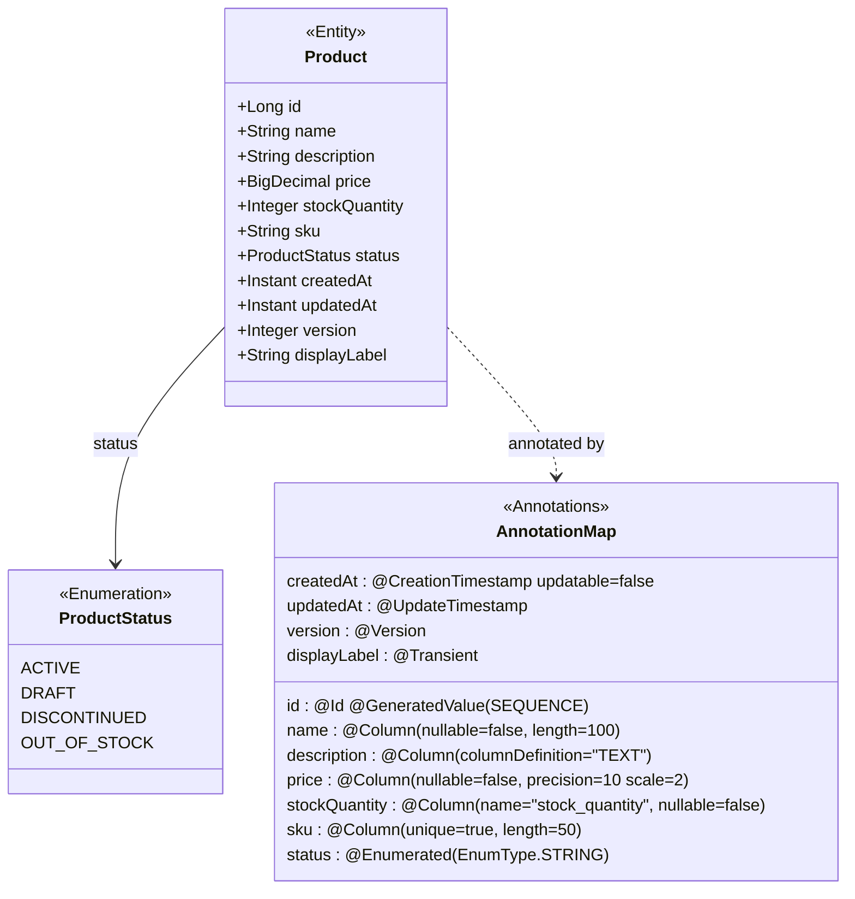

# 03 — Entity Annotations: Mapping Java Classes to Database Tables

## Why Annotations Replaced XML Mapping Files

When Hibernate was first released in 2001, the only way to tell it how to map a Java class to a
database table was through XML configuration files called `.hbm.xml` files (Hibernate Mapping
files). For every entity class, you maintained a parallel XML document describing every field,
every column name, every type, and every association. A `Product` class with 12 fields required
roughly 60 lines of XML.

The consequence was the **dual-maintenance problem**: every change to the Java class required a
corresponding change to the XML file. Rename a field in Java, update the XML. Add a column,
update both. The XML was completely unchecked at compile time — a typo in the XML property name
would not surface until Hibernate tried to build the SessionFactory, or worse, until the specific
mapping was exercised at runtime.

JPA 1.0 (2006) standardized the annotation approach: mapping metadata lives directly on the Java
class, co-located with the code it describes. The compiler validates the field names. The IDE
provides autocomplete on annotation attributes. A rename refactoring updates the annotation
automatically. Schema changes are visible in a single diff: the `@Column(length=100)` sitting next
to the `private String name` field.

Beyond maintainability, annotations enabled a second benefit: Hibernate could now validate the
entire mapping at application startup by introspecting annotations via reflection, without any
external files to load or parse. Configuration errors surface immediately, not when the relevant
code path runs in production.

## Core Annotations Deep Dive

### @Entity

Marks a Java class as a JPA entity — a class whose instances can be persisted to (and loaded from)
a relational database:

```java
@Entity
public class Product {
    // Hibernate will create a table named "product" (class name, lowercase)
    // unless overridden with @Table(name = "products")
}
```

Requirements for an `@Entity` class:
- Must be a top-level class (no anonymous or local classes)
- Must have a no-arg constructor (can be `protected`)
- Must have exactly one `@Id` field
- Must not be `final` (Hibernate creates proxy subclasses for lazy loading)

### @Table

Customizes the table name and adds schema-level constraints:

```java
@Table(
    name = "products",              // table name in DB
    schema = "catalog",            // PostgreSQL schema (like a namespace)
    indexes = {
        @Index(name = "idx_products_sku", columnList = "sku"),    // single column
        @Index(name = "idx_products_cat_status", columnList = "category_id, status") // composite
    },
    uniqueConstraints = {
        @UniqueConstraint(name = "uq_products_sku", columnNames = {"sku"})
    }
)
```

### @Id and @GeneratedValue

Every entity must have exactly one `@Id` field — this is the primary key:

```java
@Id
@GeneratedValue(strategy = GenerationType.SEQUENCE,
                generator = "products_seq")
@SequenceGenerator(name = "products_seq",
                   sequenceName = "products_id_seq",
                   allocationSize = 50)   // WHY 50: pre-allocates 50 IDs in memory,
                                          // cutting DB round trips by 50x for bulk inserts
private Long id;
```

**GenerationType strategies compared**:

| Strategy | How It Works | Best For | Caveat |
|----------|-------------|----------|--------|
| `IDENTITY` | Uses DB auto-increment (PostgreSQL SERIAL) | Simple apps, MySQL | Disables JDBC batch inserts |
| `SEQUENCE` | DB sequence + configurable allocationSize | PostgreSQL at scale | Requires DB sequence object |
| `TABLE` | Dedicated lock table for ID generation | Maximum portability | Slowest — locks a row |
| `AUTO` | Hibernate picks based on dialect | Never in production | Unpredictable across deployments |

### @Column

Maps a Java field to a specific database column with constraints:

```java
@Column(
    name = "product_name",   // DB column name (defaults to field name)
    nullable = false,        // adds NOT NULL to generated DDL
    unique = false,          // adds UNIQUE constraint if true
    length = 100,            // VARCHAR(100) for String fields
    precision = 10,          // total digits for NUMERIC fields
    scale = 2,               // decimal digits: 10,2 → 99,999,999.99
    insertable = true,       // include in INSERT (default true)
    updatable = true,        // include in UPDATE (default true; false for created_at)
    columnDefinition = "TEXT" // override with literal SQL type
)
private String name;
```

### @Enumerated

Maps a Java enum to a database column:

```java
public enum ProductStatus { ACTIVE, DRAFT, DISCONTINUED }

// WRONG — default is ORDINAL: stores 0, 1, 2
// If someone inserts a new enum value between ACTIVE and DRAFT,
// all existing DRAFT rows suddenly read as the new value
@Enumerated   // WRONG: defaults to ORDINAL

// CORRECT — stores "ACTIVE", "DRAFT", "DISCONTINUED" as VARCHAR
@Enumerated(EnumType.STRING)
@Column(nullable = false, length = 20)
private ProductStatus status;
```

### @Transient

Marks a field that should NOT be persisted to the database:

```java
// Computed at runtime — no column needed
@Transient
private String displayLabel;  // e.g., "Widget [$10.00]"

// WHY @Transient: without it, Hibernate tries to find a column named "display_label"
// and throws MappingException if it doesn't exist, or silently reads null if it does
```

Note: `transient` (Java keyword, lowercase) also works to exclude a field from persistence, but
`@Transient` is preferred because: (1) it works with field-based AND property-based access,
(2) it is explicit and searchable, (3) `transient` also prevents Java serialization which may
be unintended.

### @CreationTimestamp and @UpdateTimestamp

Hibernate-specific (not JPA standard) annotations for automatic audit timestamps:

```java
@CreationTimestamp   // WHY: Hibernate sets this on first INSERT, never touches it again
@Column(name = "created_at", nullable = false, updatable = false)
private Instant createdAt;

@UpdateTimestamp     // WHY: Hibernate sets this on every UPDATE — always current time
@Column(name = "updated_at", nullable = false)
private Instant updatedAt;
```

### @Version (Optimistic Locking)

Adds a version counter that prevents lost-update concurrency bugs:

```java
@Version            // WHY: each UPDATE increments this by 1
@Column(name = "version", nullable = false)
private Integer version;
// If two threads both load version=5 and both try to UPDATE,
// the second UPDATE's WHERE version=5 finds no row (already incremented to 6)
// Hibernate throws OptimisticLockException — caller retries
```

---

## Python Bridge: SQLAlchemy Column() vs JPA Annotations

| SQLAlchemy Python | JPA / Hibernate Java | Notes |
|-------------------|---------------------|-------|
| `Column(String(100), nullable=False)` | `@Column(length=100, nullable=false)` | Same concept |
| `Column(Integer, primary_key=True)` | `@Id @GeneratedValue` | SQLAlchemy infers auto-increment |
| `Column(Enum(Status))` | `@Enumerated(EnumType.STRING)` | SQLAlchemy stores enum name by default |
| `Column(Numeric(10,2))` | `@Column(precision=10, scale=2)` | Same mapping |
| `Column(DateTime, default=func.now())` | `@CreationTimestamp` | Hibernate annotation is cleaner |
| `Column(DateTime, onupdate=func.now())` | `@UpdateTimestamp` | Direct equivalent |
| `index=True` on Column | `@Index` in `@Table(indexes={})` | Index defined differently |
| `unique=True` on Column | `@Column(unique=true)` | Same |
| SQLAlchemy's `declared_attr` | No direct equivalent | Java uses inheritance mapping instead |

---

## Mermaid Diagram: Fully Annotated Product Entity



---

## Working Java Code: Complete Product Entity

```java
package com.learning.hibernate.basics;

import jakarta.persistence.*;
import org.hibernate.annotations.CreationTimestamp;
import org.hibernate.annotations.UpdateTimestamp;
import java.math.BigDecimal;
import java.time.Instant;

/**
 * Fully-annotated Product entity demonstrating all core JPA annotations.
 * Every annotation has a WHY comment explaining the production consequence
 * of getting it wrong.
 */
// WHY @Entity: registers this class with Hibernate's entity metamodel.
// Hibernate will look for a corresponding DB table and validate mapping at startup.
@Entity
// WHY name="products": explicit table name survives refactoring.
// If we used the default (class name "Product"), renaming the class would silently
// change the table name in schema generation and break existing databases.
@Table(
    name = "products",
    indexes = {
        // WHY index on sku: SKU lookups are the most common query. Without this index,
        // every "find by SKU" does a full table scan. At 1M products, that's catastrophic.
        @Index(name = "idx_products_sku", columnList = "sku"),
        // WHY composite index: category + status queries ("show me all active books")
        // are common in catalog browsing. Composite index serves both column orderings.
        @Index(name = "idx_products_cat_status", columnList = "category, status")
    }
)
public class Product {

    // WHY @Id: JPA requires exactly one primary key field per entity.
    @Id
    // WHY SEQUENCE over IDENTITY: IDENTITY disables JDBC batch inserts because the DB
    // must return the generated key after each INSERT. SEQUENCE pre-allocates a block
    // of IDs (allocationSize=50), enabling Hibernate to batch 50 INSERTs in one round trip.
    @GeneratedValue(strategy = GenerationType.SEQUENCE, generator = "products_seq")
    @SequenceGenerator(
        name = "products_seq",
        sequenceName = "products_id_seq",
        allocationSize = 50  // WHY: fetch 50 IDs at once, reducing DB sequence calls
    )
    private Long id;

    // WHY nullable=false: enforces NOT NULL at the DB level, not just application level.
    // Application-level validation (@NotNull) can be bypassed by direct DB access or
    // other services. DB constraint is the last line of defense.
    // WHY length=100: generates VARCHAR(100). Without this, Hibernate uses VARCHAR(255)
    // — wastes storage and can break if DB collation settings have smaller limits.
    @Column(nullable = false, length = 100)
    private String name;

    // WHY columnDefinition="TEXT": description can be longer than 255 characters.
    // TEXT type has no fixed length limit in PostgreSQL.
    @Column(columnDefinition = "TEXT")
    private String description;

    // WHY BigDecimal: double/float cannot represent 0.10 exactly in binary floating point.
    // For money, this causes rounding errors that accumulate over transactions.
    // WHY precision=10,scale=2: allows up to 99,999,999.99 with exactly 2 decimal places.
    @Column(nullable = false, precision = 10, scale = 2)
    private BigDecimal price;

    // WHY name="stock_quantity": Java convention (camelCase) vs SQL convention (snake_case).
    // Explicit column name prevents surprises when moving between DB vendors with
    // different case sensitivity rules.
    @Column(name = "stock_quantity", nullable = false)
    private Integer stockQuantity;

    // WHY unique=true: SKU must be unique across all products. This creates a UNIQUE constraint
    // in the DDL, enforced by the DB. Application-level uniqueness checks have race conditions.
    @Column(unique = true, nullable = false, length = 50)
    private String sku;

    // WHY EnumType.STRING: stores "ACTIVE", "DRAFT", "DISCONTINUED" as VARCHAR.
    // ORDINAL stores integers 0, 1, 2. If a new value is inserted before DISCONTINUED
    // in the enum (e.g., PENDING), all DISCONTINUED rows in the DB become PENDING.
    // This is a silent data corruption bug that can affect financial reporting.
    @Enumerated(EnumType.STRING)
    @Column(nullable = false, length = 20)
    private ProductStatus status;

    // WHY updatable=false: creation timestamp must never change after first INSERT.
    // Setting updatable=false prevents Hibernate from including this column in UPDATE statements.
    @CreationTimestamp
    @Column(name = "created_at", nullable = false, updatable = false)
    private Instant createdAt;

    // WHY @UpdateTimestamp: automatically tracks the last modification time.
    // Useful for cache invalidation, audit trails, and "recently updated" queries.
    @UpdateTimestamp
    @Column(name = "updated_at", nullable = false)
    private Instant updatedAt;

    // WHY @Version: enables optimistic locking. Without this, two concurrent users can both
    // read price=10.00, both apply a 10% increase, and both write back 11.00.
    // The correct final price should be 12.10 (10% of 10, then 10% of 11).
    // @Version causes the second UPDATE to fail with OptimisticLockException,
    // forcing the second caller to re-read and recalculate.
    @Version
    @Column(nullable = false)
    private Integer version;

    // WHY @Transient: displayLabel is computed from name + price.
    // We never want to store or retrieve it from the database.
    // Without @Transient, Hibernate would look for a "display_label" column and fail.
    @Transient
    private String displayLabel;

    // WHY protected no-arg constructor: required by JPA for proxy creation (lazy loading).
    // Hibernate subclasses this entity at runtime — the subclass constructor calls super().
    // Protected (not public) to prevent accidental construction without required fields.
    protected Product() {}

    public Product(String name, BigDecimal price, Integer stockQuantity,
                   String sku, ProductStatus status) {
        this.name = name;
        this.price = price;
        this.stockQuantity = stockQuantity;
        this.sku = sku;
        this.status = status;
    }

    // Computed property — updates whenever accessed
    public String getDisplayLabel() {
        return name + " [$" + price + "]";
    }

    // Standard getters/setters
    public Long getId() { return id; }
    public String getName() { return name; }
    public void setName(String name) { this.name = name; }
    public BigDecimal getPrice() { return price; }
    public void setPrice(BigDecimal price) { this.price = price; }
    public Integer getStockQuantity() { return stockQuantity; }
    public void setStockQuantity(Integer qty) { this.stockQuantity = qty; }
    public String getSku() { return sku; }
    public ProductStatus getStatus() { return status; }
    public void setStatus(ProductStatus status) { this.status = status; }
    public Instant getCreatedAt() { return createdAt; }
    public Instant getUpdatedAt() { return updatedAt; }
    public Integer getVersion() { return version; }

    public enum ProductStatus { ACTIVE, DRAFT, DISCONTINUED, OUT_OF_STOCK }
}
```

---

## Real-World Use Cases

### Fintech: Enum Annotation Choice Impacts Regulatory Compliance

**Industry**: Payments / financial compliance (Stripe, Braintree)

**Scenario**: A `PaymentTransaction` entity has a `TransactionStatus` enum with values:
`INITIATED, PROCESSING, COMPLETED, FAILED, REFUNDED`. The compliance team requires adding
`DISPUTED` between `PROCESSING` and `COMPLETED`.

**With `EnumType.STRING`**: All existing rows store `"PROCESSING"`, `"COMPLETED"`, etc. as strings.
Adding `DISPUTED` anywhere in the enum order has zero impact on existing data. Safe.

**With `EnumType.ORDINAL`**: Existing rows store 0, 1, 2, 3, 4. After adding `DISPUTED` at position
2, all existing `COMPLETED` rows (previously ordinal 2) now read as `DISPUTED`. Regulatory reports
show thousands of completed transactions as "disputed". This is a compliance violation and
potentially fraud-reportable. Recovery requires a database migration to re-map all affected rows.

**Consequence if wrong**: Real fintech companies have encountered exactly this scenario. The
business impact ranges from incorrect reporting to regulatory fines depending on the transaction
volume affected.

### E-Commerce: @Version Prevents Overselling

**Industry**: Retail inventory management (Amazon, eBay, Shopify)

**Scenario**: A flash sale event generates 5,000 concurrent "buy" requests for an item with
`stockQuantity = 1`. Without `@Version`, all 5,000 concurrent reads see `stockQuantity = 1`, all
5,000 pass the "if (stock > 0)" check, and all 5,000 decrement and write back `stockQuantity = 0`.
The item is sold 5,000 times.

**With `@Version`**: Only one of the 5,000 concurrent UPDATE statements succeeds (the first one
changes `version` from 1 to 2). The other 4,999 get `OptimisticLockException`, re-read the
entity (which now shows `stockQuantity = 0`), and fail the stock check. Only one unit is sold.

---

## Anti-Patterns

### Anti-Pattern 1: @Column(nullable=false) Without DB Constraint

**WRONG**:
```java
// WRONG: nullable=false in Java but no DB constraint
@Column(nullable = false)   // Only enforced if using hbm2ddl to generate schema
private String email;

// If hbm2ddl.auto is set to "validate" or tables were created manually,
// this constraint exists only in Hibernate's validation layer.
// Direct DB inserts, other services, or migrations can insert NULL.
```

**WHY it fails in production**: `@Column(nullable=false)` only generates a `NOT NULL` constraint
when Hibernate creates the table (`hbm2ddl.auto=create`). If the table was created by a DBA or a
Flyway migration script without the constraint, `@Column(nullable=false)` does nothing at runtime —
Hibernate does not re-check it on every INSERT. A NULL value inserted by a legacy import job
causes `NullPointerException` in application code hours or days later, far from the source of the
null. Combine `@Column(nullable=false)` with a Flyway migration constraint for defense in depth.

**RIGHT approach**: Ensure the DB schema (created by migrations) includes `NOT NULL`. Use
`hbm2ddl.auto=validate` in production so Hibernate verifies the DB matches the entity mapping.

---

### Anti-Pattern 2: EnumType.ORDINAL in Production (Silent Data Corruption)

**WRONG**:
```java
public enum OrderStatus {
    PENDING,   // ordinal 0
    CONFIRMED, // ordinal 1
    SHIPPED    // ordinal 2
}

@Enumerated  // WRONG: defaults to EnumType.ORDINAL — stores 0, 1, 2
private OrderStatus status;
```

**WHY it fails in production**: Three months later, requirements change: `PAYMENT_VERIFIED` must
be inserted between `CONFIRMED` and `SHIPPED`. After the code change:

```java
public enum OrderStatus {
    PENDING,           // ordinal 0 — unchanged
    CONFIRMED,         // ordinal 1 — unchanged
    PAYMENT_VERIFIED,  // ordinal 2 — NEW, takes the old SHIPPED slot
    SHIPPED            // ordinal 3 — all existing "SHIPPED" DB rows are now wrong
}
```

All 2 million orders previously stored as `SHIPPED` (ordinal 2) now read as `PAYMENT_VERIFIED`.
Every email, report, and fulfillment system sees all shipped orders as pending payment verification.
This is a silent data corruption incident — no exception, no log warning, just wrong data.

**RIGHT approach**: Always `@Enumerated(EnumType.STRING)`. The slight storage overhead (varchar vs
integer) is worth zero risk of this class of bug.

---

### Anti-Pattern 3: Missing @GeneratedValue — ID Never Set

**WRONG**:
```java
@Entity
public class Customer {

    @Id   // WRONG: missing @GeneratedValue
    private Long id;   // id is always null unless explicitly set

    private String email;
}
```

**WHY it fails in production**: Without `@GeneratedValue`, Hibernate never generates an ID. If you
call `session.persist(new Customer("user@example.com"))`, Hibernate sends
`INSERT INTO customer (id, email) VALUES (NULL, 'user@example.com')`. PostgreSQL throws
`ERROR: null value in column "id" violates not-null constraint`. MySQL silently stores `id = 0`
for all rows, then fails on the second insert with a duplicate key violation. This is easy to
catch in development but embarrassing in a production deployment.

**RIGHT approach**: Every `@Id` field must have `@GeneratedValue` (unless you are managing IDs
externally with UUIDs, in which case you set the ID in the constructor and skip `@GeneratedValue`).

---

## Interview Questions

### Conceptual

**Q1**: You are reviewing a PR for a new `PaymentMethod` entity. The `type` field is mapped as
`@Enumerated` with no `EnumType` specified. The enum has 5 values. What risk does this introduce,
and how would you fix it in the PR review comment?

**A**: The default `EnumType` is `ORDINAL`, which stores integers 0–4. The risk is silent data
corruption if the enum is ever reordered — a common occurrence when a new payment type needs to be
inserted alphabetically or in a specific business order. Fix: `@Enumerated(EnumType.STRING)` and
`@Column(length=30)` to give the VARCHAR column an appropriate size. In the PR comment: "Please
add `EnumType.STRING` explicitly. Without it, Hibernate defaults to ORDINAL which breaks if the
enum order ever changes. ORDINAL is never appropriate for persistent data."

**Q2**: Your entity has `@Column(nullable = false)` on a critical field, but a nightly import job
is inserting NULLs directly via a different service. The application is throwing
`NullPointerException` at seemingly random times. Why doesn't the annotation prevent the NULLs,
and what is the correct multi-layer defense?

**A**: `@Column(nullable = false)` only generates a DB constraint if Hibernate created the schema
(via `hbm2ddl.auto = create/update`). If the table was created independently (Flyway migration,
manual SQL), Hibernate does not enforce the constraint at runtime — it trusts the DB to enforce it.
The import job bypasses both Hibernate validation and (apparently) the DB constraint because the
constraint was never added to the manually-created table. Defense in depth: (1) DB NOT NULL
constraint in the migration script, (2) `@Column(nullable=false)` for documentation and DDL
generation, (3) `@NotNull` Bean Validation for API-layer validation, (4) Java null check in the
constructor.

### Scenario / Debug

**Q3**: A developer runs the application after adding a `@Transient` annotation to an existing
field (`discountPrice`) that was previously being persisted. All unit tests pass, but in
production, existing rows still have data in the `discount_price` column. New rows written after
the deployment show NULL in that column, but the application no longer reads or writes it. What
are the migration steps and risks?

**A**: Adding `@Transient` means Hibernate stops reading and writing the column, but the column
still exists in the database. Risks: (1) Application now returns null for `discountPrice` on all
objects even though the DB has data — if any code path relied on this field, it silently breaks.
(2) The column takes up storage space but receives no maintenance. Migration steps: (a) Verify no
code path uses `discountPrice` after marking it `@Transient`. (b) Write and execute a Flyway
migration that moves the data to its new location or drops the column. (c) Use
`hbm2ddl.auto=validate` to ensure Hibernate does not expect the column anymore. If the column is
dropped and `hbm2ddl.auto=validate` is set, it should pass — Hibernate does not validate `@Transient`
fields against the schema.

### Quick Fire

**Q**: What is the difference between `@Column(unique=true)` and a `@UniqueConstraint` in `@Table`?
**A**: Both create a UNIQUE constraint on the column, but `@UniqueConstraint` also lets you name
the constraint (important for readable error messages in logs) and create composite unique
constraints across multiple columns. Single-column uniqueness can use either; multi-column requires
`@UniqueConstraint`.

**Q**: Why must `@Id` fields use wrapper types (`Long`) instead of primitives (`long`)?
**A**: Primitive types cannot be null. A Transient entity (not yet persisted) has no ID — that
state must be representable as null. If `id` is `long`, its default value is 0, which Hibernate
interprets as an existing entity with ID 0, causing incorrect behavior on persist.

**Q**: When would you use `@Column(insertable=false, updatable=false)`?
**A**: For columns managed entirely by the DB or another mechanism: audit timestamps set by DB
triggers, discriminator columns managed by Hibernate's inheritance mapping, or columns that appear
in multiple entity mappings (to designate one as the "write" path).
