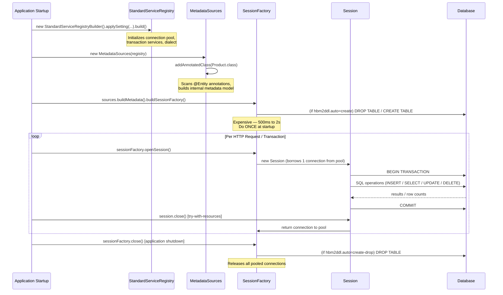

# 04 — SessionFactory and Configuration

## Why This Exists

Before Hibernate introduced its unified configuration model, every Java project that talked to a database was a swamp of repeated boilerplate. You had a database properties file, a connection helper class that wrapped `DriverManager.getConnection()`, a schema creation script you had to run by hand, and a teardown script you had to remember never to run in production. Every team invented their own version of this infrastructure, and every version had the same bugs: connection leaks, misconfigured pools, schema drift between environments, and catastrophic accidents when someone ran the "create" script against the wrong database.

Hibernate solved this by concentrating all of that knowledge — the JDBC URL, the driver class, the connection pool size, the dialect for SQL generation, the schema management strategy — into a single object called the `SessionFactory`. You build it once at application startup from a `Configuration` object (or programmatically via `StandardServiceRegistry` + `MetadataSources`), and it validates that your entity classes match the schema, creates the connection pool, and prepares all the SQL templates it will ever need. After that, any thread in your application can ask the `SessionFactory` for a lightweight `Session` — a single-use unit of work — without ever touching JDBC directly.

This design decision has enormous consequences for production systems. The `SessionFactory` is intentionally expensive to create. That cost pays for connection pooling, SQL compilation, reflection-based metadata scanning, and optionally second-level caching. By making that cost one-time at startup, Hibernate ensures every subsequent database interaction is cheap. If you accidentally recreate the `SessionFactory` per HTTP request — something that is alarmingly easy to do the first time you write Hibernate code without guidance — you pay that startup cost thousands of times per second and bring your application to its knees within minutes.

---

## SessionFactory Creation: The Three-Step Bootstrap

Modern Hibernate (5+) uses a three-step programmatic bootstrap that replaces the old `new Configuration().configure()` style. Understanding each step helps you debug startup failures.

```java
// WHY: StandardServiceRegistry aggregates all Hibernate internal services
//      (connection pooling, transaction coordination, JMX, stats, etc.)
//      Think of it as the dependency injection container for Hibernate's own internals.
StandardServiceRegistry registry = new StandardServiceRegistryBuilder()
    .applySetting("hibernate.connection.url",          "jdbc:h2:mem:demo;DB_CLOSE_DELAY=-1")
    .applySetting("hibernate.connection.driver_class", "org.h2.Driver")
    .applySetting("hibernate.dialect",                 "org.hibernate.dialect.H2Dialect")
    .applySetting("hibernate.hbm2ddl.auto",            "create-drop")
    .applySetting("hibernate.show_sql",                "true")
    .applySetting("hibernate.format_sql",              "true")
    .build();

// WHY: MetadataSources is where you tell Hibernate WHICH classes are entities.
//      In Spring Boot this is automatic via component scan.
//      Standalone, you must register each @Entity class explicitly.
MetadataSources sources = new MetadataSources(registry);
sources.addAnnotatedClass(Product.class);

// WHY: buildSessionFactory() is the expensive step.
//      It reads all entity metadata, validates against the DB schema (if validate),
//      creates the connection pool, and compiles SQL templates.
//      One per application — NEVER per request.
SessionFactory sessionFactory = sources.buildMetadata().buildSessionFactory();
```

---

## Key Hibernate Properties

| Property | Values | Production Recommendation |
|---|---|---|
| `hibernate.dialect` | `H2Dialect`, `PostgreSQLDialect`, etc. | Always set explicitly — never rely on auto-detection |
| `hibernate.connection.url` | JDBC URL string | Use connection pool (HikariCP) in prod |
| `hibernate.show_sql` | `true` / `false` | **`false`** — verbose, pollutes logs at scale |
| `hibernate.format_sql` | `true` / `false` | **`false`** — only useful during debugging |
| `hibernate.hbm2ddl.auto` | see table below | **`validate`** in prod, `create-drop` in tests |

### `hbm2ddl.auto` — The Most Dangerous Setting in Hibernate

| Value | What It Does | When to Use |
|---|---|---|
| `validate` | Compares entity classes to DB schema at startup; fails if mismatch | **Production** — fails fast on deploy rather than silently corrupt |
| `update` | Adds missing columns/tables; never drops anything | **Never** — schema drift accumulates silently |
| `create` | Drops and recreates all tables on every startup | **Never in prod** — destroys all data on restart |
| `create-drop` | Creates on startup, drops on shutdown | **Unit tests only** — perfect for H2 in-memory |
| `none` | Does nothing to the schema | **Production** when Flyway/Liquibase manages schema |

> **THE DANGER**: `hbm2ddl.auto=create` in production means every application restart — including the crash-recovery restart at 3 AM — silently destroys your entire database. This has happened to real companies. Use `validate` with Flyway in production.

---

## SessionFactory vs Session: The Heavyweight / Lightweight Split

```
SessionFactory (one per application)
├── Holds the connection pool (10–50 physical connections)
├── Holds compiled SQL templates for all entities
├── Holds second-level cache (optional, shared across all sessions)
└── Thread-safe — all threads share one instance

    Session (one per request / transaction)
    ├── Wraps one JDBC connection borrowed from the pool
    ├── Maintains first-level (L1) cache — entities loaded this session
    ├── Tracks dirty state of all persistent entities
    └── NOT thread-safe — never share between threads
```

Always close a `Session` in a try-with-resources block. A leaked Session keeps a JDBC connection checked out of the pool permanently:

```java
// WHY try-with-resources: Session implements AutoCloseable.
//     If you forget to close, the JDBC connection is never returned to the pool.
//     With a pool of 10 connections and 11 concurrent requests, the 11th hangs forever.
try (Session session = sessionFactory.openSession()) {
    Transaction tx = session.beginTransaction();
    try {
        // ... database work ...
        tx.commit();
    } catch (Exception e) {
        tx.rollback(); // WHY: prevent partial writes from becoming permanent
        throw e;
    }
} // WHY: Session.close() called here automatically, connection returned to pool
```

---

## Mermaid: Application Lifecycle — Startup to Shutdown



---

## Python Bridge: SQLAlchemy → Hibernate

### Comparison Table

| Concept | SQLAlchemy (Python) | Hibernate (Java) |
|---|---|---|
| One-time factory | `engine = create_engine(url, pool_size=10)` | `SessionFactory sf = sources.buildMetadata().buildSessionFactory()` |
| Per-request session | `session = Session(engine)` | `Session s = sf.openSession()` |
| Session cleanup | `session.close()` or `with Session(engine) as s:` | `try (Session s = sf.openSession()) { ... }` |
| Schema management | Alembic migrations | Flyway + `hbm2ddl.auto=validate` |
| SQL logging | `echo=True` on engine | `hibernate.show_sql=true` (dev only) |
| Dialect selection | `postgresql://`, `sqlite://` in URL | `hibernate.dialect=PostgreSQLDialect` |
| Thread safety | Engine is thread-safe; Session is not | SessionFactory thread-safe; Session is not |

### Mental Model

If you have used SQLAlchemy, the mental model maps cleanly. The Hibernate `SessionFactory` is your `create_engine()` call — you do it once, it sets up the connection pool, it knows which dialect to speak. The `Session` you open per request is exactly the same as a SQLAlchemy `Session` opened from a `sessionmaker` factory: stateful, tracks object changes, must be closed to release the connection.

The biggest difference is Hibernate's `hbm2ddl.auto` property, which has no SQLAlchemy counterpart. SQLAlchemy delegates schema management entirely to Alembic. Hibernate can optionally manage the schema itself — which is convenient for tests and terrifying in production.

---

## Real-World Scenarios

**Scenario 1 — Spring Boot (What You Will Actually Use)**

In a Spring Boot application you never write `new StandardServiceRegistryBuilder()`. The `@EnableJpaRepositories` annotation (auto-applied by `spring-boot-starter-data-jpa`) builds the `SessionFactory` (wrapped as a `LocalContainerEntityManagerFactoryBean`) during the application context refresh. It reads `spring.datasource.*` and `spring.jpa.*` properties from `application.properties`. Understanding what is happening underneath makes you effective when you need to tune it — for example, explicitly setting `spring.jpa.hibernate.ddl-auto=validate` and `spring.jpa.show-sql=false` in production profiles.

**Scenario 2 — E-Commerce Platform Deploy Validation**

A large retailer runs Flyway to manage database migrations. Their `application-prod.properties` sets `spring.jpa.hibernate.ddl-auto=validate`. On every deployment, Hibernate starts up, reads entity metadata, and compares it to the live database schema. If a developer added a `@Column` annotation but forgot to write the Flyway migration, the application refuses to start — returning `SchemaManagementException` — instead of silently writing null to that column or crashing at runtime. This fail-fast behavior catches schema drift during the deployment pipeline before any traffic hits the new version.

---

## Anti-Patterns

### Anti-Pattern 1: `hbm2ddl.auto=create` in Production

```java
// WRONG — catastrophic
applySetting("hibernate.hbm2ddl.auto", "create");
// WHY THIS FAILS: Every application restart (deploy, crash-recovery at 3 AM, health
// check restart) executes DROP TABLE + CREATE TABLE. All production data is silently
// destroyed. This has caused real data loss incidents at companies that copied their
// dev config to production without reviewing every property.

// RIGHT — validate in production, schema managed by Flyway
applySetting("hibernate.hbm2ddl.auto", "validate");
```

### Anti-Pattern 2: `show_sql=true` in Production

```java
// WRONG
applySetting("hibernate.show_sql",   "true");
applySetting("hibernate.format_sql", "true");
// WHY THIS FAILS: At 500 requests/sec, each executing 5 SQL statements, you generate
// 2,500 multi-line formatted SQL blocks per second to stdout. Log aggregation tools
// (Datadog, Splunk) bill by volume — this adds thousands of dollars/month.
// SQL output also contains table names, column names, and parameter values that
// expose schema details in log streams accessible to many team members.

// RIGHT — disabled in prod; use slow-query logs or APM tools for SQL profiling
applySetting("hibernate.show_sql", "false");
```

### Anti-Pattern 3: Creating SessionFactory Per HTTP Request

```java
// WRONG — catastrophic performance
@GetMapping("/products")
public List<Product> getProducts() {
    // THIS CREATES A NEW SESSION FACTORY ON EVERY HTTP REQUEST
    StandardServiceRegistry registry = new StandardServiceRegistryBuilder()
        .applySetting(...)
        .build();
    SessionFactory sf = new MetadataSources(registry)
        .buildMetadata()
        .buildSessionFactory(); // ~500ms + opens 10 new DB connections each call!
    // ...
}
// WHY THIS FAILS: SessionFactory construction scans all entity classes, validates the
// schema, opens a connection pool of N physical DB connections, and compiles SQL.
// At 100 req/sec this opens 1,000 new DB connections per second — the database
// max_connections limit is exhausted in milliseconds. Response times spike to seconds.
// The old SessionFactories are never closed so connections are never released.

// RIGHT — Spring @Bean singleton, created once at startup
@Configuration
public class HibernateConfig {
    @Bean
    public SessionFactory sessionFactory() { // called exactly once
        return new MetadataSources(buildRegistry())
            .buildMetadata()
            .buildSessionFactory();
    }
}
```

---

## Interview Questions

### Conceptual

**Q1:** You are reviewing a pull request where a teammate has set `hbm2ddl.auto=update` in `application-prod.properties`. They argue it is safe because "update only adds columns, it never drops anything." What is wrong with this reasoning, and what should replace it?

**A:** The argument is wrong on multiple levels. First, `update` creates silent, unreviewed schema changes — any `@Column` a developer adds to an entity automatically alters the live production schema with no code review, no testing, and no rollback path. Second, it never removes old columns or tables, so schema and entity model diverge permanently, wasting storage and confusing future developers. Third, in a rolling deployment with two application nodes starting simultaneously, both attempt the same `ALTER TABLE`, causing race conditions. The correct approach is `validate` (or `none`) in production with Flyway managing all schema changes through versioned, peer-reviewed migration scripts that are tested in staging before reaching production.

**Q2:** Explain why `SessionFactory` is called "heavyweight" and `Session` is "lightweight." What specifically happens during `SessionFactory` construction that justifies building it only once per application?

**A:** During `SessionFactory` construction Hibernate performs: reflection scanning of every `@Entity` class to build an in-memory metadata model of all tables, columns, relationships, and type mappings; compilation of SQL templates for INSERT/SELECT/UPDATE/DELETE for each entity; initialization of the JDBC connection pool (opening N physical database connections, each requiring a TCP handshake and database-side thread allocation); optional schema validation comparing entity metadata to the live schema; and wiring of all configured Hibernate services including caching, event listeners, and statistics. This takes hundreds of milliseconds and allocates significant heap memory. A `Session` by contrast simply borrows one already-open connection from the pool, allocates a small L1 cache map, and starts tracking dirty state — creation takes microseconds.

### Scenario / Debug

**Q3:** Your Spring Boot application deploys successfully to staging but fails to start in production with: `SchemaManagementException: Schema-validation: missing table [order_items]`. The `OrderItem` entity class exists, compiles, and works in staging. What is happening and how do you fix it?

**A:** Production uses `ddl-auto=validate`, which is correct. Hibernate scanned `OrderItem`, determined it maps to a table named `order_items`, and that table does not exist in the production database. Staging must have `ddl-auto=create` or `update`, which auto-created the table there but did not generate a migration script. The fix is: (1) write a Flyway migration `V{N}__add_order_items_table.sql` with the correct `CREATE TABLE` DDL, (2) test it in staging, (3) include it in the deployment. On the next deploy, Flyway runs the migration before the application starts, the table exists when Hibernate validates, and startup succeeds. This is exactly the fail-fast behavior `validate` is designed to provide.

### Quick Fire

**Q4:** What is the difference between `sessionFactory.openSession()` and `sessionFactory.getCurrentSession()`?

**A:** `openSession()` always creates a new, unbound Session you must close manually. `getCurrentSession()` returns a Session bound to the current transaction context managed by a `TransactionManager`; it closes automatically when the transaction completes. Spring's `@Transactional` uses `getCurrentSession()` semantics via `EntityManager`.

**Q5:** If `show_sql=true` but `format_sql=false`, what do you see in the logs?

**A:** A single-line unformatted SQL string per statement — readable but compact. With `format_sql=true`, each SQL clause is on its own indented line. Neither option logs bind parameter values by default; for that you need `logging.level.org.hibernate.type=TRACE` or Hibernate's `hibernate.use_sql_comments=true`.

**Q6:** What happens if you call `sessionFactory.close()` while a `Session` is still open?

**A:** The factory close invalidates the connection pool and all services. Any subsequent database operation on the open Session throws `HibernateException: Session factory is closed`. The underlying JDBC connection is forcibly returned to the pool (or closed). This is a common bug in test teardown when `@AfterAll` closes the factory before individual test sessions have committed and closed.
