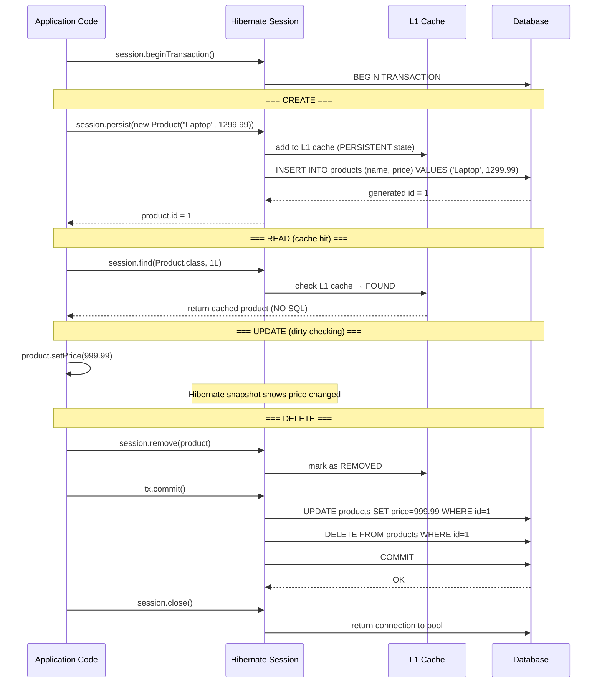

# 05 — CRUD Operations with Hibernate

## Why This Exists

Before JPA and Hibernate, every CRUD operation against a relational database meant writing ten or more lines of JDBC boilerplate: load the driver, obtain a connection from a pool, prepare a `PreparedStatement`, bind each parameter by index (getting the indices wrong was a constant source of bugs), execute the statement, check the result, close the statement, close the connection in a `finally` block, and translate any `SQLException` into something meaningful. A simple INSERT into a single table was a 15-line method. Update that same row? Another 15-line method. Delete it? Another. Fetch it by ID? Another. The application was mostly plumbing.

Hibernate reduces every one of those operations to one to three lines while handling transactions, connection cleanup, SQL generation, and result set mapping automatically. More importantly, it introduces a programming model where you think about objects and their state transitions rather than SQL statements. You do not write `UPDATE products SET price = ? WHERE id = ?` — you load the `Product` object, call `setPrice(newPrice)`, and commit the transaction. Hibernate watches for that change and generates the UPDATE automatically. This mechanism is called dirty checking, and it eliminates an entire category of bugs where the in-memory object and the database row drift out of sync because someone forgot to call `save()`.

Beyond the mechanics, Hibernate's CRUD operations enforce a discipline of explicit transaction boundaries. Every read or write that matters happens inside a transaction you control. This makes the atomicity of your operations explicit in the code, rather than relying on autocommit behavior that varies across JDBC drivers and database configurations. For a staff engineer designing a system, this discipline is not optional: it is the difference between a system that handles partial failures gracefully and one that silently corrupts data.

---

## The Five CRUD Operations

### CREATE — `session.persist(entity)`

Transitions a **Transient** entity to **Persistent**. Hibernate generates an INSERT at commit time (or earlier if `GenerationType.IDENTITY` requires the DB to assign an ID immediately).

```java
// WHY: persist() is the JPA-standard method. The older session.save() is Hibernate-
//      specific and deprecated. Use persist() for new code.
Product product = new Product("Laptop", 1299.99);
// product.id == null — entity is TRANSIENT (not known to Hibernate, not in DB)

session.persist(product);
// WHY: After persist(), product is now PERSISTENT.
//      Hibernate has queued an INSERT to run at flush/commit time.
//      product.id is now assigned (for IDENTITY strategy, INSERT runs immediately to get the ID).

tx.commit();
// WHY: The INSERT SQL executes at commit if not already sent:
// INSERT INTO products (name, price) VALUES ('Laptop', 1299.99)
```

### READ — `session.find(Entity.class, id)`

Fetches by primary key. Checks the L1 cache first — if the entity was already loaded this session, no SQL is generated.

```java
// WHY: find() is the JPA standard. The older session.get() is equivalent.
//      Returns null if not found (unlike session.load() which returns a proxy and
//      throws ObjectNotFoundException lazily — a subtle trap).
Product product = session.find(Product.class, 1L);
// If product was already loaded this session: NO SQL generated (L1 cache hit)
// If not: SELECT p.id, p.name, p.price FROM products p WHERE p.id = 1
```

### UPDATE — Dirty Checking (no explicit save call needed)

Load an entity, mutate its fields, commit the transaction. Hibernate compares the current state to the snapshot taken at load time and generates an UPDATE only for changed columns.

```java
// WHY: This is Hibernate's most powerful feature and most common source of confusion
//      for developers coming from JDBC. There is NO explicit "save" call.
//      Hibernate takes a snapshot of the entity when it is loaded (PERSISTENT state).
//      At flush/commit, it compares current state to snapshot.
//      If any field changed, it generates an UPDATE automatically.
Product product = session.find(Product.class, 1L);
product.setPrice(999.99); // WHY: just a plain Java setter — no Hibernate call needed
tx.commit();
// Hibernate generates: UPDATE products SET price = 999.99 WHERE id = 1
// The name field did not change so it is NOT included in the UPDATE.
```

### MERGE — `session.merge(detachedEntity)`

Re-attaches a **Detached** entity to a new session. Used when you loaded an entity in one session, closed that session (making the entity Detached), modified it, and now want to persist those changes.

```java
// WHY: You cannot call persist() on a detached entity — Hibernate would treat it as
//      new and try to INSERT, likely causing a primary key violation.
//      merge() generates SELECT + UPDATE (or just UPDATE if Hibernate knows the entity exists).
Product detachedProduct = loadFromSomewhere(); // came from a closed session
detachedProduct.setPrice(799.99);

// In a new session:
Product managedProduct = session.merge(detachedProduct);
// WHY: merge() returns a NEW persistent entity. The detachedProduct reference is still
//      detached. Always use the returned reference for further operations in this session.
tx.commit();
```

### DELETE — `session.remove(entity)`

```java
// WHY: remove() requires a PERSISTENT entity (loaded in the current session).
//      You cannot remove a detached entity — load it first, then remove.
Product product = session.find(Product.class, 1L); // load → PERSISTENT
session.remove(product); // WHY: entity transitions to REMOVED state
tx.commit();
// Hibernate generates: DELETE FROM products WHERE id = 1
```

---

## JPQL — Hibernate's Object-Oriented Query Language

JPQL queries entity class names and field names, not table names and column names. Hibernate translates them to the correct dialect SQL.

```java
// WHY JPQL instead of SQL: JPQL is database-independent. The same JPQL runs on
//     H2, PostgreSQL, MySQL, Oracle. Hibernate generates the dialect-specific SQL.
//     "FROM Product" refers to the Product CLASS, not the "products" TABLE.
List<Product> cheapProducts = session
    .createQuery("FROM Product WHERE price > :min ORDER BY price ASC", Product.class)
    .setParameter("min", 10.0)
    // WHY setParameter() not string concat: prevents SQL injection.
    //     Hibernate uses a PreparedStatement under the hood.
    .getResultList();
```

---

## Session Cache Control: flush, clear, evict

```java
// session.flush() — WHY: forces Hibernate to send pending SQL to the DB immediately
//     without committing. Useful before a native SQL query that needs to see recent changes.
session.flush();

// session.clear() — WHY: detaches ALL entities from this session, freeing memory.
//     Essential when processing large batches (e.g., insert 100,000 rows) to prevent
//     the L1 cache from growing without bound and causing OutOfMemoryError.
//     After clear(), all loaded entities are DETACHED.
session.clear();

// session.evict(entity) — WHY: detaches ONE specific entity from the session.
//     Use when you want to prevent dirty checking on a specific object
//     but keep other entities in the session active.
session.evict(product);
```

---

## Transaction Boundaries: The Rule

Every database operation that modifies data must be inside an explicit transaction. Every read-only operation benefits from a transaction for consistent snapshot isolation.

```java
Session session = sessionFactory.openSession();
Transaction tx = null;
try {
    tx = session.beginTransaction(); // WHY: starts a DB transaction, gets a connection

    // ... all your operations ...

    tx.commit(); // WHY: flushes all pending SQL then issues COMMIT to DB
} catch (Exception e) {
    if (tx != null) {
        tx.rollback(); // WHY: undoes all SQL in this transaction — atomicity guarantee
    }
    throw e;
} finally {
    session.close(); // WHY: returns connection to pool regardless of outcome
}
```

---

## Mermaid: Full CRUD Lifecycle with Transaction Boundaries



---

## Python Bridge: SQLAlchemy → Hibernate CRUD

### Comparison Table

| Operation | SQLAlchemy | Hibernate |
|---|---|---|
| CREATE | `session.add(obj)` then `session.commit()` | `session.persist(obj)` then `tx.commit()` |
| READ by PK | `session.get(Product, 1)` | `session.find(Product.class, 1L)` |
| UPDATE | `obj.price = 999` then `session.commit()` | `obj.setPrice(999)` then `tx.commit()` — dirty checking works the same way |
| DELETE | `session.delete(obj)` then `session.commit()` | `session.remove(obj)` then `tx.commit()` |
| QUERY | `session.query(Product).filter(Product.price > 10).all()` | `session.createQuery("FROM Product WHERE price > :min", Product.class).setParameter("min", 10.0).getResultList()` |
| Detach/Re-attach | `session.expunge(obj)` / `session.merge(obj)` | Entity detaches on session close / `session.merge(detached)` |
| Flush without commit | `session.flush()` | `session.flush()` |

### Mental Model

The SQLAlchemy and Hibernate CRUD APIs are conceptually identical. Both use a Unit of Work pattern: you operate on Python/Java objects, the session tracks all changes, and everything is sent to the database in one batch at commit time. The `session.add()` / `session.persist()` calls are equivalent. Dirty checking works the same way in both — just set the attribute/field and commit.

The main conceptual difference is that Hibernate has an explicit **Detached** state. In SQLAlchemy, when you close a session, accessing lazy-loaded attributes raises `DetachedInstanceError` — the same problem. But Hibernate makes the state machine more explicit and provides `merge()` as the standard re-attachment mechanism.

---

## Real-World Scenarios

**Scenario 1 — E-Commerce Order Creation**

When a customer checks out, the application opens a session and persists an `Order` entity, persists multiple `OrderItem` entities referencing that order, and updates the `Product.quantityInStock` for each item purchased. All three operations happen inside one transaction. If the payment gateway call fails, `tx.rollback()` undoes all three operations atomically — the order is not created, the items are not recorded, and inventory is not decremented. Without explicit transaction boundaries (the classic "forgot to add `@Transactional`" bug), each operation auto-commits and partial state is permanently written to the database.

**Scenario 2 — Inventory Bulk Update**

A warehouse management system updates 50,000 product stock counts nightly from a CSV import. A naive implementation loads all 50,000 `Product` entities into one session, updates each, and commits. The L1 cache grows to hold all 50,000 entities in memory, causing `OutOfMemoryError` on the application server. The correct pattern uses a batch loop with `session.flush()` + `session.clear()` every 500 entities: the changes are written to the database and the L1 cache is cleared, keeping memory flat throughout the operation.

---

## Anti-Patterns

### Anti-Pattern 1: No Transaction (Silent Data Loss)

```java
// WRONG — no transaction, each operation auto-commits individually
Session session = sessionFactory.openSession();
session.persist(order);       // auto-commits immediately
session.persist(orderItem1);  // auto-commits immediately
session.persist(orderItem2);  // if this throws, order and orderItem1 are ALREADY in DB
// WHY THIS FAILS: If orderItem2 fails (e.g., constraint violation), the partial
// state (order + orderItem1) is permanently committed. The database is now corrupt.
// You have an order with only one item — and no way to recover automatically.

// RIGHT — wrap in explicit transaction for atomicity
Transaction tx = session.beginTransaction();
try {
    session.persist(order);
    session.persist(orderItem1);
    session.persist(orderItem2);
    tx.commit(); // all or nothing
} catch (Exception e) {
    tx.rollback(); // nothing committed if any step fails
    throw e;
}
```

### Anti-Pattern 2: Calling `merge()` on a Never-Persisted Entity

```java
// WRONG — using merge() as if it means "save or update"
Product newProduct = new Product("Widget", 5.99); // id is null
session.merge(newProduct); // WRONG use of merge
// WHY THIS FAILS: merge() on an entity with a null ID creates a NEW entity with a
// NEW generated ID. This looks like it worked, but if you call merge() again with
// the same Java object (still has null id), it inserts ANOTHER new row.
// Result: duplicate rows in the products table.

// RIGHT — use persist() for genuinely new entities
session.persist(newProduct); // generates INSERT, assigns ID to the Java object
// merge() is for re-attaching DETACHED entities that already have a DB identity (non-null id)
```

### Anti-Pattern 3: Not Closing the Session (Connection Leak)

```java
// WRONG — no try-with-resources, exception skips the close
Session session = sessionFactory.openSession();
Transaction tx = session.beginTransaction();
Product product = session.find(Product.class, id); // throws NullPointerException
tx.commit();
session.close(); // NEVER REACHED — connection leaked forever
// WHY THIS FAILS: Every leaked session holds a JDBC connection checked out from the
// pool. A pool of 10 connections, 10 exceptions, 10 leaks = 100% pool exhaustion.
// Every subsequent database call blocks indefinitely waiting for a connection.

// RIGHT — always use try-with-resources
try (Session session = sessionFactory.openSession()) {
    Transaction tx = session.beginTransaction();
    try {
        Product product = session.find(Product.class, id);
        tx.commit();
    } catch (Exception e) {
        tx.rollback();
        throw e;
    }
} // session.close() called here even if an exception was thrown
```

---

## Interview Questions

### Conceptual

**Q1:** Explain Hibernate's dirty checking mechanism. How does Hibernate know which fields changed without you calling an explicit `save()` or `update()` method?

**A:** When Hibernate loads an entity (via `find()`, a query, or `merge()`), it creates a "snapshot" — a copy of all the entity's field values at the moment it was loaded. The entity is now in **Persistent** state, meaning Hibernate is watching it. At flush time (before commit, or on an explicit `session.flush()` call), Hibernate compares the entity's current field values to that snapshot. Any field whose current value differs from the snapshot is "dirty." Hibernate then generates an `UPDATE` statement covering only those changed fields. This comparison happens via Java reflection across all non-`@Transient` fields. The mechanism works because the entity stays in the session's first-level cache, so Hibernate always has access to both the original snapshot and the current state.

**Q2:** What is the difference between `session.find()` and `session.load()` (or `session.getReference()` in newer Hibernate), and when does that difference matter in production?

**A:** `session.find()` executes a `SELECT` immediately and returns `null` if the entity does not exist. `session.getReference()` returns a proxy object immediately without hitting the database — the actual `SELECT` is deferred until you access a field on the proxy. If the entity does not exist in the database, `getReference()` does not fail immediately; it throws `ObjectNotFoundException` when you first touch the proxy's data. In production, this matters for associations: if you only need the proxy to set a foreign key (`order.setProduct(session.getReference(Product.class, productId))`), `getReference()` avoids a redundant `SELECT`. But if you actually need the entity's data, use `find()` so you get a clear `null` check rather than a deferred exception.

### Scenario / Debug

**Q3:** A developer reports that updating a `Product` price is not being saved to the database. Their code is:
```java
Product p = session.find(Product.class, 1L);
p.setPrice(999.99);
session.close();
```
What is wrong, and what are the two different ways to fix it?

**A:** There is no transaction. Without calling `session.beginTransaction()` and `tx.commit()`, Hibernate never flushes the dirty check results to the database. The connection likely runs in autocommit mode, but Hibernate's dirty checking flush only happens at transaction commit or explicit `flush()`. Fix 1 (preferred): wrap the operation in an explicit transaction — `tx = session.beginTransaction(); p.setPrice(999.99); tx.commit();`. Fix 2 (acceptable in special cases): call `session.flush()` before `session.close()` — this forces the dirty check and sends the UPDATE SQL, relying on the connection's autocommit setting to commit it. Fix 1 is preferred because it gives explicit atomicity and rollback capability.

### Quick Fire

**Q4:** You call `session.persist(entity)` but the entity's ID is still null after the call returns. Is this a bug?

**A:** It depends on the `GenerationType`. With `SEQUENCE` or `TABLE`, Hibernate queries the sequence/table to get the next ID and assigns it before the INSERT runs, so the ID is populated immediately after `persist()`. With `IDENTITY`, the INSERT must run first for the database to generate the ID — so with `IDENTITY`, Hibernate sends the INSERT immediately (bypassing batch optimization) and populates the ID from the generated key. In either case, after `persist()` in a running session, the ID should be populated. If it is still null, check that the `@GeneratedValue` annotation is present and that `hbm2ddl.auto` created the correct sequence or auto-increment column.

**Q5:** What does `session.flush()` do that `session.clear()` does not?

**A:** `flush()` sends pending SQL to the database (INSERT/UPDATE/DELETE) but does not commit the transaction and keeps entities in the L1 cache as Persistent. `clear()` detaches all entities from the session (empties the L1 cache) but does not send pending SQL — any unflushed changes are discarded. In batch processing you typically call `flush()` then `clear()` together: first persist the pending changes to the database, then free the memory.

**Q6:** What is the correct way to delete an entity if you only have its ID, not a loaded entity reference?

**A:** Load it first then remove it: `Product p = session.find(Product.class, id); if (p != null) session.remove(p);`. Alternatively, use JPQL: `session.createMutationQuery("DELETE FROM Product WHERE id = :id").setParameter("id", id).executeUpdate();`. The JPQL bulk delete is more efficient for single rows because it skips the SELECT, but it bypasses Hibernate's cascade and lifecycle callbacks. Use `find()` + `remove()` when cascades or `@PreRemove` listeners matter; use JPQL bulk delete for performance-critical batch deletes.
