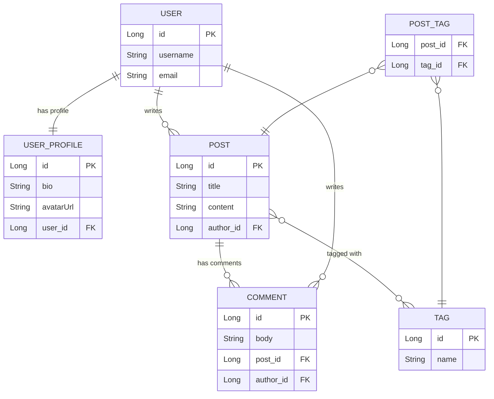

# 04-Hibernate-JPA / 02-Relationships

## What This Sub-Module Covers

Entity relationships are the heart of every real-world data model. This sub-module teaches you how
Hibernate maps the six fundamental association patterns — @OneToOne, @OneToMany, @ManyToOne,
@ManyToMany, cascade types, and fetch strategies — plus how to diagnose and eliminate the N+1
query problem that silently kills performance in production.

| File | Key Concept | What You Learn |
|------|-------------|----------------|
| `explanation/01-one-to-one.md` | @OneToOne | Owning side, mappedBy, optional=false |
| `explanation/02-one-to-many.md` | @OneToMany / @ManyToOne | Bidirectional sync, orphanRemoval |
| `explanation/03-many-to-many.md` | @ManyToMany | @JoinTable, when to promote to entity |
| `explanation/04-cascade-types.md` | CascadeType | ALL vs selective, orphanRemoval vs REMOVE |
| `explanation/05-fetch-strategies.md` | LAZY vs EAGER | LazyInitializationException, EntityGraph |
| `explanation/06-n-plus-one-problem.md` | N+1 Problem | JOIN FETCH, @EntityGraph, @BatchSize |
| `explanation/OneToOneDemo.java` | Live code | Employee ↔ EmployeeDetail demo |
| `explanation/OneToManyDemo.java` | Live code | Department → Employee bidirectional |
| `explanation/ManyToManyDemo.java` | Live code | Student ↔ Course with join table |
| `explanation/FetchStrategyDemo.java` | Live code | LAZY/EAGER, EntityGraph, statistics |
| `explanation/NPlusOneDemo.java` | Live code | N+1 vs JOIN FETCH timing comparison |
| `exercises/Ex01_UniversityRelationships.java` | Practice L1 | Guided TODOs for university domain |
| `exercises/Ex02_NPlusOneFix.java` | Practice L2 | Find and fix N+1 in Author/Book |
| `exercises/solutions/Sol01_UniversityRelationships.java` | Solution | Full solution + COMMON MISTAKES |
| `exercises/solutions/Sol02_NPlusOneFix.java` | Solution | Both N+1 fixes + COMMON MISTAKES |
| `resources/progressive-quiz-drill.md` | Quiz | 4-round progressive assessment |
| `resources/one-page-cheat-sheet.md` | Reference | Annotation syntax, defaults, traps |
| `resources/top-resource-guide.md` | Resources | Vlad Mihalcea, Hibernate 6 docs, books |

---

## Learning Outcomes

After completing this sub-module you will be able to:

1. Map all four JPA association types with correct owning-side/inverse-side placement
2. Explain why the owning side holds the foreign key column and what `mappedBy` means
3. Synchronize both sides of a bidirectional relationship correctly every time
4. Choose the right CascadeType for each association — and explain why ALL on @ManyToMany is dangerous
5. Predict the default FetchType for each annotation and override it correctly
6. Identify the N+1 problem by reading Hibernate's SQL log output
7. Apply three independent N+1 fixes (JOIN FETCH, @EntityGraph, @BatchSize)
8. Map the Python/SQLAlchemy mental model onto JPA annotations fluently

---

## Prerequisites

Complete `04-hibernate-jpa/01-hibernate-basics` before this sub-module. You should be comfortable with:

- `@Entity`, `@Table`, `@Id`, `@GeneratedValue`
- `EntityManager` lifecycle (persist, merge, remove, find)
- Hibernate configuration with H2 in-memory database
- JPQL basics (`SELECT e FROM Employee e WHERE e.name = :name`)

---

## Domain Model — Blog Platform

The examples throughout this module use a unified blog-platform domain so every concept builds
on the same entities. You will recognise the same User, Post, Comment, and Tag entities across
all six explanation files.



---

## Python Bridge — SQLAlchemy vs JPA Relationships

If you have used SQLAlchemy, every JPA annotation maps directly to something you already know.

| SQLAlchemy | JPA / Hibernate | Notes |
|------------|-----------------|-------|
| `relationship("B", uselist=False)` | `@OneToOne` | One record on each side |
| `relationship("B", back_populates="a")` | `@OneToMany` + `@ManyToOne` | Parent-child |
| `relationship("B", secondary=join_table)` | `@ManyToMany` + `@JoinTable` | Both sides |
| `cascade="all, delete-orphan"` | `cascade=ALL, orphanRemoval=true` | Full ownership |
| `cascade="save-update, merge"` | `cascade={PERSIST, MERGE}` | Selective cascade |
| `lazy="select"` (default) | `FetchType.LAZY` (default for @OneToMany) | Proxy on access |
| `lazy="joined"` | `FetchType.EAGER` | Join in same query |
| `lazy="subquery"` | `@BatchSize` / SELECT IN | Middle-ground strategy |
| `selectinload()` | JOIN FETCH / `@EntityGraph` | Explicit per-query eager load |
| `backref` | `mappedBy` | Inverse side declaration, no FK column |

**Mental model narrative:** In SQLAlchemy you define `relationship()` on one model and mirror it
with `back_populates` on the other. JPA works identically but uses annotations. The critical
difference is that JPA requires you to be explicit about which side *owns* the foreign key column —
the owning side has no `mappedBy`. SQLAlchemy infers the owning side from the `ForeignKey()` column
definition; JPA uses `@JoinColumn` to declare it explicitly.

---

## How to Run the Demos

All demo files use H2 in-memory. They can be run directly from IntelliJ IDEA (right-click → Run)
or with Gradle from the repository root:

```bash
./gradlew :04-hibernate-jpa:run --args="com.learning.hibernate.relationships.NPlusOneDemo"
```
