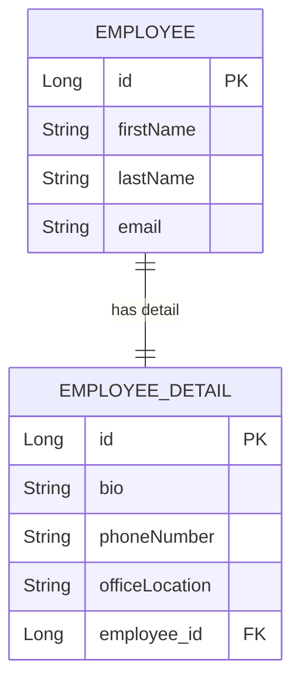

# @OneToOne — When Two Tables Share a Soul

## WHY This Was Invented

Before JPA annotations existed, a Java developer who needed to load a `User` and its associated
`UserProfile` had to write something like this by hand:

```sql
SELECT u.id, u.username, u.email,
       p.bio, p.avatar_url, p.created_at
FROM users u
LEFT JOIN user_profiles p ON p.user_id = u.id
WHERE u.id = ?
```

Then they had to manually map every column from the `ResultSet` into two separate Java objects,
hold a reference from one to the other, and remember to update the FK column whenever the
association changed. Every time a new column was added to either table, the JDBC code broke
silently at runtime.

The deeper problem was not just boilerplate — it was *correctness under change*. Keeping two
objects in sync across an application lifecycle is error-prone. A developer in one part of the
codebase might load a `User` without the profile because they forgot the JOIN. Another developer
might save a profile record but forget to set `user_id`, creating an orphaned row. There was no
mechanism to enforce the association at the object level.

`@OneToOne` was designed to solve this by making the association *part of the type system*. When
you declare `@OneToOne` on `User.profile`, Hibernate generates the JOIN automatically, enforces
the FK column via `@JoinColumn`, and synchronizes the object graph. The developer never writes
the FK column name in SQL again — the annotation is the single source of truth.

---

## Core Concepts

### Owning Side vs Inverse Side

Every bidirectional @OneToOne relationship has exactly two sides:

- **Owning side**: holds the `@JoinColumn` annotation. Hibernate reads this side to determine the
  FK value when writing to the database. The physical FK column lives in this table.
- **Inverse side**: declared with `mappedBy`. No FK column here. Hibernate ignores changes made
  only to this side when flushing.

Rule of thumb: the entity that holds the FK column in the database is the owning side.

### @JoinColumn

```java
@OneToOne
@JoinColumn(name = "address_id")  // WHY: explicitly names the FK column in this table
private Address address;
```

Without `@JoinColumn`, Hibernate generates a column name using its own naming strategy which is
often ugly (e.g., `address_id` becomes fine here but complex object graphs produce `ADDRESS_ID`
or `profile_USER_ID`). Always name it explicitly.

### mappedBy

```java
// On the inverse side (no FK column here):
@OneToOne(mappedBy = "profile")   // WHY: tells Hibernate the FK is on the UserProfile side
private UserProfile profile;
```

`mappedBy` is a promise to Hibernate: "the other entity manages the FK, not me." This is why
changes made only to the `user` field of `UserProfile` in code but not reflected on the User
side still persist correctly — and why the reverse is not true.

### optional = false

```java
@OneToOne(optional = false)
@JoinColumn(name = "user_id", nullable = false)
private User user;
```

`optional = false` tells Hibernate to treat this as a mandatory NOT NULL reference. Hibernate will
generate a `NOT NULL` constraint on the FK column and can use `INNER JOIN` instead of `LEFT JOIN`
in generated SQL, which is more efficient.

---

## Entity Relationship Diagram



---

## Java Code — Bidirectional @OneToOne

```java
@Entity
@Table(name = "employees")
public class Employee {

    @Id
    @GeneratedValue(strategy = GenerationType.IDENTITY)
    private Long id;

    private String firstName;
    private String email;

    // WHY: mappedBy="employee" means EmployeeDetail owns the FK column.
    // Hibernate reads the employeeDetail.employee field to write the FK.
    // This side is read-only from a database perspective.
    @OneToOne(mappedBy = "employee", cascade = CascadeType.ALL, fetch = FetchType.LAZY)
    private EmployeeDetail detail;

    // WHY: bidirectional sync helper — always set both sides together
    public void setDetail(EmployeeDetail detail) {
        this.detail = detail;
        if (detail != null) {
            detail.setEmployee(this); // WHY: keeps both sides consistent in same session
        }
    }
}

@Entity
@Table(name = "employee_details")
public class EmployeeDetail {

    @Id
    @GeneratedValue(strategy = GenerationType.IDENTITY)
    private Long id;

    private String bio;
    private String phoneNumber;

    // WHY: this is the owning side — the FK column "employee_id" lives in
    // the employee_details table. Hibernate reads THIS field when flushing.
    @OneToOne(fetch = FetchType.LAZY, optional = false)
    @JoinColumn(name = "employee_id", nullable = false)
    private Employee employee;
}
```

---

## Python Bridge — SQLAlchemy vs @OneToOne

| Concept | SQLAlchemy | JPA |
|---------|-----------|-----|
| Define the relationship | `relationship("UserProfile", uselist=False)` | `@OneToOne` |
| FK column location | Defined by `ForeignKey()` on the column | `@JoinColumn(name="...")` on owning side |
| Inverse (no FK) | `back_populates="user"` | `mappedBy = "user"` |
| Not null FK | `nullable=False` on Column | `optional=false` + `nullable=false` on @JoinColumn |
| Cascade delete | `cascade="all, delete-orphan"` | `cascade=CascadeType.ALL, orphanRemoval=true` |
| Load strategy | `lazy="joined"` (EAGER) | `fetch=FetchType.LAZY` (override default) |

**Mental model:** SQLAlchemy's `uselist=False` is your flag that says "this returns one object,
not a list." JPA expresses the same thing through the annotation name: `@OneToOne` vs
`@OneToMany`. The FK side in SQLAlchemy is identified by the `ForeignKey()` column decorator;
in JPA it is identified by the presence of `@JoinColumn` (owning side) or `mappedBy` (inverse).

---

## Real-World Use Cases

### 1. E-Commerce — User → BillingAddress

**Industry vertical:** E-commerce (Shopify, Amazon storefront)

A customer account has exactly one billing address. The billing address table holds the FK
(`user_id`). If you eagerly load billing addresses every time you load a User — even for
read-only operations like displaying the order list — you pay the JOIN cost for every page
that touches the user object. In a high-traffic storefront with 50,000 concurrent sessions,
this doubles the database load for no benefit. The fix is `fetch = FetchType.LAZY` on the
`@OneToOne` so the address is only loaded when the checkout page explicitly accesses it.

### 2. HR System — Employee → EmploymentContract

**Industry vertical:** Human Resources (Workday, SAP SuccessFactors)

Each employee has one employment contract containing sensitive salary and termination clauses.
Using `optional = false` enforces a business rule at the database level: a row in the `employees`
table cannot exist without a corresponding contract row. If a developer accidentally creates an
Employee without setting the contract, Hibernate throws a `ConstraintViolationException` before
the transaction commits — protecting data integrity without a separate application-level check.

---

## Anti-Patterns

### Anti-pattern 1: @OneToOne with FetchType.EAGER on a large profile entity

**WRONG:**
```java
// This loads the full UserProfile (with profile picture bytes, long bio, settings)
// every time ANY code loads a User — even just to check the username
@OneToOne(fetch = FetchType.EAGER)
@JoinColumn(name = "profile_id")
private UserProfile profile;
```

**WHY it fails:** EAGER is the default for @OneToOne. If `UserProfile` has a `byte[] avatar`
field and a long biography text, every `em.find(User.class, id)` also loads the entire profile.
A list endpoint showing 100 usernames now fetches 100 full profiles, multiplying data transfer
and memory usage unnecessarily.

**RIGHT approach:**
```java
@OneToOne(fetch = FetchType.LAZY, optional = false)
@JoinColumn(name = "profile_id")
private UserProfile profile;
```

Always explicitly set `fetch = FetchType.LAZY` on @OneToOne when the associated entity is large
or not always needed. EAGER is the JPA default for @OneToOne — it will bite you in production.

---

### Anti-pattern 2: Missing @JoinColumn

**WRONG:**
```java
@OneToOne
private Address billingAddress;  // No @JoinColumn
```

**WHY it fails:** Hibernate generates a column name using its own strategy. In Hibernate 6 this
produces `billing_address_id` which may be acceptable — but if the column already exists in the
database schema with a different name (e.g., `address_id`), you get a `SchemaValidationException`
at startup. On legacy databases or in a team where the schema is managed separately by a DBA,
this causes mismatch failures that are hard to debug.

**RIGHT approach:**
```java
@OneToOne
@JoinColumn(name = "address_id")  // Always name the FK column explicitly
private Address billingAddress;
```

---

### Anti-pattern 3: Forgetting to set both sides of a bidirectional relationship

**WRONG:**
```java
Employee emp = new Employee("Alice");
EmployeeDetail detail = new EmployeeDetail("Bio text");
emp.setDetail(detail);  // Only sets the inverse side
em.persist(emp);        // detail.employee is null — FK column will be NULL!
```

**WHY it fails:** `Employee.detail` has `mappedBy = "employee"`. Hibernate only reads
`EmployeeDetail.employee` (the owning side) when writing the FK. Since `detail.employee` is
null, the `employee_id` FK column is written as NULL even though `emp.detail` is set.

**RIGHT approach:**
```java
// Use a sync helper that sets both sides atomically:
emp.setDetail(detail);       // calls detail.setEmployee(this) internally
em.persist(emp);             // Now detail.employee != null, FK is written correctly
```

---

## Interview Questions

### Conceptual

**Q1:** Your team's `@OneToOne` between `Order` and `Invoice` works correctly in unit tests
but in production you notice `invoice_id` is always NULL even though the application code
sets the invoice. What is likely the cause and how do you fix it?

**A:** The most likely cause is that only the inverse side of the bidirectional relationship
is being set in application code, but the owning side (which Hibernate reads for the FK) is
not. If `Invoice` has `mappedBy = "order"` but the code calls `invoice.setOrder(null)` or
never sets it, Hibernate reads the owning `Order.invoice` field to write the FK and finds
null. Fix: add a bidirectional sync helper on the entity that always sets both sides together,
or ensure the service code sets the owning side field.

**Q2:** A candidate says "I set `optional = false` on my `@OneToOne` so the relationship
will always load the related entity eagerly." Is this statement correct? Explain the actual
effect of `optional = false`.

**A:** The statement is incorrect. `optional = false` is a hint that the FK is NOT NULL — it
affects the SQL generated (Hibernate can use INNER JOIN instead of LEFT JOIN) and it adds a
NOT NULL constraint to the column. It has no effect on FetchType. The association is still
LAZY or EAGER based on the `fetch` attribute. Confusing `optional` with `fetch` is a common
mistake.

### Scenario / Debug

**Q3:** You have a bidirectional `@OneToOne` between `User` (inverse side, `mappedBy="user"`)
and `UserProfile` (owning side). A developer adds a profile to a user with
`user.setProfile(profile)` and calls `em.persist(user)`. The `user_id` FK in the
`user_profiles` table is NULL. Explain step-by-step why this happens and write the fix.

**A:** Step 1: `user.setProfile(profile)` sets the `User.profile` field — but this is the
inverse side (it has `mappedBy`). Step 2: Hibernate only reads the owning side
(`UserProfile.user`) when writing to the database. Step 3: Since no code set
`profile.setUser(user)`, the owning field is null, so Hibernate writes NULL to `user_id`.
Fix: In `User.setProfile()`, add `profile.setUser(this)` to always sync the owning side.

### Quick Fire

**Q:** Which side of a `@OneToOne` holds the FK column in the database?
**A:** The owning side — the one that has `@JoinColumn` and no `mappedBy`.

**Q:** What does `mappedBy = "employee"` tell Hibernate?
**A:** It tells Hibernate that the `employee` field on the other entity owns the FK, and this
side should not write any FK column.

**Q:** What is the default FetchType for `@OneToOne`?
**A:** FetchType.EAGER — almost always override it to LAZY for non-trivial associated entities.
