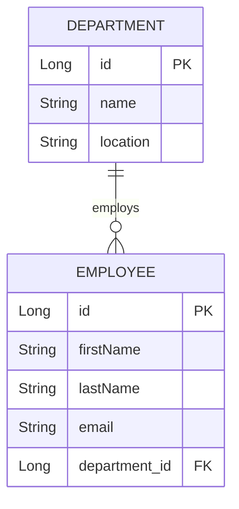

# @OneToMany / @ManyToOne — The Parent-Child Backbone of Enterprise Data

## WHY This Was Invented

Before JPA, loading a `Department` with all its `Employee` records required two separate JDBC
operations and a manual in-memory assembly step:

```sql
-- Query 1: load the parent
SELECT id, name, location FROM departments WHERE id = ?

-- Query 2: load all children for that parent
SELECT id, first_name, last_name, department_id
FROM employees
WHERE department_id = ?
```

The Java code then had to:
1. Execute query 1, map the `ResultSet` to a `Department` object
2. Execute query 2, map each row to an `Employee` object
3. Call `department.setEmployees(employees)` to wire them together
4. Remember to set `employee.setDepartment(department)` too, or risk `NullPointerException`
   when navigating from employee to department
5. Repeat this ceremony in every service method that needed the parent-with-children view

The real problem surfaced when the data model changed. Adding a column to `employees` meant
updating three or four SQL strings scattered across the codebase. Forgetting one led to silent
data corruption — the column was not selected so the field was silently null in the Java object.

`@OneToMany` and `@ManyToOne` were designed to make parent-child relationships a *declaration*,
not a *procedure*. You declare the shape of the relationship once on the entity class. Hibernate
generates all the necessary SQL, manages the FK column, and ensures both ends of the object
graph stay in sync — as long as you follow the bidirectional sync rules.

---

## Core Concepts

### Owning Side — @ManyToOne

The `@ManyToOne` side is always the owning side. This is the child entity — the one that holds
the FK column in its database table.

```java
// Employee is the "many" side — its table has the department_id FK column
@ManyToOne(fetch = FetchType.LAZY)
@JoinColumn(name = "department_id")   // WHY: explicit FK column name in employees table
private Department department;
```

**Default FetchType for @ManyToOne is EAGER.** This is usually acceptable because @ManyToOne
loads a single parent row. Override to LAZY if the parent entity is large.

### Inverse Side — @OneToMany

The `@OneToMany` side is the inverse side — the parent. It has no FK column in its table.

```java
// Department is the "one" side — no FK column here, the child table holds it
@OneToMany(mappedBy = "department", cascade = CascadeType.ALL, orphanRemoval = true)
private List<Employee> employees = new ArrayList<>();
```

`mappedBy = "department"` tells Hibernate: "look at `Employee.department` for the FK value."

**Default FetchType for @OneToMany is LAZY.** This is the correct default — keep it.

### Bidirectional Sync

Hibernate uses only the owning side (`@ManyToOne`) when flushing to the database. If you only
set `department.getEmployees().add(employee)` without also calling
`employee.setDepartment(department)`, the FK column will be NULL in the database.

The standard solution is a helper method on the parent entity:

```java
// WHY: helper that atomically sets both sides so callers cannot forget one side
public void addEmployee(Employee employee) {
    employees.add(employee);
    employee.setDepartment(this);  // WHY: sets the owning side, which Hibernate reads
}

public void removeEmployee(Employee employee) {
    employees.remove(employee);
    employee.setDepartment(null);  // WHY: clears the owning FK so the row is disassociated
}
```

### orphanRemoval = true

When an `Employee` is removed from `department.employees` collection, Hibernate automatically
issues a `DELETE` for that employee row. Without `orphanRemoval`, removing from the collection
only sets the FK to NULL — the employee row stays in the table as an orphan.

### @JoinColumn on the Child Side

The `@JoinColumn` always goes on the `@ManyToOne` side (the child). Never on `@OneToMany`.
If you accidentally put `@JoinColumn` on the `@OneToMany` side without `mappedBy`, Hibernate
treats it as a unidirectional @OneToMany and creates a *join table* instead.

---

## Entity Relationship Diagram



---

## Java Code — Department ↔ Employee Bidirectional @OneToMany

```java
@Entity
@Table(name = "departments")
public class Department {

    @Id
    @GeneratedValue(strategy = GenerationType.IDENTITY)
    private Long id;

    private String name;

    // WHY: LAZY is the correct default for collections.
    // CascadeType.ALL means persisting/deleting a Department
    // automatically persists/deletes all its Employees.
    // orphanRemoval=true means removing an Employee from this list
    // also deletes the Employee row from the database.
    @OneToMany(mappedBy = "department",
               cascade = CascadeType.ALL,
               orphanRemoval = true,
               fetch = FetchType.LAZY)
    private List<Employee> employees = new ArrayList<>();

    // WHY: always use helper methods to keep both sides in sync
    public void addEmployee(Employee employee) {
        employees.add(employee);
        employee.setDepartment(this);
    }

    public void removeEmployee(Employee employee) {
        employees.remove(employee);
        employee.setDepartment(null);
    }
}

@Entity
@Table(name = "employees")
public class Employee {

    @Id
    @GeneratedValue(strategy = GenerationType.IDENTITY)
    private Long id;

    private String firstName;
    private String email;

    // WHY: @ManyToOne is the owning side — the department_id FK column
    // lives in this table (employees). Hibernate reads this field
    // to determine what FK value to write on flush.
    // LAZY override: @ManyToOne defaults to EAGER, override for performance.
    @ManyToOne(fetch = FetchType.LAZY)
    @JoinColumn(name = "department_id")
    private Department department;
}
```

---

## Python Bridge — SQLAlchemy vs @OneToMany

| Concept | SQLAlchemy | JPA |
|---------|-----------|-----|
| Parent → Children | `relationship("Employee", back_populates="department")` | `@OneToMany(mappedBy="department")` |
| Child → Parent | `relationship("Department", back_populates="employees")` + `ForeignKey` | `@ManyToOne` + `@JoinColumn` |
| Cascade save | `cascade="save-update"` | `CascadeType.PERSIST` |
| Delete orphans | `cascade="all, delete-orphan"` | `CascadeType.ALL + orphanRemoval=true` |
| Sync helper | Python: set both sides in `__init__` or use event listeners | Java: `addEmployee()` helper method |
| Lazy loading | `lazy="select"` (default) | `FetchType.LAZY` (default for @OneToMany) |

**Mental model:** In SQLAlchemy, `back_populates` tells the ORM that these two `relationship()`
calls describe opposite ends of the same association. JPA expresses the same thing using
`mappedBy` on the inverse side. The key difference: SQLAlchemy infers the FK column from the
`ForeignKey()` column annotation on the model. JPA requires you to declare `@JoinColumn` on
the owning entity explicitly. Both ORMs require you to set both sides of the relationship in
code if you want in-session navigation to work before the next database flush.

---

## Real-World Use Cases

### 1. E-Commerce — Order → OrderLineItems

**Industry vertical:** E-commerce (Shopify, WooCommerce, Amazon Marketplace)

An `Order` contains 1-50 `OrderLineItem` records. Using `CascadeType.ALL` and
`orphanRemoval = true` on `Order → OrderLineItems` means that when a customer removes an item
from their cart (represented as a draft order), calling `order.removeItem(item)` automatically
generates a `DELETE FROM order_line_items WHERE id = ?`. Without orphanRemoval, that item row
stays in the database as a ghost record, inflating storage and causing wrong order total
calculations when the order is reloaded.

### 2. Content Management — Blog → Comments

**Industry vertical:** Publishing / CMS (WordPress, Medium, Ghost)

A `BlogPost` has many `Comment` entities. Here you should NOT use `orphanRemoval = true`
because comment deletion is a separate editorial workflow (flagging, moderation). Instead, use
`CascadeType.PERSIST` only so saving a post with new comments saves those comments, but deleting
a comment is an explicit operation with its own audit log. Getting cascade wrong here deletes
user content accidentally when a post is updated.

### 3. HR — Department → Employees

**Industry vertical:** Human Resources (SAP, Workday)

A `Department` with hundreds of `Employee` records should never use `FetchType.EAGER`. An HR
dashboard showing 200 departments would load every employee for all 200 departments in one
page request — potentially 20,000 objects. The correct design: LAZY loading with a summary
query (count of employees per department) for list views, and JOIN FETCH only on the department
detail page.

---

## Anti-Patterns

### Anti-pattern 1: @OneToMany without mappedBy (creates unexpected join table)

**WRONG:**
```java
@OneToMany
@JoinColumn(name = "department_id")  // @JoinColumn here with no mappedBy
private List<Employee> employees;
```

**WHY it fails:** This is a *unidirectional* @OneToMany with a @JoinColumn — Hibernate maps it
using a separate `department_employees` join table unless you explicitly put `@JoinColumn` on
the @OneToMany side (which then results in an update SQL for the FK rather than using
the child's column). Either way, you cannot navigate from `Employee` to `Department`, and
Hibernate issues extra UPDATE statements to manage the join table entries.

**RIGHT approach:** Always pair `@OneToMany(mappedBy="department")` with a corresponding
`@ManyToOne @JoinColumn` on the Employee side.

---

### Anti-pattern 2: Forgetting to sync both sides of bidirectional

**WRONG:**
```java
Department dept = em.find(Department.class, 1L);
Employee emp = new Employee("Bob");
dept.getEmployees().add(emp);   // Only sets inverse side
em.persist(dept);               // emp.department is null — FK will be NULL
```

**WHY it fails:** Hibernate reads `Employee.department` (owning side) to write the FK column.
Adding to `dept.employees` only modifies the inverse side, which Hibernate ignores for writing.
The `department_id` FK will be NULL.

**RIGHT approach:**
```java
dept.addEmployee(emp);  // Calls emp.setDepartment(dept) internally
em.persist(dept);       // FK is correctly written
```

---

### Anti-pattern 3: Using FetchType.EAGER on @OneToMany

**WRONG:**
```java
@OneToMany(mappedBy = "department", fetch = FetchType.EAGER)  // NEVER do this
private List<Employee> employees;
```

**WHY it fails:** Every query that loads `Department` — even `findAll()` — now also loads all
employees for all departments in the result set. A `SELECT * FROM departments` that should
return 200 rows now joins with employees and returns 200 × avg_employees rows. In a department
with 500 employees, the Hibernate result set explodes to 100,000 rows for a 200-department
query. Memory usage spikes, GC pressure increases, and the endpoint slows to a crawl.

**RIGHT approach:** Keep the LAZY default. Use JOIN FETCH or @EntityGraph in specific queries
that genuinely need employees alongside their department.

---

## Interview Questions

### Conceptual

**Q1:** You are reviewing a PR where a developer added `@OneToMany(fetch=FetchType.EAGER)` to
fix a `LazyInitializationException` on the Orders list page. The PR description says "this fixed
the exception." What is wrong with this fix, and what should they do instead?

**A:** The fix trades one problem for a much worse one. EAGER on @OneToMany means every query
that loads an `Order` — including paginated list queries — also loads all `OrderLineItems` for
every order. If the list page shows 20 orders each with 10 items, Hibernate now fetches 200
items when showing a page that only displays order summaries. The correct fix depends on where
the LazyInitializationException is thrown: (1) if inside a `@Transactional` service, the session
should still be open — check if the exception is happening inside or outside the transaction
boundary; (2) if in a REST endpoint, use a JOIN FETCH query or `@EntityGraph` on the specific
repository method for the detail endpoint; (3) if accessing lazy data in a JSON serializer, load
the data explicitly in the service layer before returning the DTO.

**Q2:** Explain why Hibernate only uses the owning side of a bidirectional relationship when
writing to the database, even though both sides hold object references.

**A:** Hibernate needs exactly one authoritative source for the FK value to avoid conflicts.
If both sides could independently declare a different FK value (e.g., `employee.department.id`
says 1 but `department.employees` contains a different employee), there would be an ambiguity.
By convention, the owning side (the `@ManyToOne` side with `@JoinColumn`) is the single source
of truth. The inverse side (`mappedBy`) is purely navigational — it lets you traverse from
parent to children in Java code, but Hibernate does not write any FK based on it.

### Scenario / Debug

**Q3:** After calling `order.removeItem(item)` in your service, the `OrderLineItem` row is
still in the database. You have `CascadeType.ALL` on the relationship. What is missing and how
do you fix it?

**A:** `CascadeType.ALL` does not delete children when they are removed from the parent's
collection. `CascadeType.REMOVE` (included in ALL) only deletes children when the *parent* is
deleted. The missing property is `orphanRemoval = true`. With
`@OneToMany(cascade=CascadeType.ALL, orphanRemoval=true)`, removing an item from
`order.items` triggers a `DELETE FROM order_line_items WHERE id = ?` on flush.

### Quick Fire

**Q:** Which side of `@OneToMany` / `@ManyToOne` holds the FK column in the database?
**A:** The `@ManyToOne` side (the child entity) — it is the owning side.

**Q:** What does `orphanRemoval = true` do that `CascadeType.REMOVE` does not?
**A:** `orphanRemoval` deletes a child row when it is removed from the parent's collection;
`CascadeType.REMOVE` deletes all children when the parent itself is deleted.

**Q:** What is the default FetchType for @ManyToOne and @OneToMany?
**A:** @ManyToOne defaults to EAGER; @OneToMany defaults to LAZY.
