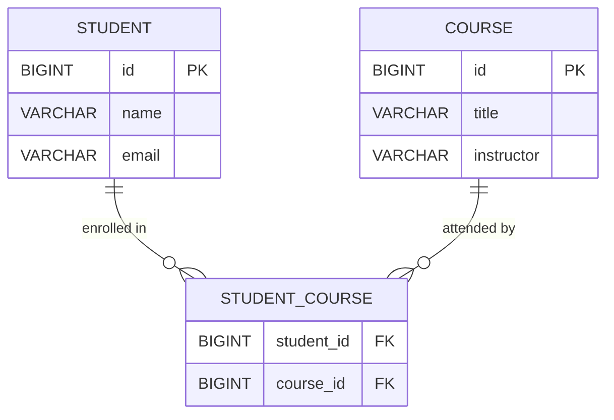

# Many-to-Many Relationships in JPA

## WHY This Exists

Before JPA, modeling a student-enrollment-course relationship in raw JDBC was a multi-step
manual process. A student could enroll in many courses, and a course could have many students.
That logic required a third table — a join table — and every enrollment operation demanded
hand-written SQL: `INSERT INTO student_course (student_id, course_id) VALUES (?, ?)`. Removing
a student from a course meant another manual DELETE. Querying all courses for a given student
required a JOIN across three tables that you wrote every single time. There was no safety net
if you forgot to populate the join table after inserting a student record.

The deeper problem was consistency. If your application had five different code paths that
could enroll a student — a web controller, a batch import job, an admin API, a scheduled
sync — all five had to remember to write to the join table. In practice, they didn't. New
developers would see the `Student` entity, add a collection field in their service layer,
and silently skip the join table insert. The database would become inconsistent, and bugs
would appear months later when reporting queries returned wrong enrollment counts.

JPA's `@ManyToMany` annotation automates the join table entirely. You declare the relationship
on the entity, annotate one side as the owner with `@JoinTable`, and JPA generates the join
table DDL, handles all INSERT/DELETE operations on that table, and lets you work exclusively
with object collections. The join table becomes an implementation detail you only think about
when you need to add extra columns to it — at which point you promote it to a real entity.

---

## Python Bridge

| Concept | Python / SQLAlchemy | Java / JPA |
|---------|---------------------|------------|
| Join table declaration | `secondary=student_course_table` parameter on `relationship()` | `@JoinTable(name="student_course", joinColumns=..., inverseJoinColumns=...)` |
| Owning side | Both sides reference the `secondary` table | Only one side carries `@JoinTable` — the other uses `mappedBy` |
| Collection type | `list` or `set` (no behavioral penalty in SA) | `Set<>` strongly preferred — `List<>` triggers DELETE+re-INSERT on any modification |
| Promoting to entity | Replace `secondary` with an association object model | Replace `@ManyToMany` with `@ManyToOne` on both sides of a new join entity class |
| Inverse declaration | `back_populates` or `backref` on the other side | `mappedBy="courses"` on the non-owning side — no second `@JoinTable` |

**Mental model difference:** In SQLAlchemy you declare the `secondary` association table as a
plain `Table` object (not a mapped class), and both sides of the relationship reference it
symmetrically. JPA uses an **ownership model**: exactly one side owns the relationship and
carries the `@JoinTable` annotation. The other side declares `mappedBy`, pointing back to the
owning field name. This asymmetry matters because JPA only writes to the join table when you
modify the **owning side's collection**. Python developers frequently hit this bug when
transitioning: they call `course.students.add(student)` (inverse side) expecting the
enrollment to be saved, but nothing persists. Always add to the owning side, or keep both
sides in sync programmatically in a helper method.

---

## Entity Relationship Diagram



---

## Working Java Code

### Basic @ManyToMany — Student Owns the Relationship

```java
// FILE: Student.java
// PURPOSE: JPA entity demonstrating @ManyToMany with join table ownership.
// The Student side owns the relationship — it carries @JoinTable.
// PACKAGE: com.learning.hibernate.relationships
// AUTHOR: Spring Mastery Learning Repo
// DATE: 2026-04-05

package com.learning.hibernate.relationships;

import jakarta.persistence.*;
import java.util.HashSet;
import java.util.Set;

/**
 * Student entity — the OWNING side of the Student to Course many-to-many relationship.
 *
 * <p>Ownership rule: the side with {@code @JoinTable} is the owner. JPA only
 * writes to the join table when collections on the owning side are modified.
 * Adding a course to {@code student.getCourses()} persists the enrollment row;
 * adding a student to {@code course.getStudents()} does NOT persist it unless
 * you also update the owning side.</p>
 */
@Entity
@Table(name = "student")
public class Student {

    @Id
    @GeneratedValue(strategy = GenerationType.IDENTITY)
    private Long id;

    @Column(nullable = false)
    private String name;

    /**
     * The owning side of the many-to-many.
     *
     * <p>WHY @JoinTable here: this annotation tells Hibernate to manage a join
     * table called "student_course" with two FK columns. Without it, Hibernate
     * defaults to a table name derived from entity names — unpredictable and not
     * DBA-friendly.</p>
     *
     * <p>WHY Set, not List: Hibernate's collection dirty-checking for Lists uses
     * positional comparisons. When you modify a List of Course, Hibernate may
     * DELETE all join rows and re-INSERT them to maintain order — even if only
     * one element changed. A Set uses equality checks, so only the added or
     * removed row is touched. With 200 enrollments, that is the difference
     * between 1 and 201 database operations.</p>
     */
    @ManyToMany
    @JoinTable(
        name = "student_course",                             // WHY: explicit name prevents Hibernate defaults
        joinColumns = @JoinColumn(name = "student_id"),      // WHY: FK pointing back to this entity
        inverseJoinColumns = @JoinColumn(name = "course_id") // WHY: FK pointing to the other side
    )
    private Set<Course> courses = new HashSet<>();            // WHY: HashSet, never ArrayList here

    /**
     * Enroll this student in a course, keeping both sides of the relationship in sync.
     *
     * <p>WHY bidirectional sync: JPA does not automatically mirror the inverse
     * side. If you only call {@code student.getCourses().add(course)}, the in-memory
     * {@code course.getStudents()} collection is stale for the remainder of the
     * current persistence context. Keeping both sides in sync prevents subtle bugs
     * in the same transaction where you read back {@code course.getStudents()}.</p>
     *
     * @param course the course to enroll in
     */
    public void enroll(Course course) {
        this.courses.add(course);        // WHY: modifies owning side — this writes to join table
        course.getStudents().add(this);  // WHY: keeps inverse side in sync in-memory
    }

    /** Remove the student from a course, keeping both sides consistent. */
    public void unenroll(Course course) {
        this.courses.remove(course);        // WHY: owning side removal triggers DELETE on join table
        course.getStudents().remove(this);  // WHY: in-memory sync
    }

    public Long getId() { return id; }
    public String getName() { return name; }
    public void setName(String name) { this.name = name; }
    public Set<Course> getCourses() { return courses; }
}
```

```java
// FILE: Course.java
// PURPOSE: Inverse side of the Student to Course many-to-many.
// No @JoinTable here — mappedBy delegates ownership to Student.
// PACKAGE: com.learning.hibernate.relationships

package com.learning.hibernate.relationships;

import jakarta.persistence.*;
import java.util.HashSet;
import java.util.Set;

/**
 * Course entity — the INVERSE (non-owning) side of the many-to-many.
 *
 * <p>The {@code mappedBy = "courses"} attribute tells Hibernate: "do not create
 * a second join table — mirror the one already managed by {@code Student.courses}".
 * If you omit {@code mappedBy}, Hibernate creates TWO join tables:
 * {@code student_course} AND {@code course_students}. Both tables store the same
 * data redundantly. This is a silent, very common mistake with @ManyToMany.</p>
 */
@Entity
@Table(name = "course")
public class Course {

    @Id
    @GeneratedValue(strategy = GenerationType.IDENTITY)
    private Long id;

    @Column(nullable = false)
    private String title;

    /**
     * Inverse side — no @JoinTable annotation.
     *
     * <p>WHY mappedBy: this field is read-only from JPA's perspective for join
     * table writes. Hibernate treats it as a mirror of {@code Student.courses}.
     * Modifying this collection in isolation will NOT persist changes to the DB.</p>
     */
    @ManyToMany(mappedBy = "courses")
    private Set<Student> students = new HashSet<>();

    public Long getId() { return id; }
    public String getTitle() { return title; }
    public void setTitle(String title) { this.title = title; }
    public Set<Student> getStudents() { return students; }
}
```

### Promoting to a Join Entity (when the join table needs extra columns)

```java
// FILE: StudentCourse.java
// PURPOSE: Promoted join entity for when enrollment needs extra data (grade, date).
// Replaces @ManyToMany with two @ManyToOne relationships — the "association object" pattern.
// WHY promote: @ManyToMany cannot hold extra columns on the join table row.
// Once you need enrollmentDate or grade, the join table must become a real entity.
// PACKAGE: com.learning.hibernate.relationships

package com.learning.hibernate.relationships;

import jakarta.persistence.*;
import java.time.LocalDate;

/**
 * Join entity representing a student's enrollment in a course.
 *
 * <p>This replaces the {@code @ManyToMany} between Student and Course once
 * the join table needs to store additional business data such as enrollment
 * date, grade, or payment status. The refactoring: remove {@code @ManyToMany}
 * from both Student and Course; replace with {@code @OneToMany(mappedBy="student")}
 * on Student and {@code @OneToMany(mappedBy="course")} on Course.</p>
 */
@Entity
@Table(name = "student_course")
public class StudentCourse {

    @Id
    @GeneratedValue(strategy = GenerationType.IDENTITY)
    private Long id;

    /**
     * WHY @ManyToOne here: the join entity is the "many" side for both
     * Student and Course. It holds the FK columns that were previously in
     * the @JoinTable annotation. LAZY fetch prevents loading the full
     * Student graph on every enrollment query.
     */
    @ManyToOne(fetch = FetchType.LAZY)
    @JoinColumn(name = "student_id", nullable = false)
    private Student student;

    @ManyToOne(fetch = FetchType.LAZY)               // WHY LAZY: same reason — avoid full Course load
    @JoinColumn(name = "course_id", nullable = false)
    private Course course;

    @Column(name = "enrollment_date", nullable = false)
    private LocalDate enrollmentDate;                // WHY: business data @ManyToMany cannot hold

    @Column(name = "grade")
    private String grade;                            // WHY: another column impossible with raw @ManyToMany

    public Long getId() { return id; }
    public Student getStudent() { return student; }
    public void setStudent(Student student) { this.student = student; }
    public Course getCourse() { return course; }
    public void setCourse(Course course) { this.course = course; }
    public LocalDate getEnrollmentDate() { return enrollmentDate; }
    public void setEnrollmentDate(LocalDate d) { this.enrollmentDate = d; }
    public String getGrade() { return grade; }
    public void setGrade(String grade) { this.grade = grade; }
}
```

---

## Real-World Use Cases

**1. CMS Platform — Post to Tag**
In content management systems (WordPress, Ghost, and Medium-like platforms), every blog post
can have many tags and each tag appears on many posts. The join table `post_tag` holds the
association. If developers naively use `List<Tag>` instead of `Set<Tag>`, publishing a post
with 10 tags and then re-saving it (even without changing the tags) triggers 10 DELETEs and
10 INSERTs on the join table on every save. At scale with thousands of posts saved per day,
that is millions of unnecessary write operations causing write amplification on the DB. Using
`Set<Tag>` reduces this to zero writes when the tag list is unchanged.

**2. Spring Security — User to Role**
In Spring Security authorization models, a `User` has many `Role` objects (ADMIN, USER,
MODERATOR), and a `Role` is shared across many users. This is a textbook `@ManyToMany`. The
critical constraint: `CascadeType.REMOVE` must never appear here. If a developer adds
`cascade = CascadeType.REMOVE` and then deletes a single user account, Hibernate cascades the
DELETE to the shared `Role` entities — wiping the ROLE_ADMIN record that every admin account
holds. This silently destroys shared reference data, locking all administrators out of the
system. The failure rarely surfaces in unit tests because test datasets typically have only
one user per role.

**3. E-commerce — Product to Category**
A product catalog (Shopify, WooCommerce) allows products to appear in multiple categories
(a running shoe can be under Footwear, Sports, and Sale simultaneously). Once the business
needs to track `featured_in_category` (a boolean per product-category pairing) or
`display_order` (sort order within a category), the `@ManyToMany` must be promoted to a
`ProductCategory` join entity with those extra columns. Teams that skip the promotion try to
work around it by adding a separate `ProductCategoryMetadata` table — creating a fragmented
schema that is harder to query than the promoted join entity would have been.

---

## Anti-Patterns

### 1. Using List Instead of Set

**What developers do:**
```java
@ManyToMany
@JoinTable(name = "student_course", ...)
private List<Course> courses = new ArrayList<>();  // WRONG
```

**Why it fails in production:** Hibernate's `List` implementation for `@ManyToMany` tracks
element positions. When you modify the list (add or remove one course), Hibernate marks the
entire collection as dirty and issues a DELETE of all join table rows for that student,
followed by a full re-INSERT of every remaining course. With 50 enrolled courses, saving
after adding course 51 generates 50 DELETE + 51 INSERT statements instead of 1 INSERT. Under
concurrent load with hundreds of students saving simultaneously, this creates lock contention
and deadlocks on the join table.

**The fix:**
```java
@ManyToMany
@JoinTable(name = "student_course", ...)
private Set<Course> courses = new HashSet<>();  // CORRECT: only the changed row is touched
```

---

### 2. CascadeType.REMOVE on @ManyToMany

**What developers do:**
```java
@ManyToMany(cascade = CascadeType.REMOVE)  // WRONG — DANGEROUS
@JoinTable(name = "user_role", ...)
private Set<Role> roles;
```

**Why it fails in production:** `CascadeType.REMOVE` propagates the DELETE operation from
parent to child entities. Deleting one `User` triggers DELETE on every `Role` entity in that
user's roles collection — including the shared `ROLE_ADMIN` record held by every admin
account. This silently deletes shared reference data and is catastrophic: all administrators
lose access. The failure is rarely caught in tests because test datasets usually have only
one user per role, making it look like the role disappears cleanly.

**The fix:**
```java
// No cascade, or PERSIST only if Roles are created dynamically with Users (rare)
@ManyToMany
@JoinTable(name = "user_role", ...)
private Set<Role> roles;  // CORRECT: deleting a User removes join table rows only
```

---

### 3. Exposing the Raw Join Entity Directly in API Responses

**What developers do:**
```java
// Controller returns the join entity directly — exposes DB internals
@GetMapping("/students/{id}/enrollments")
public List<StudentCourse> getEnrollments(@PathVariable Long id) {
    return studentCourseRepository.findByStudentId(id);  // WRONG
}
```

**Why it fails in production:** `StudentCourse` holds `@ManyToOne` references to both
`Student` and `Course`. Jackson serializes the full entity graph, including the nested
`Student` (which contains the full `courses` collection, which contains `StudentCourse`
objects again) — an infinite recursion that either throws `StackOverflowError` or produces
a response payload hundreds of kilobytes in size. Even with `@JsonIgnore` patches, the API
exposes internal database structure (raw FK column names, internal entity IDs) to external
consumers, coupling API contracts to your schema.

**The fix:**
```java
// Map to a DTO before returning — isolates API contract from DB structure
public record EnrollmentDTO(
    Long courseId,
    String courseTitle,
    LocalDate enrollmentDate,
    String grade
) {}

@GetMapping("/students/{id}/enrollments")
public List<EnrollmentDTO> getEnrollments(@PathVariable Long id) {
    return studentCourseRepository.findByStudentId(id)
        .stream()
        .map(sc -> new EnrollmentDTO(
            sc.getCourse().getId(),
            sc.getCourse().getTitle(),
            sc.getEnrollmentDate(),
            sc.getGrade()
        ))
        .toList();  // CORRECT: DTO shields API consumers from schema changes
}
```

---

## Interview Questions

### Conceptual

**Q1: Your colleague says "I'll add `mappedBy` to both sides of the `@ManyToMany` so both sides stay in sync automatically." What actually happens and why does JPA prevent this?**
> If `mappedBy` appears on both sides, JPA has no owning side to write to the join table — neither entity tracks changes to the association. Hibernate requires exactly one owning side (identified by `@JoinTable`) because it uses that side's collection as the source of truth for join table DML. With two `mappedBy` declarations, saving either entity never INSERTs or DELETEs rows in the join table — enrollments simply do not persist silently. JPA enforces this because allowing two owners would cause double-writes and conflicting DELETE/INSERT sequences on the same rows.

**Q2: You need to record the date a student enrolled and the grade they received. Your current model uses `@ManyToMany`. What is your migration strategy and why can't you just add a column to the join table while keeping `@ManyToMany`?**
> `@ManyToMany` maps the join table as a pure FK pair — JPA has no mechanism to read or write extra columns on it. Adding a column to the underlying table does not make it visible to the entity model. The migration strategy is: (1) create a `StudentCourse` entity class with `@ManyToOne Student`, `@ManyToOne Course`, and the new `enrollmentDate` / `grade` fields; (2) remove `@ManyToMany` from Student and Course, replacing with `@OneToMany(mappedBy="student")` and `@OneToMany(mappedBy="course")` respectively; (3) write a Flyway script that adds the new columns and populates `enrollment_date` with a default value for existing rows so the `NOT NULL` constraint is satisfied; (4) update service layer code to instantiate `StudentCourse` explicitly instead of calling `student.enroll(course)`.

### Scenario / Debug

**Q3: After a deployment, your monitoring shows a spike in DELETE and INSERT statements on the `post_tag` table whenever a post is saved — even when no tags changed. You have 10,000 posts saved per day and the DB CPU has doubled. What is the root cause and how do you fix it with zero downtime?**
> The root cause is a `List<Tag>` collection on the `Post` entity. Hibernate's List dirty-checking marks the whole collection as dirty on any save, deletes all join rows, and re-inserts them. Fix: change the field to `Set<Tag>` and add `@EqualsAndHashCode` on `Tag` (or ensure `equals` and `hashCode` use the entity ID). This is a two-step zero-downtime change: (1) deploy the entity change — `Set` immediately reduces DML to only changed rows; (2) optionally add a unique constraint on `(post_id, tag_id)` in the join table as a safety net against future regressions. No data migration is needed since the join table schema is unchanged.

### Quick Fire

- Which side of a `@ManyToMany` holds the `@JoinTable`? *(The owning side — the inverse side uses `mappedBy`.)*
- If you add a course to `course.getStudents()` (the inverse side) and flush the session, is the join table updated? *(No — only changes to the owning side's collection trigger join table writes.)*
- When must you promote `@ManyToMany` to a join entity? *(When the join table needs additional columns beyond the two FK columns, such as a date or a status field.)*
